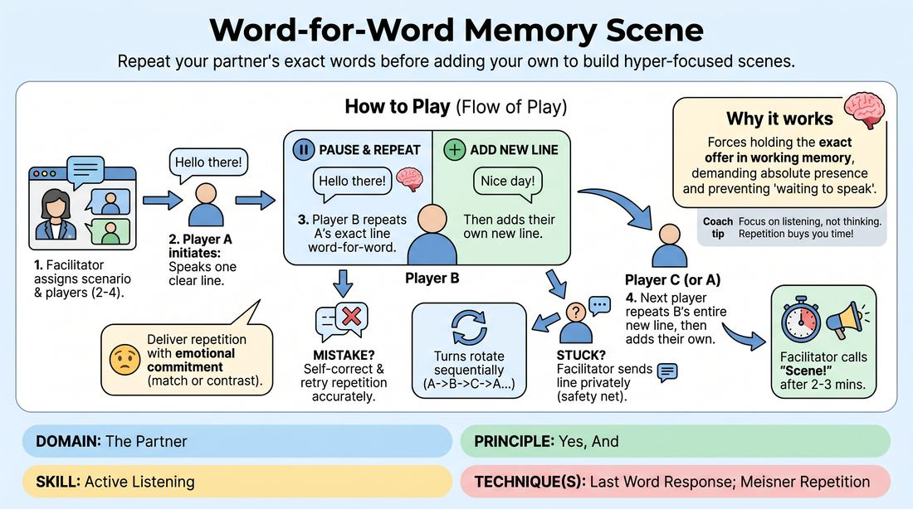

# Verbatim Echo

{ .game-hero }

> Repeat your partner's exact words before adding your own to build hyper-focused scenes.

## Overview
A high-focus virtual scene-work drill where players must repeat their partner's entire preceding line word-for-word before adding their own contribution. This structure eliminates conversational overlap, forces deep presence, and turns active listening into a collaborative game. It is designed specifically to thrive in virtual environments where audio latency often disrupts natural turn-taking.

## What It Trains
- **Domain:** D2 — The Partner
- **Principle(s):** Yes, And; Make Your Partner a Genius; The First Thought Is a Gift
- **Skill(s):** Active Listening; Offer Reception; Unfiltered Spontaneity
- **Technique(s):** Meisner Repetition; Last Word Response; Yes, And… sentence games
- **Focus:** skill_drill

**Objective:** To develop absolute active listening, precise offer reception, and unfiltered spontaneity by removing the ability to pre-plan responses.

## Setup
Conducted in a virtual meeting space. The facilitator spotlights 2 to 4 active players while other participants remain on camera in gallery view with microphones muted. The facilitator keeps a private chat window open to act as a discreet prompter if a player gets stuck. No physical props or materials are required.

## How to Play
1. The facilitator assigns a simple relationship and scenario to 2 to 4 active players.
2. Player A initiates the scene with a single, clear line of dialogue.
3. Player B must pause, repeat Player A's line word-for-word with exact precision, and then immediately deliver their own new line of dialogue.
4. Player A must then pause, repeat Player B's entire new line word-for-word, and then add their own next line.
5. If there are 3 or 4 players, the turn rotates sequentially; each player must repeat the entire line of the person who spoke immediately before them before adding their own.
6. If a player makes a mistake in their repetition, they must pause, self-correct, and try to repeat the line accurately before proceeding with their new line.
7. If a player is completely stuck, the facilitator uses the private chat function to discreetly send them the exact line, acting as a silent safety net to keep the scene flowing.
8. Players must strive to deliver the repeated lines with emotional commitment, matching or intentionally contrasting the original speaker's emotional state rather than reciting it dryly.
9. The facilitator calls 'Scene!' after approximately 2 to 3 minutes of sustained play.

## Facilitation Notes
- Side-coach emotional commitment: Remind players to treat the repeated line as an emotional offer, not just a cognitive memory test. Encourage them to inhabit the feeling behind the words.
- Manage the cognitive load: If players are struggling, remind them to keep their new lines short and simple. Long, complex sentences make the game unnecessarily punishing.
- Pitfall: Players planning their next line while their partner is speaking. Fix: Remind them that because they must repeat the exact words, any pre-planning is useless; they must surrender to the present moment.
- Discreet prompting: Keep the private chat window open and ready. Type the lines as they are spoken so you can instantly copy-paste them to a struggling player without breaking the scene's momentum.

## Variations
- Paraphrase Transition: For less experienced players, start with a round where they only have to repeat the core meaning or emotional essence of the line rather than a verbatim repetition.
- Last Word First Word: A classic variation where players only have to repeat the very last word of their partner's line as the first word of their own line.
- Emotional Shift: The repeating player must repeat the line but completely change the emotional subtext to explore how delivery alters meaning.

## Debrief
- How did knowing you had to repeat your partner's exact words change how you listened to them?
- What did it feel like to let go of planning your next line in advance?
- How did the physical or emotional delivery of the repeated line affect the reality of the scene?
- How can we apply this level of deliberate, sequential listening to our everyday virtual meetings?

## Safety & Inclusion
Ensure players know that if they experience cognitive fatigue or memory blocks, it is a natural part of the exercise and there is no shame in pausing or waiting for the facilitator's chat prompt. Encourage a supportive, low-stakes environment where mistakes are celebrated as fun moments of vulnerability.

## Why It Works
This game works because it physically prevents the common habit of waiting to speak instead of listening. By forcing a verbatim repetition, players must hold their partner's exact offer in their working memory, which demands absolute presence. In virtual spaces, this structured turn-taking naturally eliminates audio overlap and latency issues, teaching players to value precision and make their partner look like a genius by honoring every single word they offer.
