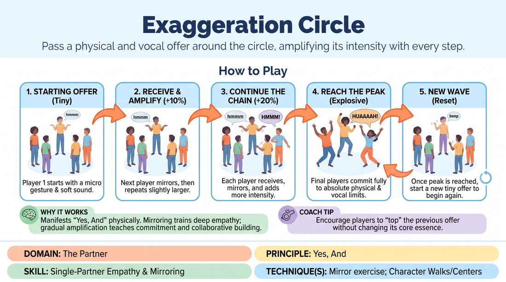

# Exaggeration Circle

{ .game-hero }

> Pass a physical and vocal offer around the circle, amplifying its intensity with every step.

## Overview
A high-energy physical warm-up where players stand in a circle and pass a single movement and sound from person to person. Each player must receive the offer, mirror it, and then amplify its size, volume, and emotional intensity before passing it on. By the time the offer reaches the end of the circle, it has transformed from a tiny micro-movement into an explosive, full-body expression.

## What It Trains
- **Domain:** D2 — The Partner
- **Principle(s):** Yes, And; Commit 100%; Group Mind
- **Skill(s):** Single-Partner Empathy & Mirroring; Offer Reception; Physicality & Space Work; Vocal Craft; Pacing & Rhythm
- **Technique(s):** Mirror exercise; Character Walks/Centers; Vocal characterization
- **Focus:** connection

**Objective:** To develop deep physical empathy, active listening, and the core 'Yes, And' principle by accepting a partner's physical offer and building upon it without changing its fundamental essence.

## Setup
Have all players stand in a circle with enough space to move their arms and take a step forward. No props or materials are required.

## How to Play
1. Form a standing circle facing inward, ensuring everyone has enough physical space to move freely.
2. The facilitator designates a starting player to initiate the first offer.
3. The starting player performs a very small, subtle physical gesture accompanied by a quiet, simple vocal sound.
4. The player immediately to their left receives the offer by mirroring it exactly, then repeats it while increasing its physical size and vocal volume by about ten to twenty percent.
5. The next player in the circle receives this slightly larger version, mirrors it, and amplifies it further, continuing the chain clockwise.
6. Each subsequent player must preserve the core shape, rhythm, and emotional quality of the original offer, ensuring they are building upon the previous player's work rather than inventing a new action.
7. The final players in the circle must commit one hundred percent to taking the gesture and sound to their absolute physical and vocal limits, resulting in a massive, theatrical climax.
8. Once the peak is reached, the next player in the circle starts a brand-new, tiny gesture and sound to begin a new wave of amplification.

## Facilitation Notes
- Side-coach pacing: 'Don't jump to a ten! If player two goes to a maximum level, there is nowhere left for the circle to grow. Build it incrementally.'
- Address the 'invention' pitfall: Players often completely change the gesture instead of amplifying it. Remind them to 'Yes, And' the specific mechanics of the movement.
- Side-coach connection: 'Receive before you amplify. Take a split second to truly mirror what you saw before you make it bigger.'
- Monitor vocal safety: Remind players to support their voices from the diaphragm and stay within their safe physical range, even at maximum commitment.

## Variations
- De-escalation Circle: Start at a massive, chaotic level ten and gradually shrink the gesture and sound down to a microscopic level one.
- Emotional Amplification: Instead of just physical size, players amplify a specific underlying emotion, starting with mild annoyance and ending with cosmic rage.
- Blind Amplification: Players stand in a straight line facing the back of the person in front of them. Player A taps Player B, shows them the gesture, and Player B must turn, amplify it, and pass it to Player C.

## Debrief
- How did it feel to receive an offer and have to build on it rather than inventing your own?
- What happened when someone jumped too quickly to a high intensity, and how did that affect the group mind?
- How does this exercise relate to 'Yes, And-ing' a partner's emotional state in a scene?

## Safety & Inclusion
Ensure players are mindful of their physical boundaries and vocal health. Encourage modifications for players with limited mobility or vocal range, such as amplifying through facial expression or breath instead of large jumps or loud screams.

## Why It Works
This game physically manifests the concept of 'Yes, And.' By requiring players to mirror the offer first, it trains deep empathy and reception. The gradual amplification teaches pacing, commitment, and collaborative building, showing how small choices can grow into high-stakes theatrical moments when supported by the group.
