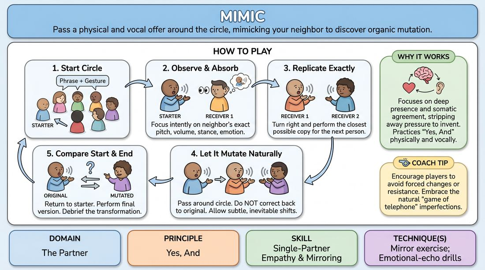

# The Echo Chamber

{ .game-hero }

> Pass a physical and vocal offer around the circle, mimicking your neighbor to discover organic mutation.

## Overview
Players stand in a circle and pass a short phrase accompanied by a distinct physical gesture and vocal tone. Each player attempts to replicate their immediate neighbor's performance as precisely as possible, rather than trying to preserve the original version. As the offer travels, tiny human imperfections accumulate, organically transforming the phrase and movement into entirely new characters and behaviors.

## What It Trains
- **Domain:** D2 — The Partner
- **Principle(s):** Yes, And; Follow the Follower; Commit 100%
- **Skill(s):** Single-Partner Empathy & Mirroring; Active Listening; Physicality & Space Work; Vocal Craft
- **Technique(s):** Mirror exercise; Emotional-echo drills; Vocal characterization
- **Focus:** connection

**Objective:** To develop deep physical and vocal empathy by practicing 'Yes, And' through exact replication, cultivating active listening, and embracing the concept of 'Follow the Follower' as a group.

## Setup
An open, moderate-sized space. Players stand in a circle facing inward, ensuring everyone has enough room to move their arms and shift their weight without colliding.

## How to Play
1. Gather the group into a standing circle facing inward.
2. Instruct the starting player to turn to the person on their right and deliver a short phrase (a quote, lyric, or simple statement) paired with a distinct physical gesture, posture, and vocal inflection.
3. The receiving player must observe their neighbor with absolute focus, absorbing the exact vocal pitch, volume, physical stance, hand movements, and emotional subtext.
4. The receiving player then turns to their right and attempts to replicate that exact performance as closely as possible for the next person.
5. Continue passing the offer around the circle, with each player mimicking only the person who just performed for them, rather than trying to correct back to the original starter's version.
6. Encourage players to let the offer mutate naturally; do not force changes, but do not resist the subtle, inevitable shifts in sound and movement that occur through human transmission.
7. Once the offer returns to the originator, let them perform the final mutated version, then debrief the differences between the start and end points.

## Facilitation Notes
- Side-coaching cue: 'Copy the person who just showed you, not the person who started the game!' This prevents players from trying to 'fix' the mutation.
- Side-coaching cue: 'Match the breath and the posture.' Encourage players to adopt the physical shape of their neighbor before they even speak to capture the emotional essence.
- Pitfall: Players intellectualizing the change or intentionally making it wacky. Fix: Remind them that the magic of the game lies in trying perfectly to copy, and letting the mutation happen unconsciously.
- Pitfall: Focusing only on the words. Fix: Coach them to treat the gibberish, sighs, pauses, and micro-gestures as equally important to the spoken text.

## Variations
- Gibberish Echo: Instead of real words, the starter uses a nonsense sound and a movement, removing the linguistic anchor and focusing purely on vocal craft and physicality.
- Emotional Amplification: Each player must slightly exaggerate the emotional intensity of the person before them, accelerating the mutation process.
- Two-Way Echo: Send two different offers in opposite directions simultaneously and observe what happens when they cross paths in the circle.

## Debrief
- How did it feel to let go of the 'original' version and fully commit to what your immediate partner gave you?
- What did you notice about how characters or emotions organically emerged from simple physical and vocal shifts?
- How does this exercise demonstrate the principle of 'Follow the Follower' in an improv scene?

## Safety & Inclusion
Ensure players are mindful of physical boundaries and mobility levels. If a player has limited mobility, the group should adapt by mirroring their range of motion rather than forcing replication of unattainable physical feats. Keep the physical offers safe and accessible for all bodies present.

## Why It Works
This game works because it strips away the pressure of invention and focuses entirely on deep presence and replication. By practicing 'Yes, And' at a physical and vocal level, players learn that agreement isn't just intellectual—it is somatic. The organic mutation of the offer teaches players to trust the present moment and find joy in accidental discoveries rather than clinging to a pre-planned script.
