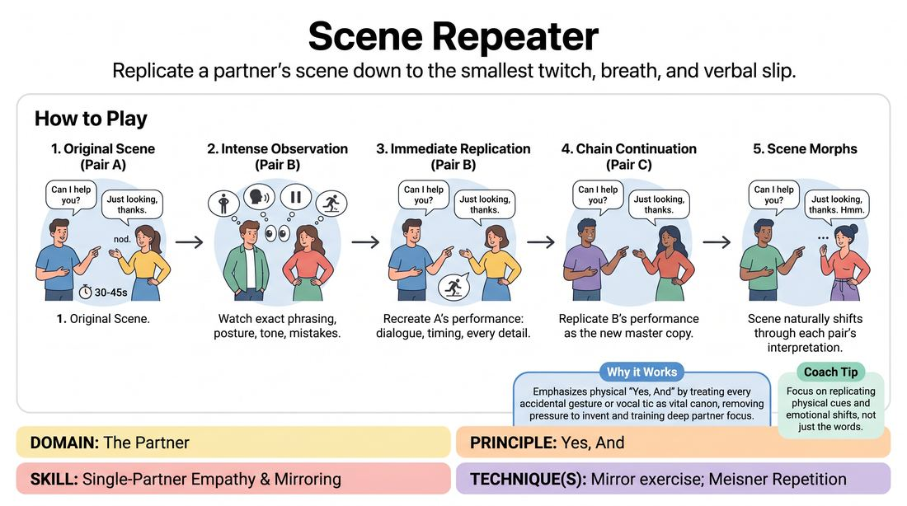

# Scene Replication

{ .game-hero }

> Replicate a partner's scene down to the smallest twitch, breath, and verbal slip.

## Overview
Two players perform a brief, simple scene while the rest of the group observes with intense focus. The next pair steps up to recreate that exact scene as faithfully as possible, mimicking not just the words, but the physical postures, pauses, mistakes, and emotional shifts of the previous performance. As the scene is passed down the line, tiny details amplify, transforming the original piece into a hilarious study of human behavior.

## What It Trains
- **Domain:** D2 — The Partner
- **Principle(s):** Yes, And; Make Your Partner a Genius; Group Mind
- **Skill(s):** Active Listening; Single-Partner Empathy & Mirroring; Peripheral Awareness
- **Technique(s):** Meisner Repetition; Mirror exercise; Thread-tracking drills
- **Focus:** skill_drill

**Objective:** To develop deep active listening, physical mirroring, and radical acceptance of a partner's exact choices, treating every accidental gesture or vocal slip as a deliberate, genius choice to be preserved.

## Setup
Clear a performance space at the front of the room. The rest of the group sits or stands in an audience arc, observing closely. No props or chairs are needed.

## How to Play
1. Divide the group into pairs and establish a clear order of performance (e.g., Pair A, Pair B, Pair C).
2. Pair A steps into the playing space and improvises a short, simple scene (approximately 30 to 45 seconds) with clear physical actions and dialogue.
3. Pair B watches Pair A with intense focus, paying close attention to exact phrasing, physical postures, vocal tones, pauses, and accidental movements.
4. Once Pair A finishes, Pair B immediately takes their exact starting positions and attempts to recreate the scene as an identical replica.
5. Pair B must match the dialogue, timing, physical choices, and any accidental stumbles or laughs from Pair A's performance.
6. Pair C then steps up to replicate Pair B's performance, treating Pair B's version as the new master copy to be mirrored.
7. Continue this chain through all pairs, allowing the scene to naturally morph as players attempt to perfectly mirror the version they just witnessed.

## Facilitation Notes
- Side-coach the observers: 'Don't just listen to the words. Watch their weight distribution, their hand gestures, and where they look.'
- If a player stumbles over a word or forgets a line, side-coach the replicating pair: 'Keep the mistake! If they paused to think, you must pause to think.'
- Pitfall: Players try to make the scene 'better' or funnier by adding new jokes. Fix: Remind them that the humor comes from the absolute precision of the replication, not from inventing new content.
- Encourage players to match the physical distance and spatial relationship between the original actors.

## Variations
- The Blind Telephone: Only the immediate next pair is allowed to watch the scene; the other pairs turn their backs or step out of the room, creating a true blind transmission.
- Emotional Amplification: Each subsequent pair must replicate the scene but increase the emotional intensity or physical scale by ten percent.
- Silent Replication: Run the entire chain using only physical movement and gibberish, focusing purely on body language and vocal dynamics.

## Debrief
- What did you notice about how 'mistakes' (like a stutter or a physical stumble) became crucial, defining parts of the scene?
- How did it feel to have your exact physical and vocal choices mirrored back to you by the next pair?
- How does this exercise change the way you listen and observe your partner in a standard improv scene?

## Safety & Inclusion
If a player has limited mobility or physical comfort boundaries, the replicating pairs must adapt the physical mirroring to match their own comfortable ranges of motion without making the physical limitation the focus of the humor.

## Why It Works
This game embodies 'Yes, And' at a physical level. By forcing players to treat every accidental vocal tic, sigh, or physical shift as a vital piece of canon, it removes the pressure to invent. It teaches players to view their partner's behavior not as a mistake to be corrected, but as a brilliant choice to be validated and matched.
