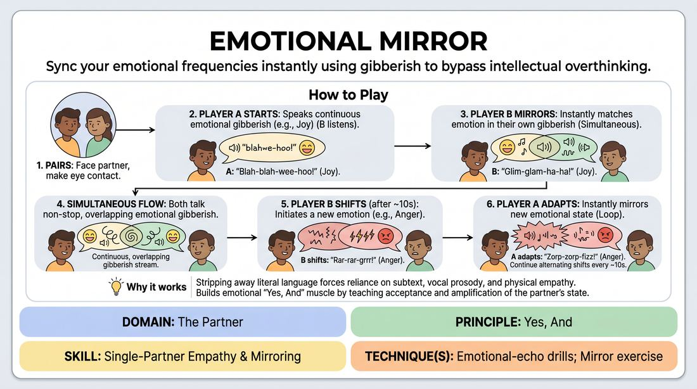

# Resonant Mirror

{ .game-hero }

> Sync your emotional frequencies instantly using gibberish to bypass intellectual overthinking.

## Overview
A rapid-fire, paired warm-up where players match and shift emotional states in real-time using nonsense language. By removing literal words, players focus entirely on vocal tone, facial expression, and physical energy to achieve deep emotional alignment.

## What It Trains
- **Domain:** D2 — The Partner
- **Principle(s):** Yes, And; Make Your Partner a Genius; Vulnerability
- **Skill(s):** Single-Partner Empathy & Mirroring; Active Listening; Offer Reception; Emotional Fluidity; Vocal Craft
- **Technique(s):** Emotional-echo drills; Mirror exercise; Gibberish
- **Focus:** connection

**Objective:** Develops rapid emotional fluidity, active listening, and non-verbal empathy, training players to say 'yes, and' to their partner's emotional state instantly.

## Setup
Pairs stand or sit facing each other in a shared space. No props or special staging required.

## How to Play
1. Divide the group into pairs and have partners stand or sit facing each other, maintaining comfortable eye contact.
2. Designate one person as Player A and the other as Player B for the initial round.
3. Player A begins speaking continuously in gibberish (nonsense language), expressing a clear, strong emotion such as ecstatic joy, deep sorrow, or simmering anger.
4. Player B immediately matches Player A's emotional state, responding in their own continuous gibberish without copying the exact sounds.
5. Both players must keep talking simultaneously without pausing, creating a continuous, overlapping stream of emotional gibberish.
6. After approximately ten seconds, Player B shifts to a completely new emotion of their choice, expressing it through their gibberish.
7. Player A must instantly adapt, mirroring Player B's new emotional state without hesitation or intellectual processing.
8. Continue this back-and-forth exchange, alternating who initiates the emotional shift every ten seconds for a few minutes.

## Facilitation Notes
- Side-coach players to focus on physical posture and facial expressions, not just vocal tones, to deepen the mirror effect.
- If players pause or hesitate when shifting emotions, coach them to make a sudden, random vocal sound first and let the emotion follow the sound.
- Remind players that they do not need to take turns speaking; the exercise works best when both voices overlap continuously.
- If pairs struggle to find a rhythm, the facilitator can call out 'Shift!' every ten seconds to prompt the transitions.

## Variations
- Physical Mirroring: Incorporate full-body movement alongside the vocal gibberish, matching gestures and spatial distance.
- Status Shift: Instead of pure emotions, mirror shifts in social status (high status to low status) using gibberish.
- Three-Way Echo: Play in groups of three, where one person initiates, and the other two mirror, rotating the initiator role.

## Debrief
- How did it feel to match your partner's emotion without knowing the literal reason behind it?
- What physical or vocal cues were the easiest to pick up on and mirror?
- How does bypassing real language help us connect more deeply with our scene partners?

## Safety & Inclusion
Ensure players know they can choose comfortable levels of eye contact and physical proximity. If intense emotions feel overwhelming, players are encouraged to play with lighter or absurd emotional states like mild confusion or extreme curiosity.

## Why It Works
By stripping away literal language, the exercise forces players to rely entirely on subtext, vocal prosody, and physical empathy. This builds the 'Yes, And' muscle at an emotional level, teaching players to accept and amplify their partner's emotional offers instantly.
