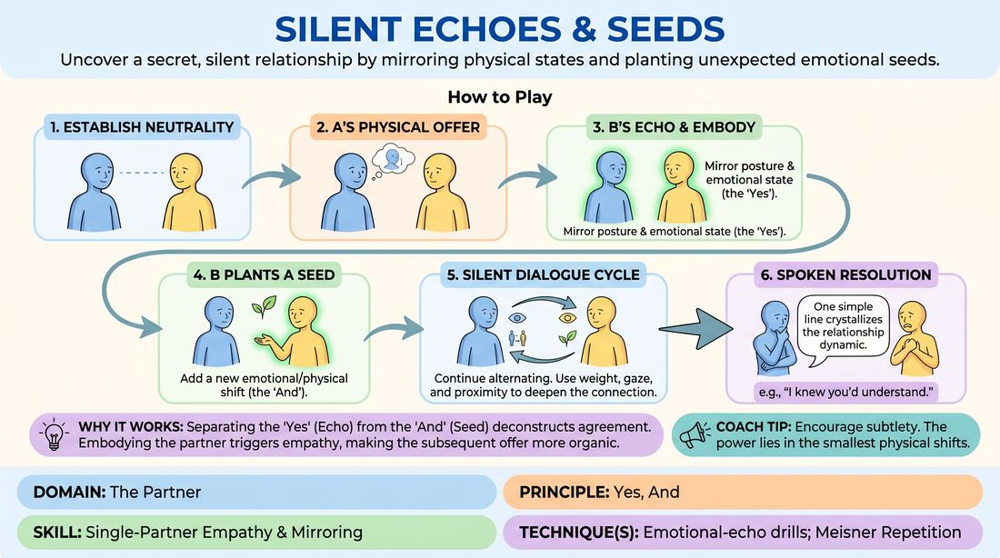

# Echo and Seed

{ .game-hero }

> Uncover a secret, silent relationship by mirroring physical states and planting unexpected emotional seeds.

## Overview
A high-connection partner game where players build a rich, unspoken relationship history entirely through physical and emotional subtext. By systematically mirroring a partner's physical state and then seeding a new emotional offer, players experience the playful tension of silent communication before a single word is spoken.

## What It Trains
- **Domain:** D2 — The Partner
- **Principle(s):** Yes, And; Make Your Partner a Genius; Assume Competence
- **Skill(s):** Physicality & Space Work; Active Listening; Status Modulation; Single-Partner Empathy & Mirroring; Offer Reception; Active Gifting
- **Technique(s):** Meisner Repetition; Status Seesaw; Mirror exercise; Emotional-echo drills; Endowment-acceptance; Endowment-gifting drills
- **Focus:** connection

**Objective:** To master physical empathy and emotional-echoing, allowing players to practice radical 'Yes, And' agreement through non-verbal status shifts and emotional alignment.

## Setup
Players stand in pairs facing each other with comfortable space to move. For online play, players position themselves mid-torso up in the camera frame, ensuring their hands and facial expressions are clearly visible.

## How to Play
1. Divide players into pairs facing each other, establishing soft eye contact and a neutral, relaxed physical posture.
2. Player A initiates the game by making a single, subtle physical offer—such as a shift in weight, a micro-expression, or a change in breathing pace.
3. Player B receives this offer and 'echoes' it, physically mirroring the posture and embodying the underlying emotional state and status of Player A.
4. Once the echo is fully established, Player B plants a 'seed' by adding a new, subtle physical gesture or emotional shift that builds upon the echoed state.
5. Player A receives Player B's seed, mirrors its emotional essence (the 'Yes'), and then plants their own new physical seed (the 'And') to continue the cycle.
6. Players continue this silent dialogue, using shifts in weight, gaze, and proximity to modulate status and deepen the emotional tension.
7. To resolve the game, once a clear, unspoken relationship dynamic is felt, either player speaks a single, simple line of dialogue that crystallizes the relationship, ending the scene.

## Facilitation Notes
- Encourage players to avoid broad, theatrical mime; the power of the game lies in micro-movements, breath, and genuine emotional connection.
- If players get stuck in a repetitive loop, side-coach them to shift their physical proximity or adjust their status (e.g., 'Take up slightly more or less space').
- For online play, coach players to use the depth of their camera frame (moving closer to or further from the lens) to simulate physical proximity and status shifts.
- Remind players that the 'Echo' is an act of radical acceptance—fully validating the partner's offer before attempting to change or build upon it.

## Variations
- The Triad Echo (Odd Numbers): Play in groups of three. Player A offers, Player B echoes and seeds, Player C echoes B's seed and adds a new seed, cycling the emotional chain continuously.
- Status Seesaw: Focus the 'seeds' on shifting the power dynamic, where each new seed must subtly raise or lower the player's status relative to their partner.
- The Unspoken Secret: One player is secretly given a silent prompt (e.g., 'You are hiding a betrayal' or 'You are deeply proud of them') which they must seed without ever stating it directly.

## Debrief
- How did it feel to physically embody your partner's emotional state before responding to it?
- What did you discover about how status and relationship can be communicated without any spoken words?
- How did the final spoken line feel different because of the extensive non-verbal foundation you built?

## Safety & Inclusion
Establish clear boundaries regarding physical proximity and eye contact before starting. Players may look at their partner's forehead, nose, or hands if direct eye contact feels overstimulating. For online play, players can adjust their self-view or look slightly off-camera to manage visual fatigue.

## Why It Works
By separating the 'Yes' (the Echo) from the 'And' (the Seed), this game physically deconstructs the core improv principle of agreement. Embodying the partner's physical state triggers empathetic resonance, making the subsequent 'And' an organic, deeply connected progression rather than an intellectual invention.
