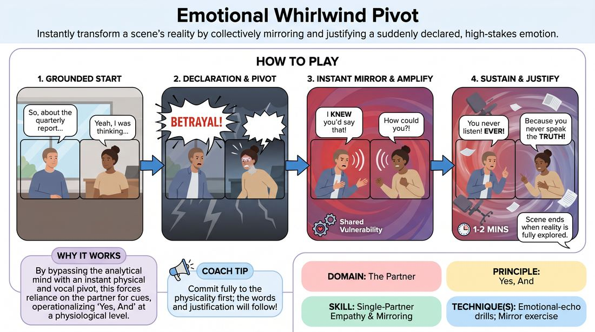

# Emotional Whirlwind Pivot

{ .game-hero }

> Instantly transform a scene's reality by collectively mirroring and justifying a suddenly declared, high-stakes emotion.

## Overview
A high-energy, two-player exercise where a grounded scene is suddenly disrupted by a single, loudly declared emotion. Both players must instantly pivot their physical, vocal, and environmental realities to fully embody and justify this new emotional state without hesitation. It trains performers to leap into shared vulnerability and treat their partner's sudden emotional shift as an absolute truth.

## What It Trains
- **Domain:** D2 — The Partner
- **Principle(s):** Yes, And; Make Your Partner a Genius; Assume Competence; The First Thought Is a Gift
- **Skill(s):** Single-Partner Empathy & Mirroring; Active Listening; Offer Reception; Active Gifting; Status Modulation; Emotional Fluidity; Justification
- **Technique(s):** Emotional-echo drills; Mirror exercise; Endowment-acceptance; Endowment-gifting drills; Give them the answer; The Emotional Dial (1→10); Justify the absurd
- **Focus:** connection

**Objective:** To develop rapid emotional mirroring, immediate offer acceptance, and collaborative justification under pressure, reinforcing the core principle of 'Yes, And' through shared emotional states.

## Setup
Conducted in a virtual meeting space with cameras on. Two active players are on screen, while other participants observe with cameras off. No physical props or special space are required, but players should have room to move within their camera frame.

## How to Play
1. Two players turn on their cameras and begin a grounded, realistic scene in a specific virtual setting.
2. The players establish a clear relationship, a shared activity, and a steady, conversational pace.
3. At any point during the scene, either player can suddenly shout a single, high-intensity emotion word directly into their microphone.
4. Immediately upon the declaration, both players must instantly pivot their physical posture, facial expressions, vocal tone, and energy to match that exact emotion.
5. Without pausing to explain why their characters are suddenly feeling this way, both players must immediately treat the physical environment and their relationship as if this emotion is the only logical response.
6. The non-declaring player must instantly mirror and amplify the emotional state, treating their partner's declaration as an absolute gift and a brilliant creative choice.
7. Both players use their virtual frame to convey the shift, adjusting their proximity to the camera, their breathing patterns, and their physical gestures to match the new reality.
8. The scene continues for one to two minutes in this heightened state, with players justifying the emotion through their dialogue and actions rather than analyzing it.
9. The facilitator calls 'Scene' once the emotional reality has been fully explored and sustained.

## Facilitation Notes
- Coaching Cue: 'Don't explain it, live it!' Remind players not to waste time explaining why they are sad or scared; instead, let the environment or the stakes of the moment justify the feeling.
- Pitfall: Lag or hesitation during the pivot. Fix: Encourage players to make a physical or vocal sound immediately upon hearing the word, bypassing the analytical brain.
- Coaching Cue: 'Fill the frame!' In a virtual setting, use facial expressions, breath, and sudden shifts in distance from the camera to communicate the emotional shift instantly.
- Pitfall: The non-declaring player playing 'catch-up' or resisting. Fix: Remind the partner that their primary job is to make the declarer look like a genius by matching or exceeding their emotional intensity.

## Variations
- Multi-Pivot Storm: Allow the facilitator or the players to call out multiple emotional pivots throughout a single three-minute scene, forcing rapid, successive adaptations.
- Status Seesaw Pivot: When the emotion is declared, players must not only match the emotion but also instantly invert their current status relationship.
- Subtext Whisperer: Instead of shouting the emotion, a player whispers it intensely, requiring the partner to lean in close to the camera and mirror a quiet, high-stakes version of the emotion.

## Debrief
- How did it feel to instantly abandon your original scene plan and commit to your partner's emotional choice?
- What physical or vocal adjustments helped you access the declared emotion without overthinking the narrative?
- How did mirroring your partner's emotional state help you discover the 'why' of the scene organically?

## Safety & Inclusion
Because this game demands rapid access to high-intensity emotions, establish a clear off-ramp or boundary signal (such as crossing arms in a T shape) if a player needs to step back or choose a different emotional direction. Ensure players debrief and shake off the high-intensity emotions after the exercise.

## Why It Works
By bypassing the analytical mind through an instant, mandatory physical and vocal pivot, this game forces players to rely entirely on their partner for cues. It operationalizes 'Yes, And' at a physiological level, demonstrating that shared emotional commitment is more than enough to build and sustain a compelling scene reality.
