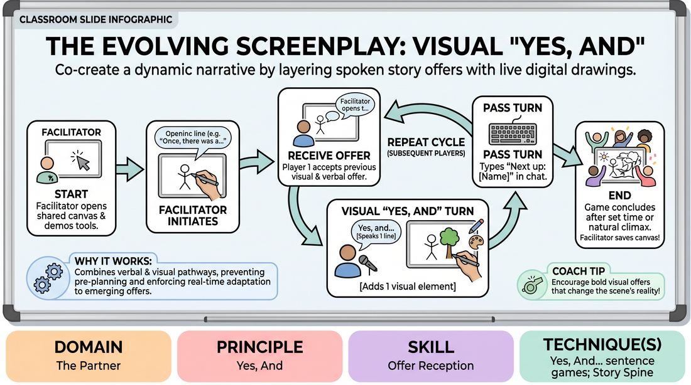

# The Evolving Screenplay

{ .game-hero }

> Co-create a dynamic narrative by layering spoken story offers with live digital drawings.

## Overview
A collaborative virtual storytelling game where players build a narrative both verbally and visually. Taking turns, each participant contributes a single line of dialogue or action while simultaneously drawing a corresponding element on a shared digital canvas. This dual-layered approach transforms a standard story-building exercise into a rich, multi-sensory collaborative canvas.

## What It Trains
- **Domain:** D2 — The Partner
- **Principle(s):** Yes, And; Make Your Partner a Genius; Serve the Story; Group Mind
- **Skill(s):** Active Listening; Offer Reception; Active Gifting; Narrative Architecture; World-Building; Peripheral Awareness
- **Technique(s):** Yes, And… sentence games; Story Spine; C.R.O.W. (Character, Relationship, Objective, Where)
- **Focus:** mixed

**Objective:** To develop deep offer reception and active listening by forcing players to integrate both verbal and visual cues, practicing the core 'Yes, And' principle across multiple modalities.

## Setup
Host a virtual meeting on a platform that supports screen sharing and participant annotations. Open a blank shared digital canvas (such as a collaborative whiteboard or slide). Ensure all participants have annotation permissions enabled and are in grid view with their text chat window open.

## How to Play
1. The facilitator shares a blank digital canvas on screen and briefly demonstrates how to use the platform's annotation tools (drawing, text, stamps, and colors), emphasizing that creative expression is valued over artistic perfection.
2. The facilitator establishes the turn-taking mechanism: after completing a turn, the active player must type the name of the next player in the text chat to pass the baton, bypassing audio latency.
3. The facilitator initiates the story by drawing a simple visual element on the canvas (e.g., a stick figure, a mysterious shape) and speaking the opening line of the narrative.
4. The first designated player receives the previous verbal line and visual drawing, accepting them fully as the reality of the scene.
5. The active player speaks one line of dialogue or action that directly builds upon ('Yes, Ands') the previous player's contribution.
6. Immediately after speaking, the player uses the annotation tools to add one new visual element to the canvas that represents, expands, or heightens their spoken line.
7. The player then types 'Next up: [Player Name]' in the text chat to officially pass the turn to the next storyteller.
8. Subsequent players repeat the cycle of listening, speaking, drawing, and passing, continuously weaving the verbal narrative and visual landscape together.
9. The game concludes after a set time or when the story reaches a natural, satisfying, or hilariously chaotic climax, at which point the facilitator saves a screenshot of the final canvas.

## Facilitation Notes
- Side-coach players to keep their drawings simple and fast (10-15 seconds max) to maintain the narrative momentum and prevent overthinking.
- If a player experiences technical difficulties with drawing, encourage them to use the text annotation tool to write a single word or use a simple stamp instead.
- Remind players to 'Yes, And' both elements: their spoken line must acknowledge the previous speaker's words, and their drawing should interact with the existing visual canvas.
- Pitfall: Players waiting for their turn might disengage. Fix: Encourage active physical reactions on camera (nodding, laughing) and keep the turn order unpredictable by letting players choose who they pass to next.
- If the canvas becomes too cluttered, the facilitator can use a selective erase tool to clear up dead space, framing it narratively as 'the camera panning' or 'time passing'.

## Variations
- Genre Constraints: Challenge the group to tell the story within a specific genre (e.g., sci-fi, noir mystery, fairy tale) which dictates both the tone of the dialogue and the style of the drawings.
- Blind Canvas: Players must close their eyes or look away while others are drawing, only looking back when it is their turn to receive the updated canvas and continue the story.
- Silent Cinema: Run a round where no one is allowed to speak; players must write their dialogue lines directly onto the canvas using the text tool alongside their drawings.

## Debrief
- How did having to draw your offer change how you listened to and processed the previous player's contribution?
- What did you notice about how the visual environment influenced the direction of the spoken plot?
- How did we handle moments where the drawing didn't perfectly match what was spoken? How did we 'Yes, And' those discrepancies?

## Safety & Inclusion
Ensure players know they can use simple stamps or text if fine-motor drawing with a mouse or trackpad is challenging. Remind the group to keep visual and verbal content collaborative, supportive, and accessible to all comfort levels.

## Why It Works
By combining verbal storytelling with real-time visual annotation, this game engages multiple cognitive pathways simultaneously. It prevents players from pre-planning their lines because they must adapt to the emerging visual landscape. The explicit chat-based handoff eliminates the awkward pauses of virtual latency, keeping the group mind highly synchronized.
