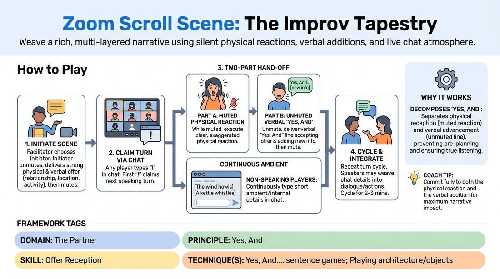

# The Digital Tapestry

{ .game-hero }

> Weave a rich, multi-layered narrative using silent physical reactions, verbal additions, and live chat atmosphere.

## Overview
A virtual ensemble game that transforms the limitations of video conferencing into a multi-layered storytelling engine. Players use gallery view, chat-based turn-taking, silent physical reactions, and text-based environmental offers to build a cohesive, highly detailed scene. The result is a rich narrative tapestry where every participant is constantly engaged, whether speaking or writing.

## What It Trains
- **Domain:** D2 — The Partner
- **Principle(s):** Yes, And; Make Your Partner a Genius; Group Mind; Base Reality First
- **Skill(s):** Active Listening; Offer Reception; Support Work; World-Building; Physicality & Space Work
- **Technique(s):** Yes, And… sentence games; Playing architecture/objects; C.R.O.W. (Character, Relationship, Objective, Where)
- **Focus:** mixed

**Objective:** To develop advanced offer reception and active listening in a virtual space, specifically training players to integrate physical, verbal, and textual offers simultaneously while practicing the core 'Yes, And' principle.

## Setup
Run on a video conferencing platform. All participants must have their cameras turned on and be in a grid or gallery view with the chat window open. Everyone starts muted. No physical props are required, but a stable internet connection is essential.

## How to Play
1. The facilitator requests a volunteer to initiate the scene with a strong physical and verbal offer establishing a relationship, location, and activity.
2. The initiating player unmutes, delivers their opening line with high physical commitment within their camera frame, and then mutes themselves.
3. To claim the next speaking turn, any player in the gallery must type a single exclamation mark ('!') into the chat window; the first to hit enter claims the turn.
4. The claiming player must perform a two-part hand-off: first, while remaining muted, they must execute a clear, exaggerated physical reaction (facial expression, gesture, or posture shift) responding to the previous speaker's offer.
5. Second, the claiming player unmutes and delivers a verbal 'Yes, And' line that accepts the previous offer and adds new narrative information, then mutes themselves again.
6. While the active speakers are exchanging lines, all non-speaking players must continuously type short, non-verbal environmental or internal details (e.g., '[The smell of burning toast fills the room]' or '[Thinking: I shouldn't have trusted them]') into the chat.
7. Active speakers may choose to organically weave these chat-based 'ambient offers' into their spoken dialogue or physical actions, though they are not obligated to do so.
8. The cycle of claiming turns via chat, reacting physically while muted, speaking a 'Yes, And' line, and contributing ambient chat details continues for 2 to 3 minutes until the facilitator calls 'Scene!'

## Facilitation Notes
- Coaching Cue: 'React before you speak!' Remind players to hold their muted physical reaction for a full second before unmuting to deliver their line, ensuring the visual offer is fully received by the group.
- Pitfall: Players typing dialogue or speaking turns in the chat instead of ambient details. Fix: Remind the group that the chat is strictly for sensory, environmental, or internal subtext, not spoken lines.
- Coaching Cue: 'Watch the whole grid!' Encourage players to keep their eyes on the gallery view rather than just their own camera feed, fostering a sense of Group Mind.
- Pitfall: Lag or typing speed disparity causing the same few players to claim every turn. Fix: The facilitator can step in to gently moderate, calling on players who haven't spoken yet or setting a rule that you cannot speak twice in a row.

## Variations
- The Emotional Tapestry: Each ambient chat offer must dictate an emotional shift for the active speakers, who must immediately adopt the suggested emotion.
- Subtext Scroll: The chat is used exclusively for the inner monologues of the active characters, revealing their secret thoughts to the audience while they maintain a polite spoken conversation.
- Soundscape Tapestry: Non-speaking players use their microphones to make subtle, muted-loop sound effects (like wind, ticking clocks, or rain) instead of typing in the chat.

## Debrief
- How did the requirement to react physically while muted change how you listened to your partner's verbal offer?
- What was it like to balance the spoken dialogue with the ambient details appearing in the chat?
- How did the chat-based turn-taking affect the pacing and tension of the scene compared to a standard verbal scene?
- In what ways did the ambient chat offers help build a stronger, more detailed Base Reality?

## Safety & Inclusion
Ensure all participants are comfortable with having their cameras on; if a participant has accessibility needs that prevent camera use, they can participate fully as the 'Ambient Voice' by contributing exclusively to the chat, or by using audio-only cues with a designated visual proxy.

## Why It Works
This game works because it decomposes the 'Yes, And' process into distinct, sequential steps: physical reception (the muted reaction) and verbal advancement (the unmuted line). By separating these elements, it prevents players from planning their lines while their partner is speaking, forcing deep active listening. Additionally, the simultaneous chat contributions keep the entire ensemble active, building a shared Group Mind and a rich Base Reality that goes beyond simple two-person dialogue.
