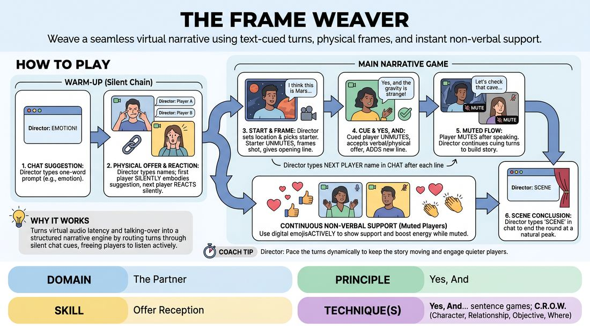

# Grid Weavers

{ .game-hero }

> Weave a seamless virtual narrative using text-cued turns, physical frames, and instant non-verbal support.

## Overview
Grid Weavers is a virtual-native improv game designed to turn the limitations of video conferencing into creative assets. A facilitator acts as the Director, using the text chat to dynamically cue the next speaker, eliminating audio overlap and heightening active listening. Players collaboratively build a story by accepting and expanding on both the verbal and visual offers of their peers, while muted players provide continuous support using digital reactions.

## What It Trains
- **Domain:** D2 — The Partner
- **Principle(s):** Yes, And; Serve the Story; Group Mind
- **Skill(s):** Physicality & Space Work; Active Listening; Offer Reception; World-Building; Support Work
- **Technique(s):** Yes, And… sentence games; C.R.O.W. (Character, Relationship, Objective, Where); Playing architecture/objects
- **Focus:** mixed

**Objective:** To develop advanced offer reception and multi-modal Yes, And skills in a virtual environment, training players to build stories collaboratively by integrating verbal, physical, and digital cues.

## Setup
Players join a virtual meeting room with their cameras on, set to grid view so everyone is visible. All players should have their text chat window open and have access to digital reaction emojis. Players are encouraged to have a few virtual backgrounds pre-loaded or be ready to use their physical space creatively. One person is designated as the Director.

## How to Play
1. The Director requests a simple, one-word suggestion (such as an emotion, object, or location) from the group via the text chat.
2. To warm up, the Director types a player's name in the chat; that player must silently embody the suggestion using facial expressions, upper-body movement, or a virtual background for five seconds.
3. The Director rapidly types a second player's name, who must immediately react silently to the first player's physical offer, establishing a silent chain reaction across the grid for one minute.
4. For the main narrative game, the Director solicits an unusual location suggestion in the chat and designates a starting player to begin the scene.
5. The starting player unmutes, adjusts their virtual background or physical framing to match the location, and delivers a single opening line establishing their character, relationship, and environment.
6. Immediately after the line, the Director types the name of the next player in the chat; only the named player may unmute to speak, while all other players remain muted.
7. The cued player must immediately Yes, And the previous speaker's verbal line, physical posture, and background, adding a new narrative offer before muting themselves again.
8. While muted, all non-speaking players must actively use digital reaction emojis (like hearts, thumbs-up, or applause) to show continuous, non-verbal support and agreement with the active speaker.
9. The Director continues to weave the story by typing names in the chat, dynamically pacing the turns, bringing in quiet players, and guiding the narrative toward a satisfying climax.
10. Once the story reaches a natural peak, the Director types SCENE in the chat to conclude the round.

## Facilitation Notes
- Coaching Cue: Remind players to keep their eyes on the grid, not just the chat. They must react to the visual offers (backgrounds, physical shifts) as much as the spoken words.
- Pitfall: The Director typing too slowly, causing dead air. Fix: The Director should have their fingers ready on the keyboard and type the next name 2-3 seconds before the current speaker finishes their thought.
- Coaching Cue: Encourage players to use their physical frame dynamically—leaning in for secrets, ducking out of frame, or moving side-to-side to simulate shared space.
- Pitfall: Players getting distracted trying to find the perfect virtual background mid-scene. Fix: Instruct players to use whatever background they currently have or rely purely on physical object work if they cannot switch backgrounds within two seconds.
- Coaching Cue: Keep the digital reactions flowing constantly. It creates a virtual laugh track and provides immediate psychological safety for the speaker.

## Variations
- Character Renaming: Before starting, have players rename their display names to reflect their character's role or relationship to the protagonist.
- Background Roulette: The Director private-messages a random virtual background theme to a player, who must immediately turn it on and justify why their character is suddenly in that new environment.
- Sound Effects Track: Designate one muted player as the Foley Artist who is allowed to unmute briefly to provide real-time sound effects matching the physical actions on screen.

## Debrief
- How did having your turn dictated by the chat cue change how closely you listened to the entire story?
- In what ways did you Yes, And a visual offer (like a background or a physical gesture) rather than just the spoken words?
- How did receiving constant digital reactions from your muted peers affect your confidence while speaking?
- What strategies did we use to make our separate video frames feel like a single, shared physical space?

## Safety & Inclusion
Ensure all players are comfortable with having their cameras on. If a player has technical limitations preventing virtual backgrounds, explicitly state that physical object work, expressive facial work, or creative camera angles are equally valuable and welcome. Allow players to use standard text chat to contribute if they experience sudden audio issues.

## Why It Works
This game succeeds by turning the technical friction of virtual platforms—specifically audio latency and the talking over each other phenomenon—into a structured narrative engine. By routing turn-taking through a silent chat cue, it frees players from the anxiety of timing their entry and forces deep, continuous listening. It expands the concept of Yes, And into a multi-modal practice: players must accept verbal offers, visual framing offers, and support each other through non-verbal digital reactions, building a tight-knit group mind despite physical distance.
