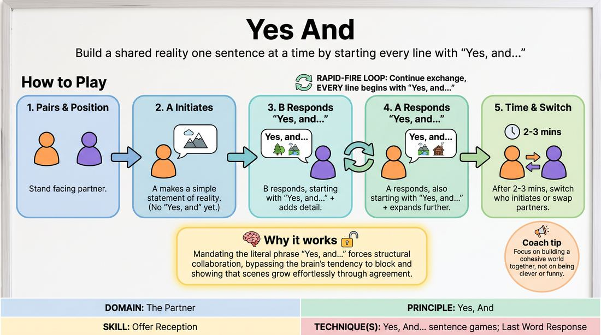

# Yes, And Sentence Build

{ .game-hero }

> Build a shared reality one sentence at a time by starting every line with "Yes, and..."

## Overview
A foundational two-player drill where partners co-create a scene by strictly beginning every single line with the phrase "Yes, and..." This constraint forces players to explicitly validate their partner's previous statement before adding their own new contribution. It transforms abstract agreement into a concrete, physicalized linguistic habit.

## What It Trains
- **Domain:** D2 — The Partner
- **Principle(s):** Yes, And; Make Your Partner a Genius
- **Skill(s):** Active Listening; Offer Reception; Active Gifting; World-Building
- **Technique(s):** Last Word Response; Yes, And… sentence games; Endowment-gifting drills; C.R.O.W. (Character, Relationship, Objective, Where)
- **Focus:** skill_drill

**Objective:** To build muscle memory for active listening and immediate offer acceptance, training players to treat every partner contribution as an absolute truth to be expanded upon.

## Setup
Players stand or sit in pairs facing each other. No props, stage, or special materials are required. The facilitator can run this for the entire room simultaneously in pairs.

## How to Play
1. Divide the group into pairs and have partners stand facing one another.
2. Instruct Player A to initiate the scene with a simple, clear statement of reality (e.g., "We are standing on the edge of a volcano"). This first line does not need to start with "Yes, and".
3. Player B must respond by starting their sentence with the exact words "Yes, and..." followed by a new detail that builds directly on Player A's premise.
4. Player A must then respond, also starting their sentence with "Yes, and..." to accept Player B's addition and expand the scene further.
5. Continue this rapid-fire back-and-forth exchange, ensuring every single line (except the very first initiation) begins with the literal phrase "Yes, and..."
6. Encourage players to focus on building a cohesive narrative or environment together, rather than trying to be funny or clever.
7. Run the exercise for 2 to 3 minutes, then have partners switch who initiates, or swap partners for a second round.

## Facilitation Notes
- Side-coaching cue: "Listen to the whole sentence before you start formulating your Yes, and." This prevents players from planning ahead.
- Common Pitfall: Saying "Yes, but..." or "Yes, and..." followed by a contradiction (e.g., "Yes, and actually we aren't at a volcano, we are at a beach"). Fix: Remind players that "Yes" means accepting the reality as 100% true, and "And" means adding to it, not rewriting it.
- Side-coaching cue: "Keep your additions small!" A tiny, specific detail is much easier for your partner to build on than a massive plot twist.
- Common Pitfall: Treating "Yes, and" as a meaningless speedbump. Fix: Encourage players to pause slightly after saying "Yes, and" to let the agreement land before they deliver their new offer.

## Variations
- Storytelling Circle: Run the game in a larger circle where each player adds one "Yes, and..." sentence to build a single cohesive group story.
- The Infomercial: Partners act as TV co-hosts selling a bizarre product. Every line must start with "That's right, [Partner's Name], and..." to heighten the features of the product.
- Silent Agreement: Players do the same exercise but must perform a physical action (object work) that matches their "Yes, and" statement, grounding the verbal agreement in physical reality.

## Debrief
- How did it feel to have every single one of your offers immediately accepted and built upon?
- Did you ever find yourself planning your next line while your partner was still speaking? How did that affect the scene?
- What is the difference between agreeing intellectually ("Yes") and contributing actively ("And")?

## Safety & Inclusion
Ensure players are aware they can set boundaries on the content of the scene. If a partner introduces a premise that makes the other uncomfortable, they can pause, reset, or gently redirect the scene's focus without penalty.

## Why It Works
By mandating the literal words "Yes, and", the game bypasses the analytical brain's default tendency to block, negotiate, or control. It forces a structural commitment to collaboration, demonstrating that scenes grow effortlessly when players focus on elevating their partner's ideas rather than inventing their own isolated plotlines.
