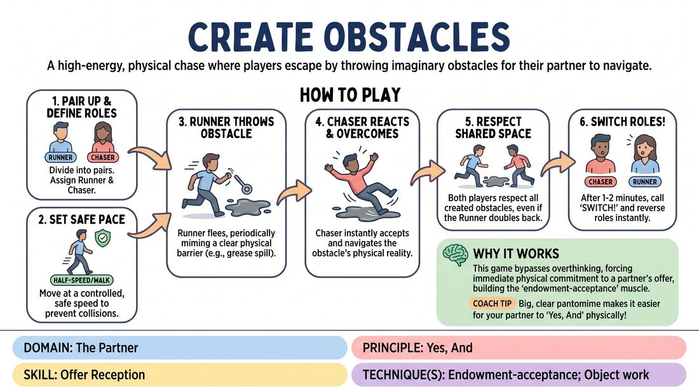

# Obstacle Chase

{ .game-hero }

> A high-energy, physical chase where players escape by throwing imaginary obstacles for their partner to navigate.

## Overview
In this high-energy physical warm-up, pairs engage in a controlled chase across the room. The player being pursued dynamically creates imaginary physical barriers through clear pantomime, and the pursuer must instantly accept, physically commit to, and overcome these obstacles to keep up the chase.

## What It Trains
- **Domain:** D2 — The Partner
- **Principle(s):** Commit 100%; Yes, And; Make Your Partner a Genius
- **Skill(s):** Physicality & Space Work; Offer Reception; Active Gifting
- **Technique(s):** Object work; Endowment-acceptance; Endowment-gifting drills
- **Focus:** skill_drill

**Objective:** To develop instant physical agreement and endowment-acceptance by treating imaginary offers as real, high-stakes physical realities.

## Setup
A large, open room cleared of actual physical hazards (bags, chairs, cables). Players pair up and find their own starting space in the room.

## How to Play
1. Divide the group into pairs and spread them out across the designated play area.
2. Designate one player in each pair as the 'Runner' and the other as the 'Chaser.'
3. Instruct all players to move at a safe, controlled pace—such as a brisk walk or half-speed—to prevent actual collisions.
4. The Runner begins to flee, periodically looking back to physically 'throw' or establish a mimed obstacle in the path of the Chaser (e.g., pulling down a heavy gate, spilling grease, or summoning a laser grid).
5. The Chaser must instantly accept the reality of the obstacle, reacting physically to its specific properties (e.g., slipping on the grease, ducking under the gate, or carefully stepping through the lasers) before continuing the pursuit.
6. The Runner must also respect their own created obstacles if they double back, keeping the shared physical space consistent.
7. After one to two minutes of play, the facilitator calls out 'Switch!' and the roles of Runner and Chaser instantly reverse.

## Facilitation Notes
- Coaching cue: 'Make it big and clear!' Encourage runners to use clear, exaggerated physical gestures so their partner knows exactly what the obstacle is.
- Coaching cue: 'Commit to the physics!' Remind chasers to show the weight, height, or texture of the obstacle rather than just bypassing it instantly.
- Pitfall: Players moving too fast, risking safety. Fix: Enforce a strict 'half-speed' or 'slow-motion' rule to keep the focus on physical storytelling rather than actual athletic competition.
- Pitfall: Vague obstacles that the partner cannot read. Fix: Side-coach the runners to use their whole body to define the boundaries of the obstacle (e.g., tracing the top of a wall or showing the struggle of opening a heavy door).

## Variations
- Slow-Motion Matrix: Run the entire exercise in extreme slow-motion, emphasizing hyper-detailed physical reactions and gravity-defying leaps.
- Vocalized Sound Effects: Players must add vocal sound effects to their obstacles (e.g., 'Whoosh!', 'Sizzle!') to help define the physical properties of the hazard.
- Tag-Team Relay: Run this with larger groups where a runner can tag a bystander to take over their role, dynamically shifting who is chasing whom.

## Debrief
- How did committing 100% to the physical reality of the obstacle make your partner look good?
- What did you have to pay attention to in order to instantly 'Yes, And' a physical offer?
- How did the speed of your reaction affect the fun and momentum of the chase?

## Safety & Inclusion
Ensure the floor is completely clear of physical hazards. Emphasize that this is a game of physical storytelling, not a race; physical contact is not required to 'catch' the partner. Players with mobility limitations can play at a walking or seated pace, using upper-body gestures to establish and navigate obstacles.

## Why It Works
This game bypasses the analytical brain by forcing players into high-energy physical action. By requiring the Chaser to immediately adapt to the Runner's physical offers, it builds the muscle of endowment-acceptance—treating a partner's imaginary creation as an absolute, unshakeable truth.
