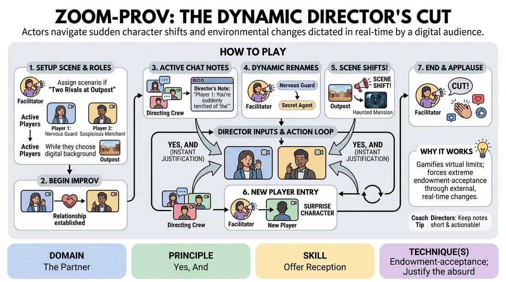

# The Live Edit

{ .game-hero }

> Actors navigate sudden character shifts and environmental changes dictated in real-time by a digital audience.

## Overview
The Live Edit is a high-energy virtual improv game where active players perform a scene while the remaining participants act as a live directing crew. Using the platform's chat, renaming, and background features, the directors inject sudden constraints, character changes, and environmental shifts that the actors must instantly accept and justify. The result is a fast-paced, chaotic, and highly collaborative exercise in radical adaptability.

## What It Trains
- **Domain:** D2 — The Partner
- **Principle(s):** Yes, And; The First Thought Is a Gift; The Audience Is the Final Scene Partner
- **Skill(s):** Active Listening; Offer Reception; Unfiltered Spontaneity; Justification; Room Reading
- **Technique(s):** Endowment-acceptance; Justify the absurd; First Thought drills
- **Focus:** mixed

**Objective:** To develop advanced offer reception and endowment-acceptance under high cognitive load, training players to instantly treat external, unexpected digital inputs as absolute truths.

## Setup
Conducted on a virtual meeting platform with gallery view enabled. All participants must have their text chat panels open. The facilitator (or a co-facilitator) must have host privileges to rename participants and spotlight video feeds. Players should have a few diverse digital backgrounds pre-loaded or easily accessible, though default platform backgrounds or simple physical adjustments work too.

## How to Play
1. The facilitator establishes a simple, open-ended starting scenario (e.g., 'Two rivals meet at a remote outpost') and casts 2 to 3 active players, while the remaining participants form the 'Directing Crew' (the audience).
2. The facilitator immediately renames the active players' display names to reflect their starting roles (e.g., 'Player 1: The Nervous Guard', 'Player 2: The Suspicious Traveler').
3. The active players select a digital background that fits the starting location and begin improvising their scene, establishing their relationship and objective.
4. The Directing Crew actively types short, actionable 'Director's Notes' into the text chat (e.g., 'Player 1: You are suddenly terrified of the word "the"' or 'Player 2: Reveal you have a hidden map').
5. Active players must continuously monitor the chat and instantly integrate these notes into their performance, using the principle of 'Yes, And' to justify the new endowments without breaking character.
6. At any moment, the facilitator can dynamically rename an active player to a completely new character (e.g., changing 'The Nervous Guard' to 'The Secret Agent'), forcing an immediate shift in status, voice, and objective.
7. The facilitator may also spotlight a new player from the Directing Crew and rename them, instantly dropping them into the scene as a surprise character who must be integrated immediately.
8. The facilitator can call out a 'Scene Shift!', prompting all active players to instantly change their digital backgrounds to a new environment, which they must immediately justify in their dialogue.
9. After 3 to 5 minutes of rapid-fire changes, the facilitator calls 'Cut!' to end the scene, followed by a brief round of applause using digital reactions.

## Facilitation Notes
- Coaching Cue: 'Read and react!' Remind players to keep one eye on the chat and immediately physicalize or verbalize the very first note they see rather than waiting for a 'better' one.
- Pitfall: The chat moves too fast, overwhelming the actors. Fix: Instruct the Directing Crew to only post one note every 15-20 seconds, or have the facilitator read key chat notes aloud to assist the actors.
- Coaching Cue: 'Justify the change!' When a player's name is changed mid-scene, they shouldn't ignore it; they must immediately explain why their identity has shifted (e.g., 'Aha! My disguise is blown!').
- Pitfall: Technical lag when changing backgrounds. Fix: If a player cannot change their digital background quickly, have them describe the new environment verbally or use physical object work to represent the shift.

## Variations
- The Silent Director: The Directing Crew can only use non-verbal reaction emojis to guide the scene's emotional temperature, with actors escalating their choices whenever they see a specific emoji.
- The Tag-Team Edit: When the facilitator spotlights a new player, the player they replace must instantly freeze and pass their current character's objective to the newcomer.

## Debrief
- How did it feel to balance listening to your scene partner with reading the incoming chat directives?
- What strategies did you use to instantly justify a sudden change in your character's identity or environment?
- How does treating a sudden digital disruption as a 'gift' change your relationship to mistakes or unexpected changes?

## Safety & Inclusion
Ensure all participants are aware that they can opt out of being spotlighted as an active actor and remain in the Directing Crew. Remind the Directing Crew that chat directives must remain respectful, safe, and supportive, avoiding prompts that force physical strain or uncomfortable personal disclosures.

## Why It Works
This game works by gamifying the limitations of virtual communication. By turning the chat panel and renaming features into active narrative engines, it forces players to practice extreme endowment-acceptance. Because the changes are external and rapid, players cannot overthink or plan ahead; they must rely on their first instinct, fostering unfiltered spontaneity and deep trust in their partner's ability to 'Yes, And' the chaos.
