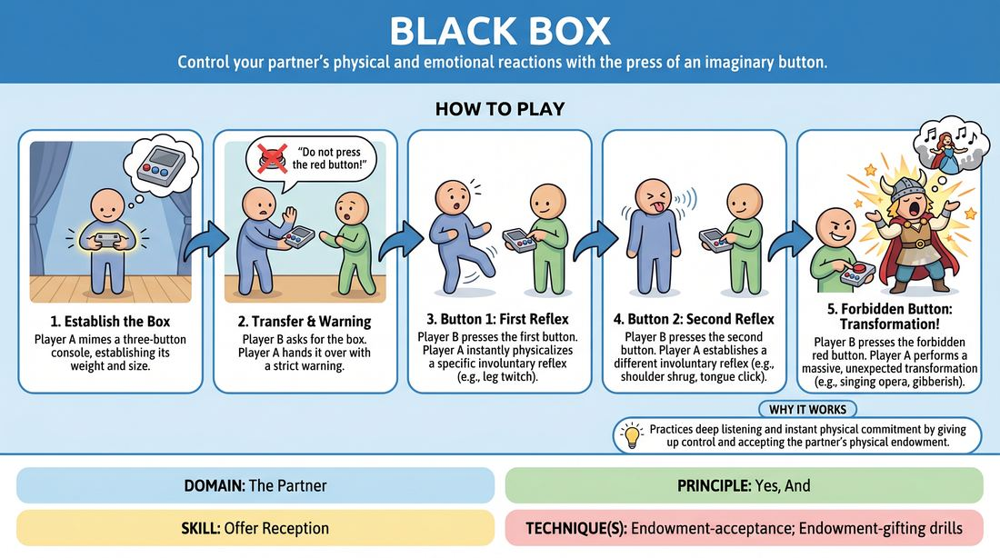

# The Three-Button Box

{ .game-hero }

> Control your partner's physical and emotional reactions with the press of an imaginary button.

## Overview
Two players share a scene centered around a mimed control box featuring three buttons, including a forbidden red one. As one player presses the buttons, the other instantly physicalizes and heightens the resulting behaviors, building anticipation for the final, chaotic button press.

## What It Trains
- **Domain:** D2 — The Partner
- **Principle(s):** Yes, And; The First Thought Is a Gift; Show, Don't Tell
- **Skill(s):** Offer Reception; Active Gifting; Physicality & Space Work; Emotional Fluidity; Game Identification; Heightening & Exploration
- **Technique(s):** Endowment-acceptance; Endowment-gifting drills; Object work; The Emotional Dial (1→10); Finding & Playing the Game; The 'ladder' (escalating beats)
- **Focus:** comedy_game

**Objective:** To practice instant physical and emotional endowment-acceptance, active gifting, and collaborative game-building by responding immediately to a partner's physical prompts.

## Setup
Two players stand in the performance space. No physical props are needed; the control box is entirely mimed. The rest of the group watches as the audience.

## How to Play
1. Player A begins on stage holding a mimed, hand-held console with three distinct buttons, establishing its weight and size through object work.
2. Player B enters the scene, notices the device, and asks to interact with it. Player A hands it over but delivers a strict warning: 'You can press the first two, but whatever you do, never press the red button!'
3. Player B takes the console and presses the first button. Player A must instantly react with a specific, involuntary physical or vocal reflex (e.g., a leg twitch, a high-pitched squeak, or a sudden salute).
4. Player B presses the second button, and Player A immediately establishes a different involuntary reaction (e.g., a shoulder shrug, a tongue click, or a sudden spin).
5. Player B plays with these first two buttons, combining them, pressing them rapidly, or holding them down, while Player A physicalizes these commands with precise timing and commitment.
6. Player B eventually yields to temptation and presses the forbidden red button.
7. Upon the red button press, Player A undergoes a massive, unexpected transformation—such as a dramatic mood swing, speaking in gibberish, singing opera, or a total personality shift—which both players then explore and heighten to close the scene.

## Facilitation Notes
- Side-coach Player A to react instantly without thinking; the first physical reaction that comes to mind is the correct one.
- Encourage Player B to vary the rhythm of their button presses (e.g., double-tapping, holding down) to help Player A find the comedic game of the physical reactions.
- Pitfall: Player B presses the red button too quickly. Fix: Remind Player B to build anticipation and fully explore the first two buttons before triggering the climax.
- Ensure Player A's reactions are safe and sustainable; they should avoid high-impact physical drops or strains.

## Variations
- The Dial: Replace one of the buttons with a dial that Player B can turn to increase or decrease the intensity of Player A's reaction from 1 to 10.
- The Shared Console: Both players have a console that controls the other, leading to a chaotic, mutual remote-control battle.
- The Emotional Remote: Instead of physical reflexes, the first two buttons trigger specific, contrasting emotional states (e.g., extreme grief and intense joy).

## Debrief
- How did it feel to have your physical movements dictated entirely by your partner's timing?
- For the controller, how did you use repetition and rhythm to help your partner find the comedy in their physical reactions?
- What made the red button press satisfying, and how did you handle the sudden shift in the scene's reality?

## Safety & Inclusion
Ensure players establish physical boundaries before starting. Players should only perform physical movements that are safe for their bodies, and the controller must respect the physical limits of the performer being controlled.

## Why It Works
This game relies on the core principle of 'Yes, And' through physical endowment. By giving up control of their own body to their partner, the reacting player practices deep listening and instant physical commitment. The controller learns to gift clear offers and identify the comedic game through repetition and pacing.
