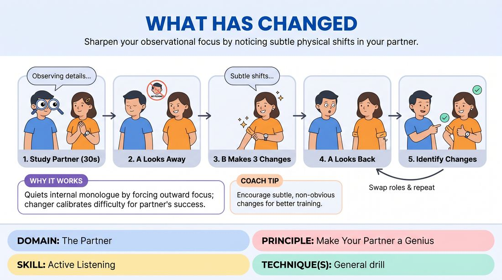

# What Has Changed

{ .game-hero }

> Sharpen your observational focus by noticing subtle physical shifts in your partner.

## Overview
What Has Changed is a quiet, paired exercise where players closely study each other's appearance, make subtle physical alterations while the other's eyes are closed, and then identify the changes. This simple game builds deep, non-verbal connection and hyper-awareness of one's partner.

## What It Trains
- **Domain:** D2 — The Partner
- **Principle(s):** Make Your Partner a Genius
- **Skill(s):** Active Listening
- **Focus:** connection

**Objective:** To develop acute visual observation and active listening, training players to focus entirely on their partner rather than their own internal thoughts.

## Setup
Players stand in pairs facing each other with about two feet of space between them in an open room. No props or special materials are needed.

## How to Play
1. Divide the group into pairs and have partners stand facing each other.
2. Designate one player as Partner A and the other as Partner B.
3. Instruct Partner A to silently study Partner B's physical appearance for thirty seconds, paying close attention to details like clothing, hair, posture, and accessories.
4. Have Partner A close their eyes or turn around so they cannot see Partner B.
5. Instruct Partner B to make exactly three subtle changes to their appearance, such as rolling up a sleeve, moving a ring, or untying a shoe.
6. Have Partner A open their eyes or turn back around to face Partner B.
7. Partner A must observe Partner B and identify all three changes.
8. Swap roles so Partner B observes and Partner A makes the changes.

## Facilitation Notes
- Coaching cue: Look for the tiny details, not just the obvious ones. Make your partner the absolute center of your universe right now.
- Pitfall: Players making changes that are completely hidden or impossible to see. Fix: Remind players that the goal is to help their partner succeed, not to trick them. Make changes visible but subtle.
- Coaching cue: If your partner is struggling, give them a warm, non-verbal hint with your eyes or posture to make them look like a genius.
- Encourage players to maintain a supportive, playful attitude rather than a competitive one.

## Variations
- The Posture Shift: Instead of changing physical clothing or accessories, players change three small things about their physical posture or facial expression.
- Speed Round: Reduce the observation time to ten seconds and make only one change to heighten the focus.
- The Group Circle: One person leaves the room, the circle changes three things collectively, and the guesser returns to find the changes.

## Debrief
- How did it feel to have someone look at you with such focused, non-judgmental attention?
- What strategies did you use to remember your partner's details?
- How does this level of visual observation translate to supporting your partner on stage during a scene?

## Safety & Inclusion
Remind players to respect physical boundaries; do not touch the partner's body or clothing. If closing eyes is uncomfortable or inaccessible, players can simply turn their backs. Adjust the game for visually impaired players by focusing on vocal or auditory changes instead.

## Why It Works
By forcing players to focus outward rather than inward, it quiets the internal monologue. It embodies making your partner a genius because the changer must calibrate the difficulty so their partner can successfully spot the changes, building mutual trust and deep connection.
