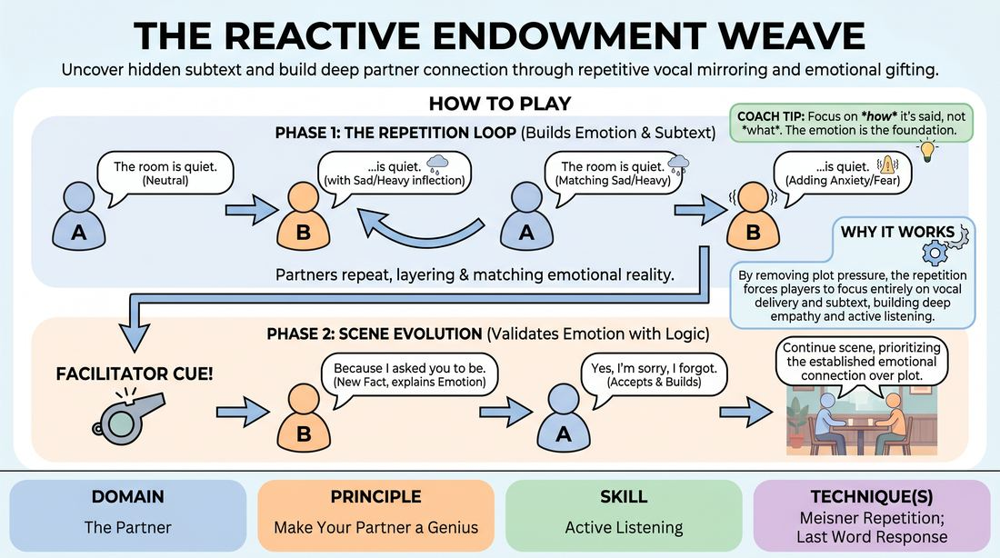

# The Resonance Weave

{ .game-hero }

> Uncover hidden subtext and build deep partner connection through repetitive vocal mirroring and emotional gifting.

## Overview
This two-player exercise bridges the gap between pure repetition and organic scene initiation. Players begin by echoing and emotionally coloring each other's exact words, gradually shifting their relationship and status through vocal inflection alone. Once a rich emotional foundation is established, they transition into a fully realized scene built on mutual support.

## What It Trains
- **Domain:** D2 — The Partner
- **Principle(s):** Yes, And; Make Your Partner a Genius; Assume Competence
- **Skill(s):** Active Listening; Status Modulation; Single-Partner Empathy & Mirroring; Offer Reception; Active Gifting; Emotional Fluidity; Vocal Craft
- **Technique(s):** Meisner Repetition; Last Word Response; Status Seesaw; Emotional-echo drills; Yes, And… sentence games; Endowment-acceptance; Endowment-gifting drills; Give them the answer
- **Focus:** connection

**Objective:** To develop advanced active listening and emotional attunement by training players to read, accept, and amplify the subtle vocal and physical subtext behind their partner's words.

## Setup
Players stand in pairs facing each other in a quiet space, maintaining soft but steady eye contact. No props or physical stages are required. The facilitator prepares to offer simple, neutral starting observations.

## How to Play
1. Begin in pairs. Player A initiates the exchange by stating a simple, neutral observation about the immediate environment or a basic fact (e.g., 'The room is quite warm').
2. Player B immediately repeats only the last two to four words of Player A's statement, but infuses them with a distinct, unstated emotional tone or status shift using only vocal inflection and body language (e.g., whispering '...quite warm?' with sudden suspicion).
3. Player A absorbs this emotional endowment and repeats their original statement, adjusting their own delivery to validate and match the emotional reality introduced by Player B (e.g., 'Yes, it is quite warm in here' spoken with growing anxiety).
4. Player B then echoes the last few words of Player A's new statement, adding another layer of emotional subtext or status modulation. The partners continue this tight loop of echoing and endowing for two to three minutes, letting the emotional stakes naturally escalate.
5. On the facilitator's cue, the pair transitions to Phase Two: Scene Evolution. Player B introduces a brand-new, logical piece of information that explains or expands upon the established emotional tension (e.g., 'Yes, and the thermostat has been locked since the incident last winter').
6. Player A accepts this new information and builds upon it using an implicit or explicit 'Yes, and' approach, establishing a clear relationship, setting, or narrative context.
7. The players continue to build the scene collaboratively, prioritizing the emotional connection and status dynamics established in the first phase over rapid plot progression.

## Facilitation Notes
- Coaching Cue: If players get stuck in a monotonous loop, call out 'Shift the temperature!' to encourage a sudden, bold change in vocal inflection or status.
- Pitfall: Players often try to add new narrative information too early in Phase One. Fix: Remind them that Phase One is strictly for emotional and vocal exploration of the repeated words; no new facts allowed.
- Coaching Cue: Encourage players to focus on their partner's eyes and breathing. The physical cues of an emotional shift often precede the vocal delivery.
- Pitfall: The transition to Phase Two can feel jarring. Fix: Instruct players to carry the exact emotional state from the final repetition directly into their first 'Yes, and' statement.

## Variations
- Status Seesaw: Assign one player high status and the other low status. They must use the vocal repetitions in Phase One to subtly challenge, yield, or reinforce these power dynamics.
- Undercurrents: The facilitator secretly assigns a specific underlying emotion (e.g., grief, jealousy, or awe) to one player, which they must slowly infect their partner with through the repetition.
- Silent Echoes: Run Phase One entirely through physical mirroring and non-verbal vocalizations (sighs, hums, gasps) before launching into spoken dialogue for Phase Two.

## Debrief
- How did it feel to have your own words returned to you with a completely different emotional meaning?
- What physical or vocal cues did your partner use that made their emotional endowment easiest to read and accept?
- How did establishing a strong emotional foundation in Phase One change the way you made narrative choices in Phase Two?

## Safety & Inclusion
Because this game requires sustained eye contact and close emotional mirroring, players should be reminded that they can adjust the intensity of their gaze or step back slightly to maintain comfortable personal space. Encourage participants to communicate any boundaries regarding intense emotional themes before beginning.

## Why It Works
By stripping away the pressure to invent plot, the repetition mechanic forces players to focus entirely on vocal delivery, subtext, and physical presence. This builds deep empathy and active listening, as players must truly receive their partner's emotional offer before they can respond. When narrative elements are finally introduced, they rest on a rock-solid foundation of mutual attunement.
