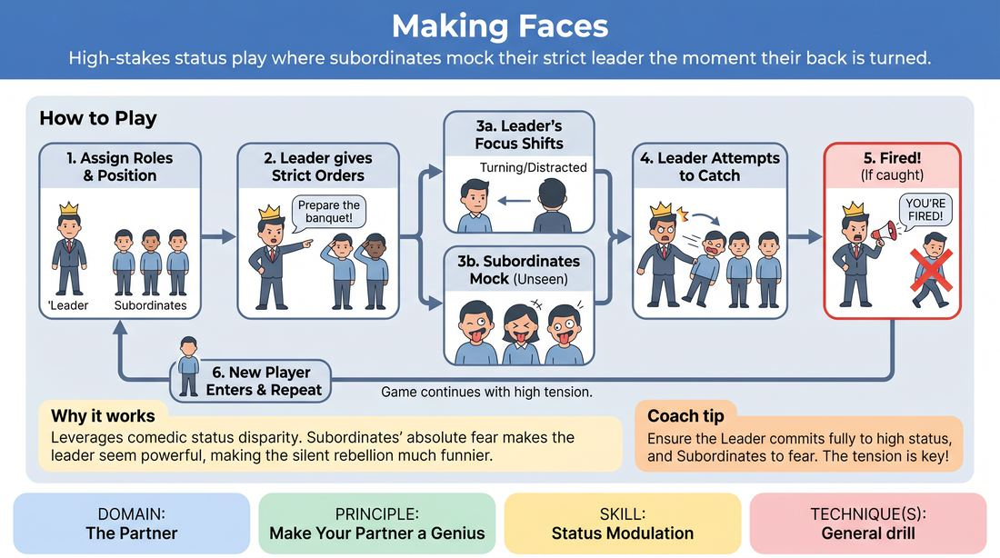

# Making Faces

{ .game-hero }

> High-stakes status play where subordinates mock their strict leader the moment their back is turned.

## Overview
A high-energy status game where one player acts as a demanding leader giving orders to a line of subordinates. While the leader's attention is diverted, the subordinates must pull extreme faces and mock them, risking instant dismissal if caught. It creates a playful tension between absolute authority and silent rebellion.

## What It Trains
- **Domain:** D2 — The Partner
- **Principle(s):** Make Your Partner a Genius; Commit 100%
- **Skill(s):** Status Modulation; Physicality & Space Work; Peripheral Awareness
- **Focus:** comedy_game

**Objective:** To develop status modulation, physical commitment, and peripheral awareness while supporting the leader's high-status authority.

## Setup
Set up a line of three to four chairs (or standing spots) for the active subordinates. One player stands in front of them as the Leader. The remaining players form a queue offstage, ready to sub in.

## How to Play
1. Assign one player to be the high-status Leader and three to four players to be the low-status Subordinates standing or sitting in a line facing them.
2. The Leader initiates a scene where they are planning an event or giving strict, detailed instructions to their staff (e.g., preparing a royal banquet or organizing a high-stakes corporate launch).
3. The Leader must physically turn their attention to different subordinates, addressing them directly and demanding absolute obedience.
4. Whenever the Leader is not looking directly at a subordinate (either because their back is turned or they are addressing someone else), that subordinate must immediately pull exaggerated, mocking faces or make silent, rebellious gestures.
5. The Leader must try to catch the subordinates in the act by turning around suddenly or shifting their gaze unexpectedly.
6. If the Leader catches a subordinate making a face, they must immediately 'fire' them with high-status outrage (e.g., 'You're finished! Pack your bags!').
7. The fired player immediately exits, and a new player from the queue steps in to take their place as a new subordinate.
8. The game continues with the Leader maintaining their high-status dominance and the subordinates constantly pushing the boundaries of risk to make the Leader's authority feel genuinely threatened and comical.

## Facilitation Notes
- Coaching cue: 'Leader, commit to your high status! Be demanding and strict, but don't just spin in circles—give real instructions to build the scene.'
- Coaching cue: 'Subordinates, make your partner look like a genius by reacting with absolute terror and submission when they look at you, and instant defiance when they don't.'
- Pitfall: Subordinates play too safe, barely moving their faces. Fix: Encourage them to take massive physical risks, pulling faces that require full-body commitment.
- Pitfall: The Leader spins around constantly like a radar dish, making it impossible to play. Fix: Remind the Leader that they must actually deliver content and engage in the scene to make their sudden turns surprising.

## Variations
- Physical Mockery: Subordinates must mimic the Leader's physical posture or walk behind their back instead of just making faces.
- Vocal Rebellion: Subordinates can make quiet, rebellious noises (like raspberries or sighs) that must stop instantly when the Leader turns.
- The Cooperative Coup: Subordinates try to pass a silent, rebellious physical gesture down the line without the Leader noticing who started it.

## Debrief
- How did committing to absolute fear/submission make the Leader's high status more effective?
- What did you notice about your peripheral awareness when trying to time your faces?
- How does taking big physical risks as a subordinate help build the comedy of the scene?

## Safety & Inclusion
Ensure physical movements and facial expressions do not mock real-world physical or cognitive disabilities. Remind players to keep the physical space clear so players subbing in and out can move safely without tripping.

## Why It Works
It relies on the classic comedic tension of status disparity. By playing the fear 100%, the subordinates make the leader look incredibly powerful (making their partner a genius), which in turn makes the silent rebellion much funnier and higher-stakes.
