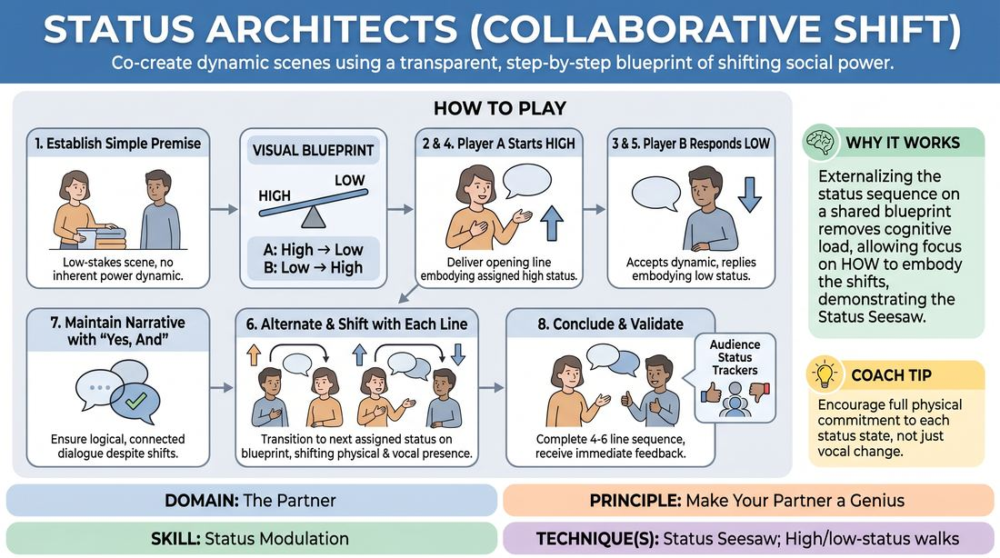

# Status Architects

{ .game-hero }

> Co-create dynamic scenes using a transparent, step-by-step blueprint of shifting social power.

## Overview
Status Architects is a structured, collaborative scene-building exercise where two players improvise a scene guided by an explicit, pre-determined sequence of status shifts. Instead of guessing or discovering power dynamics organically, players work from a shared visual blueprint, consciously modulating their physical and vocal presence line-by-line. This transparent approach demystifies status, turning it into a playful, supportive physical game rather than a source of narrative tension.

## What It Trains
- **Domain:** D2 — The Partner
- **Principle(s):** Yes, And; Make Your Partner a Genius; Assume Competence
- **Skill(s):** Physicality & Space Work; Vocal Craft; Active Listening; Status Modulation; Offer Reception; Active Gifting
- **Technique(s):** Status Seesaw; High/low-status walks; Yes, And… sentence games; Endowment-acceptance; Endowment-gifting drills; Give them the answer
- **Focus:** skill_drill

**Objective:** To master status modulation and the Status Seesaw technique by consciously adjusting physical posture, vocal tone, and spatial relationships to elevate and support a partner's choices.

## Setup
Two active players stand in the center of the space. The facilitator sets up a whiteboard or visual aid visible to both players and the audience, displaying a simple grid template (e.g., a 2-column, 4-row table showing alternating High and Low status assignments for each line of dialogue). The rest of the group sits as active observers, ready to track or assign the status levels.

## How to Play
1. Establish a simple, low-stakes scene premise with no inherent power dynamic, such as two people waiting for a bus or folding laundry together.
2. Display a clear visual blueprint for the players. For absolute beginners, use a simple Seesaw sequence: Player A starts High and shifts Low, while Player B starts Low and shifts High.
3. Assign the observing audience the role of Status Trackers, who will monitor the physical and vocal shifts, using silent hand gestures (thumbs up for High, thumbs down for Low) to validate when a player successfully executes their assigned status.
4. Player A delivers the opening line, embodying their assigned status through physical posture (e.g., open chest, steady eye contact for High) and vocal delivery (e.g., calm, measured tone).
5. Player B actively listens, accepts the status dynamic, and responds with their first line while fully embodying their own assigned status (e.g., closed posture, hesitant speech for Low).
6. With each alternating line of dialogue, both players transition to their next assigned status on the visual blueprint, consciously shifting their physical and vocal presence a split second before they speak.
7. The players must maintain narrative continuity, using Yes, And to ensure their dialogue remains logical and connected, even as their physical and vocal power dynamics shift.
8. Conclude the scene once both players have completed their 4-to-6 line sequence, followed by immediate validation from the audience trackers.

## Facilitation Notes
- The Physical Shift First: Coach players to physically adjust their posture, breathing, or eye contact a split second before they speak. This physical initiation makes the vocal and verbal shift feel natural and grounded.
- Avoid the Neutral Trap: When transitioning to Medium status, players often become flat or disengaged. Encourage them to view medium status as active, polite, and professional (e.g., a helpful bank teller) rather than passive.
- Audience as Directors: If players get stuck or lose track of the sequence, have the observing audience gently call out the next status shift (e.g., whispering High or Low) to keep the momentum going without breaking the scene's flow.
- Gifting the Power: Remind players that playing low status is an active gift that makes their partner look brilliant, while playing high status provides a strong, stable force for their partner to react to.

## Variations
- Audience Architects: Instead of using a pre-written blueprint, the observing audience uses hand signals or dry-erase boards to dynamically change the players' status levels in real-time during the scene.
- The Status Clash: Assign both players the same status (e.g., High/High or Low/Low) for a specific line, forcing them to navigate the comedic tension of competing for dominance or mutually avoiding it.
- Subtextual Status: Add an emotional or situational constraint to the status assignment (e.g., High status but deeply apologetic or Low status but holding a winning lottery ticket) to build psychological complexity.

## Debrief
- How did having a visible, shared blueprint change how you listened and responded to your partner's offers?
- What physical or vocal adjustments felt most natural when initiating a sudden shift in status?
- How did the audience's real-time tracking affect your awareness of your own physical presence?

## Safety & Inclusion
Because status play involves physical posturing and spatial dominance, players must establish clear physical boundaries before starting. Emphasize that high status does not mean physical intimidation or invading personal space; it can be played with quiet, still confidence. Ensure players avoid punching down or using status to mock marginalized identities, focusing instead on situational and behavioral dynamics.

## Why It Works
By externalizing the status sequence on a shared visual blueprint, this game removes the cognitive load of deciding what to do, allowing players to focus entirely on how to do it. It physically demonstrates the Status Seesaw—showing that status is a relational, collaborative resource. When one player lowers their status, they actively elevate their partner, reinforcing the core principle of making your partner look like a genius.
