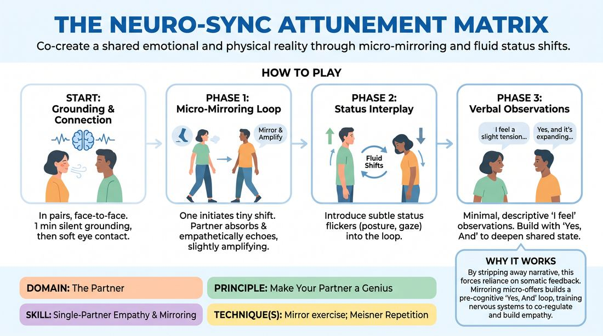

# Somatic Resonance Matrix

{ .game-hero }

> Co-create a shared emotional and physical reality through micro-mirroring and fluid status shifts.

## Overview
A deep, slow-tempo partner exercise where players establish a continuous, non-verbal feedback loop of physical and emotional states. By receiving, mirroring, and subtly amplifying their partner's micro-movements and status shifts, players learn to operate as a single, co-regulating system.

## What It Trains
- **Domain:** D2 — The Partner
- **Principle(s):** Vulnerability; Yes, And; Make Your Partner a Genius; Assume Competence
- **Skill(s):** Physicality & Space Work; Active Listening; Status Modulation; Single-Partner Empathy & Mirroring; Offer Reception; Active Gifting
- **Technique(s):** Meisner Repetition; Status Seesaw; Mirror exercise; Emotional-echo drills; Endowment-acceptance; Endowment-gifting drills
- **Focus:** connection

**Objective:** To develop profound non-verbal attunement, active somatic listening, and fluid status modulation, training players to treat every micro-offer as a stroke of genius.

## Setup
Players stand in pairs, facing each other about three to five feet apart. The space should be quiet and free of distractions. No props are required.

## How to Play
1. Begin in pairs, standing face-to-face with a soft, relaxed gaze that takes in your partner's entire body rather than staring intensely.
2. Spend one minute in silence with eyes closed, breathing deeply to ground yourself and tune into your own physical and emotional state.
3. Open your eyes on the facilitator's cue, establishing soft, non-demanding eye contact to acknowledge your partner without initiating action.
4. Phase 1: One partner subtly initiates a tiny, genuine physical or emotional shift, such as a slight weight change, a breath pattern shift, or a facial muscle softening.
5. The receiving partner actively absorbs this micro-expression and mirrors it, not as a robotic copy, but as an empathetic echo that slightly amplifies or varies the offer.
6. Continue this non-verbal loop back and forth, with each partner receiving, absorbing, and slightly amplifying the other's physical and emotional state.
7. Phase 2: Allow the natural interplay of status to enter the loop, responding to subtle status flickers, such as a slight posture straightening or a lowered gaze, by yielding or gently countering.
8. Phase 3: Optionally introduce minimal, descriptive verbal observations of the current moment, such as 'I feel a slight tension in your shoulders', to deepen the connection.
9. Build on these verbalizations using a 'Yes, And' approach to internal states, validating and expanding the shared emotional landscape without starting a narrative scene.

## Facilitation Notes
- Side-coach players to avoid performing or exaggerating movements; the power of the exercise lies in authentic, micro-level physical truths.
- If players get stuck in a repetitive loop, cue them to focus on their breath or introduce a subtle status shift to break the pattern.
- Remind players to assume competence by treating every accidental twitch, sigh, or gaze shift from their partner as an intentional, brilliant offer.
- Watch for intellectualization; if players start planning their next move, gently coach them back into their bodies and the present moment.

## Variations
- Blind Resonance: Run Phase 1 with eyes closed, relying entirely on the sound of breathing, shifting weight, and spatial proximity.
- The Subtext Scene: Transition from Phase 3 directly into a fully voiced scene, maintaining the exact physical and emotional attunement established during the exercise.

## Debrief
- How did it feel to have your tiniest physical and emotional shifts immediately received and validated by your partner?
- What did you notice about how status naturally shifted when you stopped trying to consciously control it?
- How does treating a partner's micro-movements as genius offers change your approach to active listening?

## Safety & Inclusion
Ensure players know they can adjust their physical stance or close/open their eyes at any point if they experience sensory overload or physical discomfort. Establish that eye contact can be soft or occasionally broken to maintain personal comfort boundaries.

## Why It Works
By stripping away narrative and dialogue, this exercise forces players to rely entirely on somatic feedback. Mirroring and amplifying micro-offers builds a pre-cognitive 'Yes, And' loop, training the nervous system to co-regulate and treat the partner's presence as the ultimate source of inspiration.
