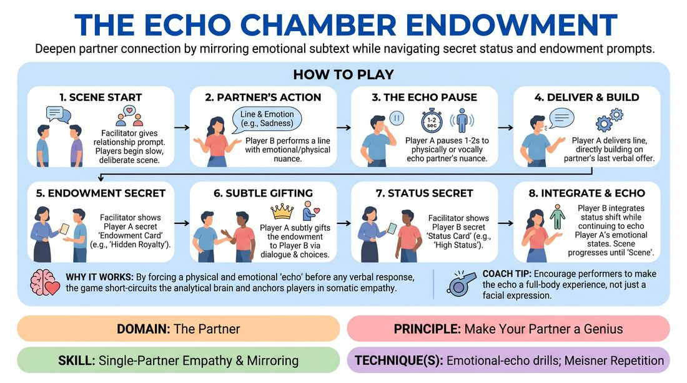

# The Resonance Chamber

{ .game-hero }

> Deepen partner connection by mirroring emotional subtext while navigating secret status and endowment prompts.

## Overview
Two players build a scene where every line is preceded by a physical or vocal echo of their partner's emotional state. As the scene progresses, the facilitator introduces secret, non-verbal prompts to shift status or endow the partner with hidden traits. This creates a highly attuned, multi-layered dialogue where subtext and physical connection take center stage.

## What It Trains
- **Domain:** D2 — The Partner
- **Principle(s):** Yes, And; Make Your Partner a Genius; Assume Competence
- **Skill(s):** Active Listening; Status Modulation; Single-Partner Empathy & Mirroring; Offer Reception; Active Gifting
- **Technique(s):** Meisner Repetition; Last Word Response; Status Seesaw; Mirror exercise; Emotional-echo drills; Yes, And… sentence games; Endowment-acceptance; Endowment-gifting drills; Give them the answer
- **Focus:** connection

**Objective:** To develop advanced partner attunement, emotional mirroring, and the ability to receive and integrate subtle, unstated offers in real-time.

## Setup
An open performance space. The facilitator prepares two sets of small index cards: 'Endowment Cards' (e.g., 'Make your partner feel brilliant,' 'Endow your partner with a secret guilt') and 'Status Cards' (e.g., 'Slightly raise your status,' 'Lower your status through deferential posture'). The rest of the group sits as active observers.

## How to Play
1. Two players take the stage, and the facilitator provides a simple relationship-based scene prompt.
2. The players begin a slow, deliberate scene, alternating lines of dialogue.
3. Before speaking a line, the active player must pause for 1-2 seconds to physically or vocally 'echo' the emotional or physical nuance of their partner's last action or line.
4. Immediately following this physical/vocal echo, the player delivers their verbal line, directly building on the partner's last verbal offer.
5. Approximately one minute into the scene, the facilitator quietly approaches Player A and shows them a secret 'Endowment Card' without Player B seeing it.
6. Player A must immediately begin subtly gifting this endowment to Player B through their dialogue and physical choices, without explicitly naming the trait.
7. Shortly after, the facilitator quietly shows Player B a secret 'Status Card' containing a status modulation instruction.
8. Player B must subtly integrate this status shift into their performance, while simultaneously continuing to echo Player A's emotional states.
9. Both players continue the scene, balancing the emotional echo, verbal progression, and their respective secret prompts until the facilitator calls 'scene' after 5-7 minutes.

## Facilitation Notes
- Coaching Cue: 'Let the echo land.' Remind players not to rush into their verbal lines; the physical/vocal echo must be a distinct, conscious beat of connection.
- Pitfall: Players over-exaggerate the secret prompts, making them too obvious. Fix: Side-coach them to 'dial it down to a level 2 out of 10' to keep the attunement subtle and realistic.
- Coaching Cue: 'Receive before you react.' Encourage the player who is being endowed to accept whatever they perceive, even if they do not know the exact prompt.
- Pitfall: High cognitive load causes players to freeze or drop the emotional echo. Fix: Pause the scene briefly, have them take a breath, and instruct them to prioritize the physical connection over clever dialogue.

## Variations
- Silent Resonance: Run the entire scene without any spoken dialogue, relying purely on the physical/vocal echo and the secret status/endowment prompts.
- Double Blind: Both players receive both an endowment and a status card at the very beginning of the scene, forcing them to manage multiple hidden layers from the first line.

## Debrief
- For the receiver: What did you feel your partner was gifting or endowing you with, and what physical cues tipped you off?
- For the sender: How did you adapt your delivery when you noticed your partner receiving or missing your subtle status or endowment offers?
- How did the mandatory 1-2 second emotional echo change the pacing and emotional depth of the scene compared to a standard improv scene?

## Safety & Inclusion
Because this game requires close physical observation and mirroring, establish a boundary check beforehand. Players may opt out of close physical proximity or direct eye contact, and the 'echo' can be adapted to purely vocal tone or hand gestures to accommodate different comfort levels and physical abilities.

## Why It Works
By forcing a physical and emotional 'echo' before any verbal response, the game short-circuits the analytical brain and anchors players in somatic empathy. The addition of secret prompts trains players to treat every micro-movement and tonal shift as a valid, high-value offer, embodying the principle of making their partner a genius by actively gifting and accepting subtext.
