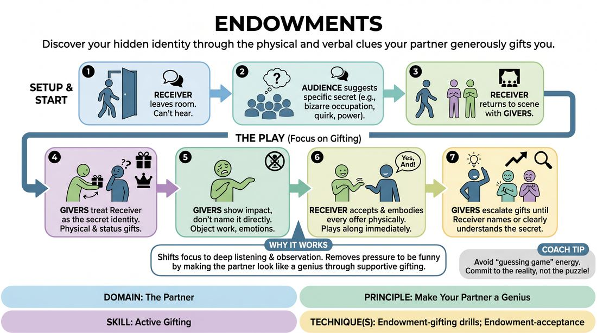

# The Secret Gift

{ .game-hero }

> Discover your hidden identity through the physical and verbal clues your partner generously gifts you.

## Overview
One player steps out of the room while the audience decides on a secret attribute, occupation, or quirk for them. When they return, their scene partners must treat them exactly as if they possess this trait, using physical and verbal gifts to help them organically discover and adopt the identity. The game emphasizes collaborative world-building and high-status support over rapid puzzle-solving.

## What It Trains
- **Domain:** D2 — The Partner
- **Principle(s):** Make Your Partner a Genius; Yes, And; Show, Don't Tell
- **Skill(s):** Active Gifting; Offer Reception; World-Building; Stage Presence & Clarity
- **Technique(s):** Endowment-gifting drills; Endowment-acceptance; Endowment chains
- **Focus:** comedy_game

**Objective:** Develops active gifting, offer reception, and the ability to make your partner look brilliant by endowing them with specific, usable traits.

## Setup
One player (the Receiver) steps out of hearing range. The remaining players (the Givers) and the audience agree on a secret identity, occupation, or quirk. The playing space is cleared for a standard two- or three-person scene.

## How to Play
1. Send the designated Receiver out of the room so they cannot hear the suggestion.
2. Obtain a specific, active secret from the audience, such as a unique occupation, a bizarre superpower, or a specific physical limitation.
3. Bring the Receiver back into the space to begin an improvised scene with one or two Givers.
4. The Givers must immediately treat the Receiver as if they already are this character, using physical reactions, status shifts, and dialogue that implies the secret.
5. The Givers must avoid naming the secret directly, instead showing the impact of the secret on the world through physical object work and emotional reactions.
6. The Receiver must accept every physical and verbal offer by physically embodying whatever is implied, playing along even before they fully understand what their identity is.
7. The scene continues with the Givers escalating their specific gifts until the Receiver can confidently name or clearly demonstrate their understanding of the secret identity within the context of the scene.

## Facilitation Notes
- Coaching cue: 'Show, don't tell! Don't just say you are a chef. Hand them the heavy mixing bowl and complain about the soufflé!'
- Pitfall: Givers playing 'charades' or guessing games rather than maintaining a natural scene. Fix: Remind players that the scene's relationship and environment are more important than a rapid guess.
- Coaching cue: 'Receiver, say yes to the physical offers first. If they hand you something heavy, feel the weight before you try to figure out what it is.'
- Pitfall: The Receiver freezing up because they don't know who they are yet. Fix: Encourage the Receiver to make bold physical choices based on how they are being treated, trusting that their partners will justify those choices.

## Variations
- Mutual Secrets: Two players each have a secret identity that only the other player knows, requiring them to simultaneously endow each other while discovering their own.
- The Superhero's Sidekicks: The Receiver is a new superhero with a specific power and weakness. The Givers play sidekicks who desperately need the hero's specific power to solve a crisis, while carefully avoiding their weakness.
- Object Endowment: The Receiver must discover a series of invisible, highly specific objects placed in the scene by their partners' physical interactions with the space.

## Debrief
- How did it feel as the Receiver to trust your partners to guide you without knowing your identity?
- What was the difference between a 'clue' (which feels like a puzzle) and a 'gift' (which builds the scene)?
- How does making your partner look like a genius actually make the scene easier for you to play?

## Safety & Inclusion
Ensure the secrets suggested do not rely on offensive stereotypes, physical disabilities, or sensitive personal conditions. Keep the focus on playful, imaginative, or occupational traits.

## Why It Works
This game shifts the focus from self-generation to deep listening and observation. By forcing the Givers to make their partner look like a genius, it removes the pressure of 'being funny' and replaces it with the joy of supporting someone else. The Receiver learns to surrender control and discover their character through the environment and relationships.
