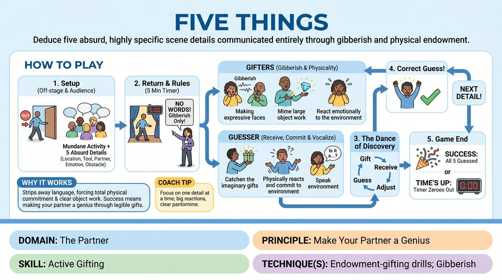

# Five-Point Endowment

{ .game-hero }

> Deduce five absurd, highly specific scene details communicated entirely through gibberish and physical endowment.

## Overview
One player leaves the room while the group and audience establish a mundane activity modified by five highly specific, bizarre details. When the player returns, the rest of the cast must use gibberish, physical object work, and emotional endowment to help them guess all five modifications within a strict time limit. It is a high-energy, comedic guessing game that relies on extreme physical clarity and generous partner support.

## What It Trains
- **Domain:** D2 — The Partner
- **Principle(s):** Make Your Partner a Genius; Commit 100%; Show, Don't Tell
- **Skill(s):** Active Gifting; Offer Reception; Vocal Craft; World-Building
- **Technique(s):** Endowment-gifting drills; Gibberish; C.R.O.W. (Character, Relationship, Objective, Where)
- **Focus:** comedy_game

**Objective:** To develop active gifting and endowment-gifting drills, training players to make their partner look like a genius by setting up clear, physically legible offers.

## Setup
An in-person performance space with a clear stage area. One player (the Guesser) leaves the room or wears noise-canceling headphones. The remaining players (the Gifters) stand on stage with the facilitator and the audience.

## How to Play
1. Send one player out of the room so they cannot hear the setup.
2. Ask the audience for a mundane, everyday activity, such as brushing teeth or washing a car.
3. With the audience's help, establish five specific modifications to this activity: 1. A different location, 2. A bizarre tool/object being used, 3. An unexpected character identity for the guesser, 4. A major physical obstacle, and 5. A famous historical or pop-culture figure who enters the scene.
4. Bring the Guesser back to the stage and explain that they are performing the modified activity, but they do not know any of the five specific details.
5. Start a five-minute timer. The Gifters must immediately initiate the scene using only gibberish, physical object work, and emotional endowment—no real words are allowed.
6. The Gifters must actively gift the details to the Guesser by physically handing them imaginary objects, reacting to the environment, treating them as the specific character, and physically embodying the celebrity guest.
7. The Guesser must actively receive these offers, committing 100% to the physical reality being built around them, and must vocalize their guesses out loud to the audience as they figure them out.
8. When the Guesser correctly identifies a modified element, the audience cheers loudly, and the players immediately transition to gifting the next element.
9. The game ends successfully when all five elements are guessed, or when the five-minute timer runs out.

## Facilitation Notes
- Coaching cue: 'Show, don't tell! Use your body language, spatial relationships, and vocal tone to convey status and identity, not just wild hand gestures.'
- Pitfall: Gifters standing back and shouting gibberish at the guesser. Fix: Encourage them to step in, physically interact, and hand over imaginary objects (endowment) to force the guesser into the action.
- Coaching cue: 'Make your partner a genius! If they guess something close, adapt your play to validate their choice or guide them gently to the exact word.'
- Pitfall: The Guesser staying passive or guessing silently. Fix: Remind the Guesser to think out loud and physically try out the objects they are being handed.

## Variations
- Silent Film: Play the entire game in complete silence, removing gibberish entirely to rely solely on pure pantomime and physical endowment.
- Emotional Endowment: Instead of physical details, the five modifications are specific, shifting emotional states or secrets that the Guesser must discover.
- Tag-Team Gifters: Only two players gift at a time, with other players tagging in to introduce new elements or characters to keep the stage uncluttered.

## Debrief
- How did it feel to receive physical gifts (endowments) versus vocal gibberish clues?
- What specific physical choices made a complex clue immediately clear to the guesser?
- How does 'making your partner a genius' change your focus from your own performance to theirs?

## Safety & Inclusion
Ensure physical boundaries are respected, especially since players are communicating non-verbally and may want to guide each other physically. Establish a rule that players cannot physically grab or force the guesser's body into positions; all physical endowment must be offered, not forced.

## Why It Works
This game strips away the crutch of literal language, forcing players to rely entirely on physical commitment, vocal inflection, and clear object work. By focusing on making their partner a genius, the gifters must craft highly legible, generous offers, while the guesser must practice deep, active listening and offer reception.
