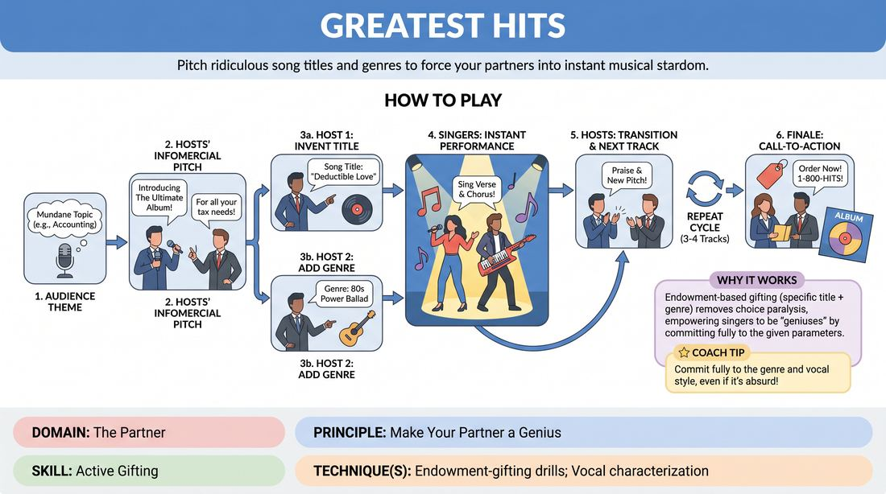

# Greatest Hits

{ .game-hero }

> Pitch ridiculous song titles and genres to force your partners into instant musical stardom.

## Overview
Two hosts pitch a themed compilation album to the audience, inventing absurd song titles and musical genres on the fly. Two singers immediately bring these fictional tracks to life in high-energy, improvised musical performances.

## What It Trains
- **Domain:** D2 — The Partner
- **Principle(s):** Commit 100%; Yes, And; Make Your Partner a Genius; The Audience Is the Final Scene Partner
- **Skill(s):** Unfiltered Spontaneity; Vocal Craft; Offer Reception; Active Gifting; Stage Presence & Clarity
- **Technique(s):** Vocal characterization; Endowment-acceptance; Endowment-gifting drills; Cheating out
- **Focus:** comedy_game

**Objective:** Develops active gifting, rapid offer reception, and vocal commitment by forcing partners into specific, challenging, and hilarious performance parameters.

## Setup
Four players stand on stage. Two act as the television infomercial hosts (standing downstage left and right). Two act as the musical performers (standing upstage center, ready to step forward). No props or instruments are required.

## How to Play
1. Ask the audience for a mundane occupation, hobby, or historical event to serve as the compilation album's theme.
2. The Hosts begin an enthusiastic, high-energy infomercial-style dialogue, pitching 'The Ultimate Compilation Album' based on the audience's theme.
3. The Hosts banter to establish the album's premise, then one Host invents a specific, funny song title related to the theme.
4. The second Host immediately adds a specific musical genre or artist style to that song title.
5. Upon hearing the title and style, the Singers instantly step forward to center stage and perform a short, high-energy verse and chorus of that song.
6. The Hosts cut back in to transition, praising the performance, and then pitch the next track with a new title and genre.
7. Repeat this cycle for three to four distinct tracks, building the energy and variety of musical styles.
8. The Hosts deliver a final, rapid-fire call-to-action with pricing and ordering details to close the infomercial.

## Facilitation Notes
- Coaching cue: 'Hosts, gift your singers with styles they can sink their teeth into—give them clear, theatrical genres!'
- Pitfall: Hosts pitching genres that are too obscure or difficult to sing (e.g., '14th-century Gregorian throat singing'). Fix: Encourage hosts to stick to recognizable genres like reggae, punk, country, or opera that allow the singers to succeed.
- Coaching cue: 'Singers, commit immediately to the physical and vocal posture of the genre before you even sing the first note.'
- Pitfall: Singers hesitating or discussing the song before starting. Fix: Remind singers to start making sound within two seconds of the host's cue; the first line doesn't have to be perfect, just confident.

## Variations
- The Soloist: A single singer handles all the tracks, requiring rapid-fire character and vocal shifts.
- The Guest Star: The hosts introduce a 'special guest artist' (one of the singers) who has a specific, bizarre backstory that must be integrated into the song.
- Modern Streaming: Frame the game as a podcast or a Spotify playlist pitch rather than a traditional TV infomercial.

## Debrief
- Hosts, how did you balance making the challenge difficult versus making your partners look like geniuses?
- Singers, how did committing to the physical posture of the genre help you find the lyrics and melody?
- How does receiving a highly specific 'gift' (title + genre) make improvisation easier than having total freedom?

## Safety & Inclusion
Ensure that musical genres are treated with respect and avoid cultural caricatures. If players are uncomfortable singing, they can perform spoken-word, rap, or rhythmic poetry styles.

## Why It Works
This game perfectly demonstrates 'making your partner a genius' through endowment. By giving the singers highly specific parameters (a title and a genre), the hosts remove the paralysis of choice. The singers don't have to think about what to sing, only how to execute the gift, leading to highly confident, spontaneous comedic performances.
