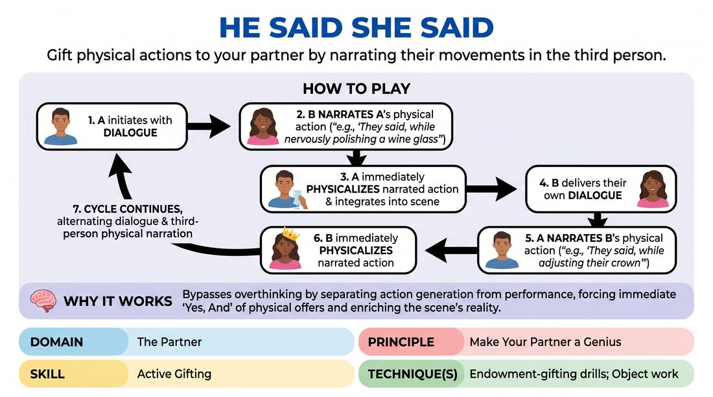

# Narrated Endowments

{ .game-hero }

> Gift physical actions to your partner by narrating their movements in the third person.

## Overview
A two-player scene-building drill where players alternate speaking dialogue and narrating their partner's physical actions in the third person. Each player must immediately physicalize the narrated action, using it to deepen their character's emotional state and the scene's reality.

## What It Trains
- **Domain:** D2 — The Partner
- **Principle(s):** Yes, And; Make Your Partner a Genius; Show, Don't Tell
- **Skill(s):** Physicality & Space Work; Offer Reception; Active Gifting; World-Building
- **Technique(s):** Object work; Endowment-acceptance; Endowment-gifting drills; Endowment chains
- **Focus:** skill_drill

**Objective:** To practice active gifting and physical endowment, training players to make their partner look brilliant by giving them clear, playable physical offers and instantly accepting the physical offers given to them.

## Setup
Two players stand in the performance space. No props or special staging are required; just enough room to move and pantomime object work.

## How to Play
1. Player A initiates the scene with a line of dialogue.
2. Player B immediately responds by narrating Player A's physical reaction or action in the third person (e.g., 'They said, while nervously polishing a wine glass').
3. Player A must instantly physicalize the narrated action (polishing the glass) and integrate it into their performance.
4. Player B then delivers their own line of dialogue.
5. Player A responds by narrating Player B's physical action in the third person (e.g., 'They said, while adjusting their crown').
6. Player B physicalizes the action, and then delivers their next line of dialogue.
7. The cycle continues, alternating dialogue and third-person physical narration, building a rich physical and emotional scene.

## Facilitation Notes
- Side-coaching cue: 'Keep the narrated actions physical and active! Avoid internal states like "they thought about their mother"—give them something to do with their hands or body.'
- Side-coaching cue: 'Accept the gift instantly! Don't hesitate or question why your character is doing the action; find the emotional justification after you start moving.'
- Pitfall: Players sometimes narrate impossible, dangerous, or mean-spirited actions. Fix: Remind players that the goal is to make their partner look like a genius, not to trap them. Gift actions that reveal character, status, or environment.
- Pitfall: Players forget to do the action they were gifted. Fix: Pause the scene and have them physically commit to the action before they speak their next line.

## Variations
- Four-Player Director Split: Two players act and speak the dialogue, while two off-stage players provide the third-person physical narrations for them.
- Emotional Endowments: Instead of physical actions, narrate emotional shifts (e.g., 'They said, suddenly overcome with a wave of guilt').

## Debrief
- How did it feel to have your physical actions chosen for you? Did it make acting easier or harder?
- What makes a physical gift 'good' or 'playable' for your partner?
- How did the physical actions change the subtext and emotional stakes of the dialogue?

## Safety & Inclusion
Ensure players are mindful of physical limitations; do not narrate actions that require extreme physical strain, falling, or unwanted physical contact. Encourage players to adapt any narrated action to their own comfort and mobility levels.

## Why It Works
By separating the generation of physical action from the actor performing it, this game bypasses the analytical mind. It forces players to 'Yes, And' physical offers immediately, demonstrating how physical endowment (Show, Don't Tell) instantly builds a rich, believable environment and deepens character relationships.
