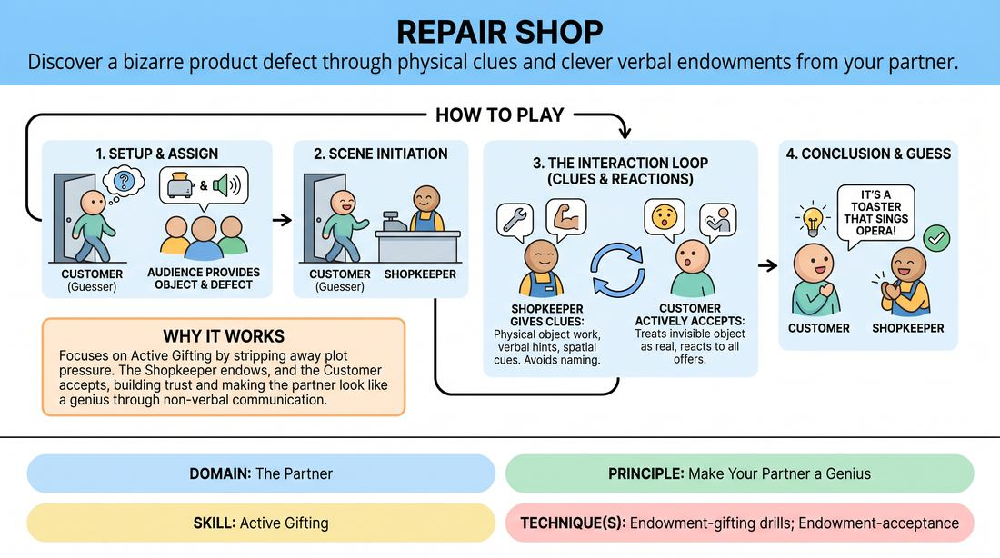

# The Fix-It Shop

{ .game-hero }

> Discover a bizarre product defect through physical clues and clever verbal endowments from your partner.

## Overview
One player steps out while the audience establishes a specific object and its highly unusual defect. When they return, they must interact with a shopkeeper who uses physical and verbal endowments to help them deduce both the item and its bizarre problem.

## What It Trains
- **Domain:** D2 — The Partner
- **Principle(s):** Make Your Partner a Genius; Yes, And; Show, Don't Tell
- **Skill(s):** Active Listening; Offer Reception; Active Gifting; World-Building
- **Technique(s):** Endowment-acceptance; Endowment-gifting drills; Endowment chains
- **Focus:** comedy_game

**Objective:** To practice active gifting and endowment, training players to deliver clear, physicalized clues that make their partner look brilliant while advancing a shared scene.

## Setup
An in-person performance space with two chairs representing a shop counter. One player (the Guesser) leaves the room or wears noise-canceling headphones, while the remaining players (the Shopkeepers) and the audience establish the secret object and its specific, absurd defect.

## How to Play
1. Select one player to be the Customer (the Guesser) and send them out of earshot of the performance space.
2. Ask the audience for a common household or industrial object and a highly specific, unusual defect.
3. Bring the Customer back into the space to initiate the scene at the repair counter, where the other player acts as the Shopkeeper.
4. The Shopkeeper must interact with the Customer, using physical object work, spatial relationships, and verbal hints to endow the Customer with clues about the object and its defect.
5. The Customer must actively accept every physical and verbal offer, treating the invisible object as real and reacting to the Shopkeeper's clues as if they are discovering the truth.
6. The Shopkeeper avoids naming the object or the defect directly, instead focusing on making the Customer look like a genius by setting up obvious physical reactions or leading questions.
7. The scene continues with the Customer progressively narrowing down the identity of the object and the nature of the defect through active listening and physical exploration.
8. The game concludes successfully when the Customer correctly identifies both the object and its specific defect within the context of the scene.

## Facilitation Notes
- Encourage the Shopkeeper to use physical scale and weight to communicate the object's size immediately.
- Pitfall: The Shopkeeper simply lists clues verbally. Fix: Side-coach them to 'show, don't tell' by miming the defect's consequences or reacting physically to the object.
- Pitfall: The Guesser lists random guesses rapidly. Fix: Remind the Guesser to stay in character and treat every guess as a logical discovery based on the partner's gifts.
- Remind players that the goal is not to stump the partner, but to make them look like a genius who solves the mystery effortlessly.

## Variations
- Veterinary Clinic: The object is a pet or exotic animal, and the defect is a bizarre behavioral issue or physical ailment.
- Return Policy: The Guesser is the Shopkeeper who must figure out what item the customer is trying to return and why they are unsatisfied.
- Multi-Expert Panel: Two or three shopkeepers work together, passing the focus and building on each other's physical endowments to guide the guesser.

## Debrief
- How did it feel to receive physical clues versus purely verbal hints?
- What specific endowment made the solution click for the guesser, and why was it effective?
- How does focusing on making your partner look smart change how you deliver information?

## Safety & Inclusion
Ensure the physical space is clear of obstacles for the guesser returning to the stage. If players have sensory or auditory sensitivities, use visual signals instead of noise-canceling headphones to keep the secret.

## Why It Works
This game works because it strips away the pressure of inventing plot, forcing the off-stage player to focus entirely on active listening and offer reception. Meanwhile, the on-stage players must master active gifting, using physical endowment and precise verbal framing to guide their partner to success without breaking the reality of the scene.
