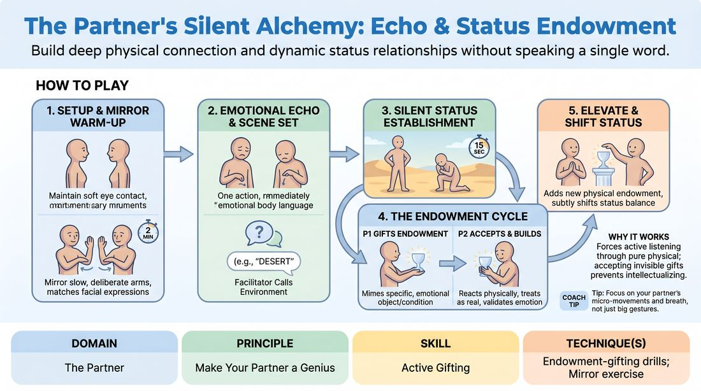

# Silent Alchemy

{ .game-hero }

> Build deep physical connection and dynamic status relationships without speaking a single word.

## Overview
A fully non-verbal partner exercise where players build a shared physical environment and emotional narrative. By stripping away dialogue, players must rely entirely on physical endowments, emotional mirroring, and status shifts to communicate. The result is a heightened state of mutual focus where every physical gesture becomes a generous gift.

## What It Trains
- **Domain:** D2 — The Partner
- **Principle(s):** Yes, And; Make Your Partner a Genius; Assume Competence; Show, Don't Tell
- **Skill(s):** Active Listening; Status Modulation; Single-Partner Empathy & Mirroring; Offer Reception; Active Gifting; Physicality & Space Work
- **Technique(s):** Mirror exercise; Emotional-echo drills; Meisner Repetition; Last Word Response; Endowment-acceptance; Endowment-gifting drills; Give them the answer; Status Seesaw; High/low-status walks; Object work
- **Focus:** connection

**Objective:** To develop active gifting and endowment-acceptance skills, allowing players to make their partner look brilliant by fully committing to and elevating their physical offers while dynamically modulating status.

## Setup
An open, quiet room with enough space for players to work in pairs. No props or chairs are needed. Players stand facing their partners with comfortable eye contact.

## How to Play
1. Divide the group into pairs and have partners stand facing each other in a clear space, establishing soft eye contact.
2. Begin with a two-minute physical mirror warm-up, where partners take turns leading and following slow, deliberate movements, matching posture and facial expressions precisely.
3. Transition into emotional echoing: one partner initiates a simple physical action with a clear emotional quality, and the other partner immediately embodies the physical and emotional weight of that action before offering their own subtle physical response.
4. The facilitator calls out a simple, single-word environment to set the scene.
5. Partners take fifteen seconds to silently establish their initial relative status in the space using posture, height, and physical distance.
6. The first player initiates the scene by gifting a physical endowment, miming a specific, emotionally charged object or environmental condition.
7. The second player immediately accepts the endowment by reacting physically, treating the mimed object or condition as completely real and validating its emotional impact.
8. The second player then builds on the reality by adding a new physical endowment that elevates the first player's offer.
9. Continue the silent exchange back and forth, with each player using their physical interactions to subtly shift the status balance and respond directly to the last physical beat.

## Facilitation Notes
- Coaching cue: Don't just look at the object; feel what your partner feels when they hold it. Let their physical tension live in your body.
- Pitfall: Players moving too quickly or rushing through mimed actions. Fix: Remind them to honor the physical weight, size, and resistance of every endowed object.
- Coaching cue: Make your partner a genius. If they struggle to lift something, make it look like the heaviest, most important object in the world when you help them.
- Pitfall: Players reverting to charades or trying to spell out words with gestures. Fix: Instruct them to focus on emotional truth and relationship rather than trying to communicate specific plot points.
- Coaching cue: Use the status seesaw. If your partner bows to you, how does that change your posture? Do you grow taller, or do you try to lift them up?

## Variations
- Sound Effects Only: Play the same game but allow players to make non-verbal vocalizations, sighs, or abstract sound effects to enhance the physical endowments.
- The Verbal Transition: After three minutes of silent play, the facilitator calls out 'Speak,' and players transition into a spoken scene, carrying the established physical reality, emotional stakes, and status dynamics into their dialogue.
- Blind Endowment: One player closes their eyes while the other sets up a physical environment. When the first player opens their eyes, they must immediately adapt to and accept the physical status and environment presented.

## Debrief
- How did removing dialogue change how closely you had to observe your partner's physical choices?
- What did your partner do that made you feel like a genius or made your physical offers feel incredibly important?
- How did you communicate shifts in status or power without using words?
- In what ways did mirroring your partner's physical tension help you understand their emotional state?

## Safety & Inclusion
Ensure players are mindful of physical boundaries, especially during the mirroring and close-proximity status work. Encourage players to communicate non-verbally if a physical distance feels uncomfortable, and allow modifications for players with limited mobility by focusing the mirroring and status work on facial expressions, head tilts, and upper-body posture.

## Why It Works
By removing the safety net of verbal communication, players are forced to practice active listening through pure physical observation. When a player must physically accept and build upon an invisible object, they cannot intellectualize the scene; they must commit to the shared reality. This physical 'yes-and' builds deep empathy, as players literally embody the physical states of their partners, naturally leading to generous gifting and intuitive status modulation.
