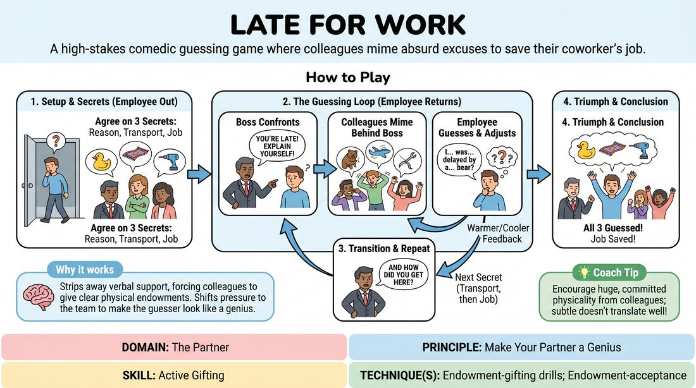

# Late for Work

{ .game-hero }

> A high-stakes comedic guessing game where colleagues mime absurd excuses to save their coworker's job.

## Overview
One player steps out of the room while the group establishes three secrets: an absurd reason they were late, an unusual mode of transportation, and their highly specific job. When the player returns as the tardy employee, they must deduce these secrets from the physical, silent endowments of their coworkers and the verbal prompts of their boss.

## What It Trains
- **Domain:** D2 — The Partner
- **Principle(s):** Make Your Partner a Genius; Yes, And; Group Mind
- **Skill(s):** Active Gifting; Offer Reception; Physicality & Space Work; Support Work
- **Technique(s):** Endowment-gifting drills; Endowment-acceptance; Object work
- **Focus:** comedy_game

**Objective:** To practice active gifting and physical endowment, training players to support their partner by sending clear, readable physical offers that make the guesser look brilliant.

## Setup
An in-person playing space with a clear 'stage' area. One player (the Employee) is sent out of hearing range. The remaining players (the Boss and the Colleagues) gather to solicit or decide on three specific details: 1) an unusual reason for being late, 2) a bizarre method of transportation, and 3) a highly specific, unusual occupation.

## How to Play
1. Designate one player as the Employee, one as the Boss, and the remaining players as the Colleagues.
2. Send the Employee out of the room so they cannot hear the setup.
3. The remaining players establish three distinct secrets: the bizarre reason for lateness, the strange mode of transport, and the specific job.
4. Bring the Employee back into the room to begin the scene. The Boss immediately confronts them about their lateness, demanding an explanation.
5. The Employee begins to make excuses, looking past the Boss to the Colleagues, who are positioned behind the Boss's line of sight to silently mime the first secret (the reason for being late).
6. The Employee uses the physical clues to guess the reason, verbalizing their stream of consciousness while the Colleagues adjust their miming to guide them ('warmer' or 'colder').
7. Once the first secret is guessed, the Boss transitions the scene to the second secret ('And how on earth did you get here in that state?'), prompting the Colleagues to mime the mode of transport.
8. After the transport is guessed, the Boss demands they get to work, prompting the Colleagues to mime the specific job.
9. The scene concludes triumphantly once the Employee successfully identifies all three secrets and commits to doing their job.

## Facilitation Notes
- Coaching Cue: 'Make your partner a genius!' Remind the miming players that their goal is to help the guesser succeed quickly, not to stump them with overly abstract gestures.
- Pitfall: The Boss stands in a way that blocks the Employee's view of the Colleagues. Fix: Have the Boss stand slightly to the side or turn their back to the Colleagues, allowing a clear line of sight for the Employee.
- Coaching Cue: 'Yes-and the guesses!' If the Employee makes a guess that is close or funnier than the original suggestion, the Colleagues and Boss can subtly steer them or even accept it to keep the momentum high.
- Encourage the Boss to drop verbal hints wrapped in character dialogue if the Employee gets stuck on a specific detail.

## Variations
- Press Conference: The guesser is a famous figure or politician at a podium, and the other players are journalists asking loaded questions that hint at the guesser's secret identity or scandal.
- The Party Guest: The guesser is a host, and each arriving guest has a specific bizarre quirk or identity endowed by the other players that the host must guess.

## Debrief
- How did it feel to receive physical gifts from your partners when you had no idea what the answer was?
- What physical choices made a clue instantly readable versus confusing?
- How did the Boss balance challenging the Employee while simultaneously supporting them to succeed?

## Safety & Inclusion
Ensure the physical miming space is clear of tripping hazards. Encourage players to use expressive facial gestures and upper-body movement so that players with limited mobility can fully participate as mimers.

## Why It Works
This game works because it strips away verbal communication for the supporting players, forcing them to rely entirely on clear physical endowments. It shifts the pressure off the guesser and onto the team, embodying the principle of making your partner look good through active, generous physical gifting.
