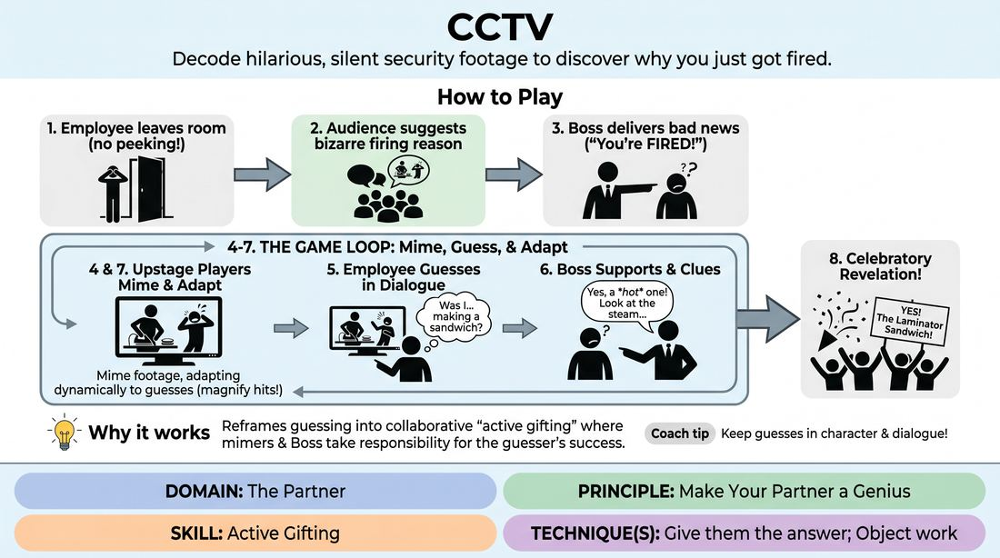

# CCTV Playback

{ .game-hero }

> Decode hilarious, silent security footage to discover why you just got fired.

## Overview
One player is fired from an unspecified job for a highly unusual, audience-suggested infraction. To discover their crime, they must watch their castmates physically re-enact the 'security camera footage' in real-time. It is a high-energy guessing game where the performers' physical clarity and supportive verbal hints guide the guesser to a triumphant realization.

## What It Trains
- **Domain:** D2 — The Partner
- **Principle(s):** Make Your Partner a Genius; Fail Joyfully; Group Mind
- **Skill(s):** Active Gifting; Physicality & Space Work; Support Work; Offer Reception
- **Technique(s):** Give them the answer; Object work; Endowment-acceptance
- **Focus:** comedy_game

**Objective:** Develops active gifting and physical support work. Players learn to prioritize their partner's success by translating complex narrative ideas into clear, readable physical offers, ensuring the guessing player is set up to look like a genius.

## Setup
An in-person playing space with a clear 'office' area downstage for the Boss and Employee, and a designated 'CCTV screen' area upstage where 2-3 players will perform the silent physical re-enactments. One player (the Employee) temporarily leaves the room so they cannot hear the audience's suggestion.

## How to Play
1. Send one player (the Employee) out of the room where they cannot hear or see the stage.
2. Ask the audience for a highly specific, bizarre, or mundane action that would get someone fired (e.g., 'using the office laminator to seal a grilled cheese sandwich').
3. Bring the Employee back into the room. Another player (the Boss) initiates the scene by calling them into the office and delivering the bad news: they are fired, and the proof is on the security camera.
4. On the Boss's cue ('Let's look at the tape!'), the remaining players upstage immediately begin to mime the security footage, acting out the suggested infraction with exaggerated, clear physical movements.
5. The Employee watches the physical playback and makes active guesses about what they are doing, integrating their guesses into the dialogue ('Was I... making a sandwich?').
6. The Boss acts as a supportive bridge, validating correct elements of the guess, offering verbal clues, and directing the Employee's attention to specific details of the mime ('Yes, you were making a sandwich, but what were you using to press it?').
7. The upstage performers adapt their mime dynamically based on the Employee's guesses, magnifying the parts they get right and adjusting their physical offers to clarify the parts they get wrong.
8. The game concludes with a celebratory revelation once the Employee successfully guesses the exact reason they were fired.

## Facilitation Notes
- Side-coach the mimers to focus on slow, deliberate, and exaggerated object work rather than frantic, chaotic movements.
- Encourage the Boss to actively help the Employee. The Boss's goal is not to gatekeep the answer, but to 'give them the answer' through clever verbal framing and leading questions.
- Remind the Employee to guess early and often. Every 'wrong' guess is a gift that helps the mimers adjust their physical offers.
- Pitfall: The mimers try to act out a whole narrative sequence. Fix: Coach them to loop a single, highly clear physical action repeatedly so the guesser can process it.

## Variations
- Fast-Forward & Rewind: The Boss can call out 'Fast-forward!' or 'Rewind!' to force the upstage mimers to speed up or reverse their physical actions, highlighting different moments of the infraction.
- Multiple Angles: The Boss can switch 'cameras' (e.g., 'Let's look at Camera 2!'), prompting the mimers to instantly change their physical perspective or zoom in on a specific detail.

## Debrief
- How did it feel as the guesser when the mimers adjusted their physical offers based on your incorrect guesses?
- For the mimers, how did you balance making the action funny versus making it clear and readable?
- How does the principle of 'making your partner a genius' change the dynamic of a guessing game from a test into a collaborative victory?

## Safety & Inclusion
Ensure the physical space upstage is clear of obstacles so players can move freely and safely during high-energy physical mimes. If a player has mobility limitations, they can play the role of the Boss or use verbal sound effects to represent the 'audio track' of the security footage.

## Why It Works
This game succeeds because it reframes guessing from an individual test of intelligence into a collaborative team sport. By focusing on 'active gifting,' the mimers and the Boss take full responsibility for the guesser's success. When the performers prioritize making their partner look brilliant, the pressure to be 'correct' vanishes, allowing the players to fail joyfully and discover comedy in the miscommunications.
