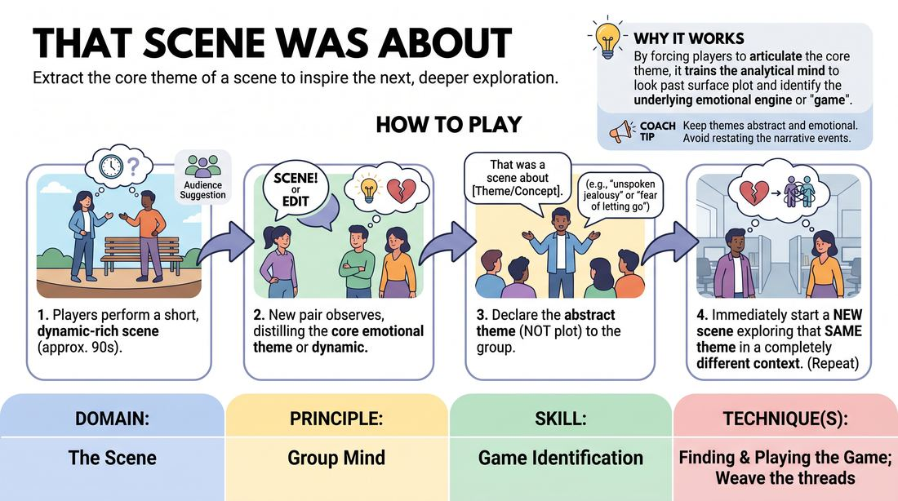

# That Scene Was About

{ .game-hero }

> Extract the core theme of a scene to inspire the next, deeper exploration.

## Overview
A fast-paced scenework drill where players perform a scene, and the next pair of players must immediately distill its core emotional or thematic essence into a single declarative statement. This statement then serves as the direct inspiration for a brand-new scene that explores the same underlying dynamic in a completely different context.

## What It Trains
- **Domain:** D3 — The Scene
- **Principle(s):** Group Mind; Serve the Piece
- **Skill(s):** Game Identification; Thematic Synthesis; Suggestion Deconstruction (A-to-C); Heightening & Exploration
- **Technique(s):** Finding & Playing the Game; Weave the threads; What's interesting about this? mining; Exploring the 'why'
- **Focus:** skill_drill

**Objective:** Develops the ability to identify the 'game' or core theme of a scene (Game Identification) and synthesize it into an abstract concept (Thematic Synthesis), which is then applied to a new scenario using A-to-C association.

## Setup
Players stand in a line-up or semi-circle facing the performance space. No props or chairs are needed, though two chairs can be available if preferred. The facilitator prepares to offer an initial suggestion to kick off the first scene.

## How to Play
1. Two players step forward and initiate a standard, two-person scene based on a simple audience suggestion.
2. The players edit the scene or the facilitator calls 'scene' after about 60 to 90 seconds, once a clear dynamic or theme has emerged.
3. Immediately upon the edit, two new players step into the performance space.
4. Before starting their scene, one of the new players addresses the audience/group and states: 'That was a scene about [Theme/Concept].'
5. The theme identified must be an abstract concept, emotional state, or relational dynamic (e.g., 'unspoken jealousy' or 'the fear of letting go'), rather than a literal plot point.
6. The new players immediately begin a completely new scene in a different setting that explores this newly stated theme.
7. Repeat the process, with each subsequent pair of players distilling the previous scene's theme and launching a new one.

## Facilitation Notes
- Encourage players to avoid literal summaries. If a scene was about two people arguing over a restaurant bill, the summary shouldn't be 'about money,' but rather 'about petty power struggles' or 'the fear of being taken advantage of.'
- Side-coach players to jump in quickly. The transition from the edit to the 'That was a scene about...' statement should be snappy to keep the momentum high.
- If players struggle to find a theme, pause and ask the observing group: 'What was the underlying tension there?' to build collective game-identification skills.
- Watch out for players repeating the same scenario. Ensure the new scene is a complete 'A-to-C' leap in environment and characters, even though it shares the same thematic DNA.

## Variations
- Monologue Transition: Instead of a scene, the player who steps forward delivers a brief, personal monologue about the identified theme before the next scene starts.
- Silent Extraction: The next pair does not say the theme out loud; they must silently agree on what the scene was about and launch into the new scene, testing their non-verbal alignment.
- Thematic Escalation: Each subsequent scene must heighten the stakes of the identified theme (e.g., 'mild annoyance' becomes 'deep-seated resentment' in the next iteration).

## Debrief
- How did distilling a scene into a single theme change how you approached initiating the next scene?
- What is the difference between a scene's plot (what happens) and its game or theme (what it's 'about')?
- Did you find it easier to play a scene when the theme was explicitly stated beforehand? Why or why not?

## Safety & Inclusion
Ensure players feel safe exploring vulnerable or high-emotion themes. Remind the group that they can choose lighthearted themes (e.g., 'the joy of trivial victories') and are never forced to delve into personal trauma or highly sensitive topics unless they choose to, with the option to edit or tap out at any time.

## Why It Works
By forcing players to articulate the core theme of a scene, it trains their analytical mind to look past the surface plot and identify the emotional engine or 'game' of the scene. Translating this theme into a brand-new context prevents repetitive scenework and teaches players how to use thematic synthesis to create rich, varied, and deeply connected long-form pieces.
