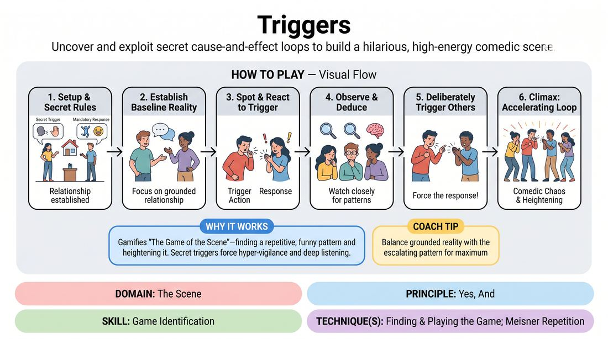

# Chain Reactions

{ .game-hero }

> Uncover and exploit secret cause-and-effect loops to build a hilarious, high-energy comedic scene.

## Overview
Three players perform a grounded scene where each has a secret, assigned trigger (an action or word from another player) that forces them to execute a specific response. As the scene progresses, players must actively listen and observe to deduce their castmates' triggers, intentionally activating them to heighten the comedic pattern.

## What It Trains
- **Domain:** D3 — The Scene
- **Principle(s):** Yes, And; Make Your Partner a Genius
- **Skill(s):** Active Listening; Offer Reception; Game Identification; Heightening & Exploration
- **Technique(s):** Meisner Repetition; Endowment-acceptance; Finding & Playing the Game; The 'ladder' (escalating beats)
- **Focus:** comedy_game

**Objective:** Develops acute active listening, pattern recognition, and game identification. Players learn to discover the 'game of the scene' through physical and verbal cause-and-effect loops, heightening the comedy by deliberately feeding their partners' patterns.

## Setup
Three players stand on stage. The facilitator asks two players to plug their ears while the audience (or remaining players) helps assign a secret trigger (e.g., someone touches their face) and a secret response (e.g., speaking in a high-pitched voice) to the active player. This is repeated for all three players so that everyone has a secret trigger-response pair unknown to the others.

## How to Play
1. Position three players on stage and establish a simple, grounded relationship and location suggestion to start the scene.
2. Explain that each player has a secret 'Trigger' (an action or word performed by someone else) and a 'Response' (their own mandatory reaction).
3. Begin the scene normally, focusing on establishing a baseline reality before the triggers start taking over.
4. When a player detects their specific trigger occurring in the scene, they must immediately and naturally execute their assigned response.
5. As the scene continues, players must closely observe their scene partners to deduce what triggers their partners' unusual behaviors.
6. Once a player believes they have identified a partner's trigger, they should deliberately perform that trigger action to force the response, heightening the comedic rhythm.
7. The scene reaches its climax as the chain reactions accelerate, with players rapidly triggering one another in a chaotic but structured comedic loop.

## Facilitation Notes
- Encourage players to start with a grounded scene; if they start too chaotic, the triggers lose their comedic impact.
- Side-coach players to keep their responses integrated into the scene's context rather than just doing them in a vacuum.
- If a player misses their trigger, the facilitator can gently call out 'Trigger!' or repeat the triggering action to help them notice.
- Remind players not to explicitly state the rules of the game during the scene (e.g., avoiding saying 'Every time I cough, you jump!'). Instead, play the behavior.

## Variations
- Silent Symphony: Play the entire game without dialogue, relying purely on physical triggers and physical responses.
- The Outsider: Two players have secret triggers, while a third player has no triggers but must actively try to figure out and manipulate the other two players' loops.
- Chain Link: Player A's response is Player B's trigger, and Player B's response is Player C's trigger, creating an automatic cascading loop.

## Debrief
- How did having a secret rule affect your ability to listen to your scene partners?
- What did it feel like when you successfully deduced a partner's trigger and deliberately activated it?
- How does this game mirror the way we find and play 'the game' in a standard, unconstrained improv scene?

## Safety & Inclusion
Ensure physical triggers and responses are safe and accessible for all players. Avoid triggers that require sudden, high-impact physical movements (like jumping or falling) unless all players are physically comfortable with them. Offer verbal or low-impact physical alternatives (like winking, changing vocal tone, or shifting posture).

## Why It Works
This game works because it gamifies the core improv concept of 'the game of the scene'—finding a repetitive, funny pattern and heightening it. By keeping the triggers secret, it forces players into a state of hyper-vigilance and deep listening. Once the patterns are discovered, the joy of the scene comes from the collaborative 'Yes, And' of deliberately setting each other up to succeed.
