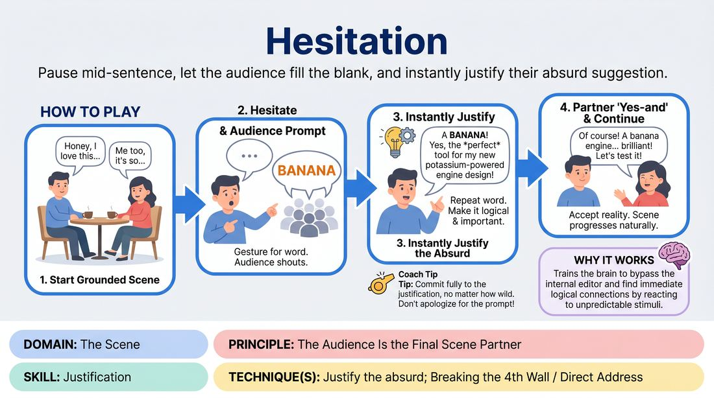

# The Hesitation Scene

{ .game-hero }

> Pause mid-sentence, let the audience fill the blank, and instantly justify their absurd suggestion.

## Overview
In this comedic scene-work game, players intentionally pause mid-dialogue to solicit random words from the audience. The actors must immediately accept whatever is shouted out and logically justify why that bizarre element makes perfect sense in their fictional world. It creates a high-energy, collaborative experience where the audience becomes an active writer of the scene.

## What It Trains
- **Domain:** D3 — The Scene
- **Principle(s):** The Audience Is the Final Scene Partner; Yes, And; The First Thought Is a Gift
- **Skill(s):** Justification; Audience-Energy Management; Offer Reception; Unfiltered Spontaneity
- **Technique(s):** Justify the absurd; Breaking the 4th Wall / Direct Address; Endowment-acceptance
- **Focus:** comedy_game

**Objective:** To develop rapid justification skills, practice unfiltered spontaneity, and master audience-energy management by treating unexpected suggestions as absolute truth.

## Setup
Two to four players stand in the performance space. An active audience is seated facing them. No props or physical materials are required.

## How to Play
1. Begin a standard, grounded scene based on a simple location or relationship suggestion from the audience.
2. Establish a clear platform, focusing on the relationship between the characters and the physical environment.
3. At any point during a line of dialogue, a player may intentionally hesitate, pausing mid-sentence and gesturing to the audience to prompt them for a word.
4. The audience shouts out a random word to fill in the blank.
5. The speaking player must immediately repeat the shouted word, accepting it as the absolute reality of the scene.
6. The player must then instantly justify why that specific, often absurd word is logical and important in the context of the scene.
7. The scene partner must 'yes-and' this new reality, treating the justified element as a natural part of their shared world.
8. Continue the scene, alternating who hesitates, ensuring the story still progresses naturally between the audience prompts.

## Facilitation Notes
- Side-coach players to avoid dismissing suggestions. If the audience shouts 'chainsaw' when a player asks for a kitchen utensil, the player must not say 'No, not a chainsaw.' They must justify why they are using a chainsaw to slice bread.
- Watch out for players overusing the hesitation mechanic. If they ask for a word every three seconds, the scene loses its narrative structure. Encourage them to build a solid platform first.
- Remind players to use physical commitment. If they receive an absurd object, they should immediately start using object work to show its weight, size, and utility.
- If the audience shouts multiple words at once, coach the player to grab the first one they hear clearly and run with it confidently.

## Variations
- Partner Justification: The player hesitates and gets the word from the audience, but their scene partner is the one who must immediately step in and justify why that word makes sense.
- Emotional Hesitation: Instead of nouns or objects, the player hesitates to ask the audience for an emotion or attitude that they must instantly adopt for the rest of the scene.
- Genre Hesitation: The player hesitates to ask for a film or literary genre, and the scene instantly shifts its style to match that genre.

## Debrief
- How did it feel to surrender control of your dialogue to the audience?
- What mental strategies helped you instantly justify an absurd suggestion instead of freezing?
- How does treating the audience's random input as a valuable gift change the energy of the performance?

## Safety & Inclusion
Ensure the audience is primed beforehand on the appropriate rating of the show (e.g., family-friendly or PG-13) so suggestions remain inclusive and comfortable for all players. If an inappropriate suggestion is shouted, players are encouraged to creatively re-interpret the word or quickly ask for another suggestion without shaming the audience member.

## Why It Works
This game bypasses the performer's internal editor by forcing them to react to external, unpredictable stimuli. By demanding immediate justification, it trains the brain to find patterns and logical connections between unrelated ideas, which is the core mechanism of organic comedy and narrative cohesion.
