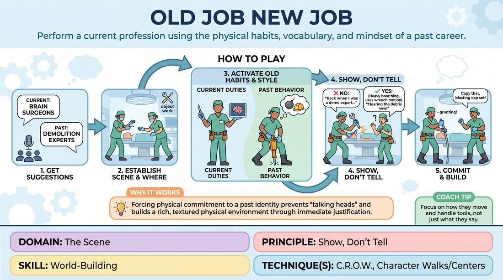

# Old Job, New Job

{ .game-hero }

> Perform a current profession using the physical habits, vocabulary, and mindset of a past career.

## Overview
Two players improvise a scene set in their current workplace, but their characters are deeply shaped by a previous, completely different profession. The humor and depth arise from how they physically and verbally apply their old habits to their new responsibilities without explicitly naming their past jobs.

## What It Trains
- **Domain:** D3 — The Scene
- **Principle(s):** Show, Don't Tell; Commit 100%; Yes, And
- **Skill(s):** World-Building; Physicality & Space Work; Offer Reception; Justification
- **Technique(s):** C.R.O.W. (Character, Relationship, Objective, Where); Character Walks/Centers; Justify the absurd
- **Focus:** comedy_game

**Objective:** To develop physical characterization, environmental world-building, and the 'Show, Don't Tell' principle by layering a character's history into their present actions and dialogue.

## Setup
Two players stand in the performance space. The facilitator or audience provides two suggestions: a current job they are performing right now, and a previous job they both used to have.

## How to Play
1. Ask the audience or group for two suggestions: a current profession (e.g., brain surgeons) and a past profession both characters shared (e.g., demolition experts).
2. The two players initiate a scene actively performing their current job, establishing the 'Where' through physical object work and environment building.
3. Players must execute their current duties while adopting the physical postures, vocal patterns, vocabulary, and tools-handling style of their previous job.
4. Avoid explicitly naming the previous job; instead, let the audience deduce it through physical choices, metaphors, and behavioral quirks.
5. Accept and build on each other's physical offers, justifying why a current task is being handled with the energy or technique of the old profession.
6. Maintain a high level of commitment to both realities, ensuring the current job's stakes remain real while the past job's habits dictate the execution.

## Facilitation Notes
- Side-coach players to focus on physical object work. If they are surgeons who used to be mechanics, how do they hold the scalpel? Do they wipe grease off their hands?
- Pitfall: Players simply talking about their old job ('Remember when we were plumbers?'). Fix: Remind them to 'Show, Don't Tell'—use the plumbing tools physically on the current task instead of reminiscing.
- Encourage players to use the jargon of the old job as metaphors for the new job's challenges.
- Keep the energy medium but focused; the comedy comes from the contrast of high-stakes current tasks done with inappropriate past habits.

## Variations
- Individual History: Each of the two players has a different past job, creating a clash of two distinct behavioral styles in the new workplace.
- Status Shift: The past job represents a massive shift in social status (e.g., former royalty now working as fast-food cashiers), emphasizing status play.
- Secret Past: The audience knows the past job, but the players must discover each other's past jobs solely through physical clues dropped during the scene.

## Debrief
- How did having a physical history change the way you interacted with the objects in your current environment?
- What was the effect of showing your past through behavior rather than explaining it through dialogue?
- How did your partner's physical choices help you justify your own actions in the scene?

## Why It Works
By forcing players to filter their current actions through a past identity, the game naturally prevents 'talking heads' scenes. It demands active physical commitment and immediate justification, which builds a rich, textured physical environment (World-Building) and establishes clear character points of view (C.R.O.W.) without relying on heavy exposition.
