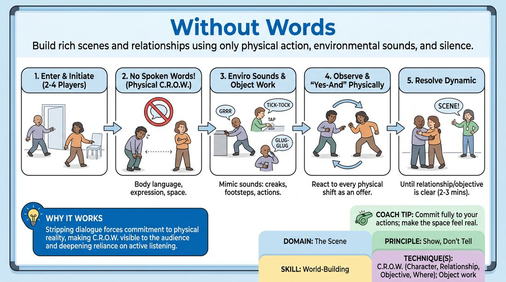

# The Wordless World

{ .game-hero }

> Build rich scenes and relationships using only physical action, environmental sounds, and silence.

## Overview
In this scene-work drill, players perform a fully realized scene without speaking a single word of dialogue. By relying entirely on physical space work, body language, and organic environmental sounds, players learn to communicate deep narrative details without verbal exposition.

## What It Trains
- **Domain:** D3 — The Scene
- **Principle(s):** Show, Don't Tell; Yes, And
- **Skill(s):** World-Building; Physicality & Space Work; Active Listening; Silence & Stillness
- **Technique(s):** C.R.O.W. (Character, Relationship, Objective, Where); Object work
- **Focus:** skill_drill

**Objective:** Develops physical world-building, active listening, and the C.R.O.W. framework (Character, Relationship, Objective, Where) by forcing players to show rather than tell.

## Setup
A clear performance space with no physical props. Two to four players stand ready to enter the playing area.

## How to Play
1. Two to four players step into the performance space.
2. The facilitator provides a simple location suggestion, or players can initiate organically based on a physical action.
3. Players begin the scene immediately, adhering to a strict rule: no spoken words or verbal dialogue of any kind are permitted.
4. Players must establish their Character, Relationship, Objective, and Where (C.R.O.W.) using physical posture, facial expressions, and spatial distance.
5. Players are encouraged to generate non-verbal environmental and object-based sounds, such as mimicking a creaking door, a ticking clock, heavy footsteps, or a sharp gasp.
6. Players must actively watch their scene partners, treating every physical movement or shift in weight as a narrative offer that requires a 'yes-and' response.
7. The scene continues until a clear relationship dynamic or physical objective is resolved, typically lasting two to three minutes, before the facilitator calls 'scene.'

## Facilitation Notes
- Side-coaching cue: 'Let the silence breathe. Do not rush to fill the space with frantic movement.'
- Pitfall: Players using gibberish or mouth-mumbling to bypass the 'no words' rule. Fix: Remind them that sounds must be strictly environmental or physiological (e.g., sighs, laughs, wind, machinery).
- Side-coaching cue: 'Show us how you feel about your partner by how close or far you stand from them.'
- Pitfall: Losing track of mimed objects (e.g., putting a cup down in mid-air). Fix: Gently call out the object's location to remind players to respect the physical reality they have built.

## Variations
- Sound Effects Assistant: Off-stage players provide all the environmental sound effects, and the on-stage players must instantly justify and react to those sounds.
- The Single Line: Players must play the entire scene in silence, but each player is allowed exactly one spoken sentence at a high-stakes moment of their choosing.
- Emotional Dial: The facilitator calls out numbers from 1 to 10 to dynamically scale the emotional intensity of the silent physical interactions.

## Debrief
- How did removing dialogue change the way you established your character's relationship and objective?
- What physical offers did you notice from your partner that you might have missed if you were both talking?
- How did using environmental sounds help make the imaginary space feel more concrete and real?

## Safety & Inclusion
Because non-verbal scenes rely heavily on physical proximity and body language, establish clear boundaries regarding physical contact before the scene begins. Ensure the playing area is completely clear of physical hazards.

## Why It Works
Stripping away dialogue removes the ability to explain the scene verbally, forcing players to commit to physical reality. This makes the C.R.O.W. elements immediately visible to the audience and deepens the players' reliance on active physical listening and spatial awareness.
