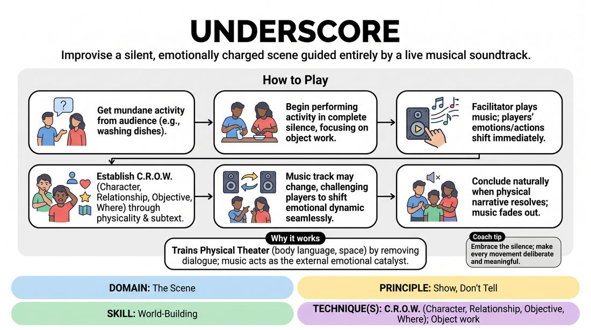

# Cinematic Underscore

{ .game-hero }

> Improvise a silent, emotionally charged scene guided entirely by a live musical soundtrack.

## Overview
Two players perform a completely silent scene, using physical action and environment work to tell a story. A facilitator plays various instrumental music tracks in the background, which the players must use as their emotional compass and narrative engine. The result is a highly cinematic, deeply felt exploration of relationship and space without a single spoken word.

## What It Trains
- **Domain:** D3 — The Scene
- **Principle(s):** Show, Don't Tell; Yes, And; Make Your Partner a Genius
- **Skill(s):** World-Building; Physicality & Space Work; Silence & Stillness; Active Listening; Single-Partner Empathy & Mirroring
- **Technique(s):** C.R.O.W. (Character, Relationship, Objective, Where); Object work; Emotional-echo drills; Hold-the-beat reps
- **Focus:** mixed

**Objective:** To develop physical storytelling, precise object work, and emotional responsiveness by stripping away dialogue and relying on musical cues to establish C.R.O.W. (Character, Relationship, Objective, Where).

## Setup
An open performance space with a clear stage area. A sound system (PA or Bluetooth speaker) connected to a music player loaded with a diverse playlist of instrumental tracks (e.g., melancholic piano, tense thriller strings, whimsical woodwinds, epic orchestral). Two players stand on stage, while the rest of the group observes as an audience.

## How to Play
1. Ask the audience or group for a simple, mundane physical activity that two people might do together (e.g., washing dishes, folding laundry, painting a wall).
2. The two players take their positions on stage and begin performing the suggested activity in complete silence, focusing on detailed, realistic object work.
3. The facilitator starts playing an instrumental music track, setting a distinct emotional tone (e.g., somber, suspenseful, romantic, or joyful).
4. Players must immediately let the music influence their physical movements, facial expressions, and the underlying subtext of their relationship.
5. Without speaking, players establish their C.R.O.W. elements: who they are to each other, what they want, and where they are, using only their physical interactions and the environment.
6. The facilitator may transition to a different track mid-scene to challenge the players to shift their emotional dynamic and narrative direction seamlessly.
7. The scene concludes naturally when the physical narrative reaches a satisfying resolution, at which point the facilitator fades out the music.

## Facilitation Notes
- Side-coaching cue: 'Slow down.' Encourage players to move at half-speed to allow the emotional weight of the music and their physical choices to land.
- Pitfall: Rushing to find a plot. Fix: Remind players to focus on the physical reality of their environment and their partner's eyes before trying to 'do' something dramatic.
- Side-coaching cue: 'Let the music breathe through you.' If players are ignoring the soundtrack, remind them to let the tempo and volume dictate their physical pacing.
- Pitfall: Pantomime guessing games. Fix: Ensure players are reacting to the feeling of the scene rather than trying to sign-language specific words or complex plot points to each other.

## Variations
- Genre Shift: The facilitator changes the music track every 60 seconds, forcing the players to instantly justify why their relationship's emotional temperature has radically shifted.
- The Third Character: One player controls the music player, using the tracks to actively 'edit' or direct the on-stage players' physical choices in real-time.
- Spoken Transition: Allow the players to speak exactly one line of dialogue each at the very peak of the musical track, then return immediately to silence.

## Debrief
- How did the music change your physical relationship with the imaginary objects in the room?
- How did you establish the C.R.O.W. elements (especially relationship and objective) without using any words?
- What moments felt the most honest, and how did silence help you achieve that honesty?

## Safety & Inclusion
Since this game relies heavily on physical proximity and non-verbal communication, establish boundaries regarding physical contact before starting. Players should agree on whether touch is permitted, and if so, what kind. Encourage players to use eye contact and breath to mirror and connect without needing physical touch.

## Why It Works
By removing verbal dialogue, players are forced to rely on the core tenets of physical theater: body language, spatial relationships, and environment work. The music acts as an external emotional catalyst, bypassing the analytical brain and tapping directly into intuitive, felt responses. This builds a strong foundation for C.R.O.W. because players must show, not tell, their circumstances.
