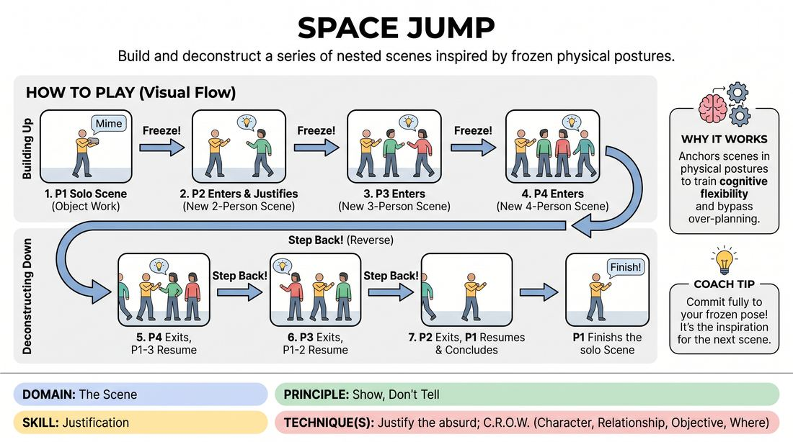

# Space Jump

{ .game-hero }

> Build and deconstruct a series of nested scenes inspired by frozen physical postures.

## Overview
Space Jump is a physical, fast-paced scene-building game where players layer multiple scenarios on top of one another. By freezing in place and using their physical shapes as the inspiration for new scenes, players practice rapid justification. Once the maximum number of players is reached, the game reverses, challenging players to recall and resume their previous scenes.

## What It Trains
- **Domain:** D3 — The Scene
- **Principle(s):** Show, Don't Tell; Yes, And; The First Thought Is a Gift; Group Mind
- **Skill(s):** Justification; World-Building; Physicality & Space Work; Offer Reception; Support Work
- **Technique(s):** Justify the absurd; C.R.O.W. (Character, Relationship, Objective, Where); Object work; Endowment-acceptance; Tap-ins
- **Focus:** skill_drill

**Objective:** Develops physical justification, narrative memory, and the ability to show rather than tell by using physical postures to inspire and transition between scenes.

## Setup
A clear performance space. Four to eight players stand on the sidelines ready to enter, while the rest of the group acts as active observers.

## How to Play
1. Player 1 enters the stage and begins a solo scene, focusing heavily on physical object work and clear environmental actions.
2. After about 15 to 30 seconds, the facilitator calls 'Freeze!' and Player 1 must instantly freeze in their current physical posture.
3. Player 2 enters the stage, observes Player 1's frozen posture, and initiates a brand-new, two-person scene that justifies Player 1's physical position in a completely different context.
4. Player 1 immediately adopts this new reality, and they play a brief two-person scene together.
5. The facilitator calls 'Freeze!' again. Player 3 enters, looks at the frozen shapes of Players 1 and 2, and initiates a three-person scene with a new premise.
6. The facilitator calls 'Freeze!' a final time. Player 4 enters and initiates a four-person scene based on the three frozen players' shapes.
7. After the four-person scene is established, the facilitator calls 'Step Back!' to signal the reverse sequence. Player 4 exits the stage.
8. Players 1, 2, and 3 must instantly resume their three-person scene, picking up exactly where they left off or justifying their current physical positions back into that narrative.
9. The facilitator calls 'Step Back!' again. Player 3 exits, and Players 1 and 2 resume their two-person scene.
10. The facilitator calls 'Step Back!' one last time. Player 2 exits, and Player 1 resumes and quickly resolves their original solo scene to conclude the round.

## Facilitation Notes
- Side-coach players to freeze instantly when called, avoiding the temptation to 'clean up' or adjust their posture into an easier position.
- Encourage the entering player to make a bold physical choice or interpret the frozen shapes in an unexpected, non-literal way to practice justifying the absurd.
- If players forget what their previous scenes were about, remind them that the physical posture is their anchor; let the body remind the brain of the character.
- Ensure the transitions backward are clean. The exiting player should leave immediately, and the remaining players must instantly re-engage with high energy.

## Variations
- Blind Entrances: The entering player must keep their eyes closed until the freeze is called, forcing them to make an instant, unfiltered physical interpretation.
- Forward Only: Instead of going backward, keep adding players up to 8 or 10, creating a massive, chaotic group scene, then ending on a high note.
- Emotional Carryover: When returning to previous scenes, players must keep the emotional state of the scene they just left, justifying why their character is suddenly ecstatic, angry, or terrified.

## Debrief
- How did your physical posture help you remember the context of the previous scene when we went backward?
- What strategies did you use to instantly justify an absurd or uncomfortable physical position when a new player entered?
- How does focusing on physical shapes change the types of scenes we initiate compared to verbal suggestions?

## Safety & Inclusion
Encourage players to prioritize physical safety; if a frozen posture is physically straining or uncomfortable, they should adjust to a safe position. Respect personal space boundaries when entering another player's physical zone.

## Why It Works
By anchoring scenes in physical postures rather than verbal ideas, players bypass intellectual planning and engage directly with the physical environment. The nesting structure trains cognitive flexibility and narrative recall, proving that any physical shape can be justified into a logical story element.
