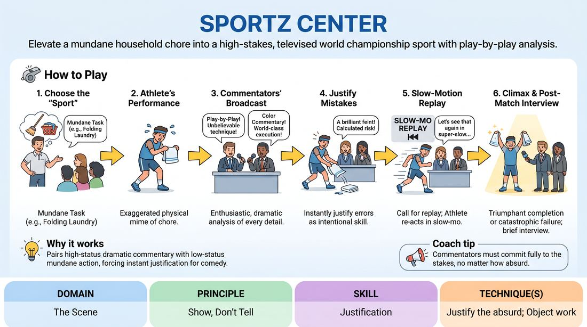

# Championship Commentary

{ .game-hero }

> Elevate a mundane household chore into a high-stakes, televised world championship sport with play-by-play analysis.

## Overview
Three players collaborate to treat an ordinary, everyday task as an elite, high-stakes athletic event. One player acts as the competitor performing the task physically, while the other two act as sports commentators providing dramatic play-by-play analysis and expert color commentary. The humor and narrative drive come from the commentators instantly justifying the competitor's physical choices, mistakes, and triumphs as elite athletic strategies.

## What It Trains
- **Domain:** D3 — The Scene
- **Principle(s):** Show, Don't Tell; Make Your Partner a Genius; Group Mind
- **Skill(s):** Justification; Heightening & Exploration; Physicality & Space Work; Active Gifting; Support Work
- **Technique(s):** Justify the absurd; Object work; Endowment-gifting drills; Playing architecture/objects
- **Focus:** comedy_game

**Objective:** To develop rapid justification of physical choices, heightening mundane actions into high-comedy, and practicing active gifting between physical performers and verbal commentators.

## Setup
Three players stand in the performance space. One player (the Athlete) stands center-stage to perform the physical task. The other two players (the Commentators) stand to one side, facing the audience as if in a broadcast booth. No props are used; all physical actions are mimed. The facilitator or group provides a simple, mundane daily chore (e.g., making toast, tying shoes, folding laundry).

## How to Play
1. The facilitator obtains a mundane daily task from the group to serve as the 'sport' for the World Championship.
2. The Athlete begins performing the task in real-time, using exaggerated, highly focused physical mime to treat the chore with intense athletic gravity.
3. The two Commentators immediately begin their broadcast, providing enthusiastic play-by-play and color commentary, treating every minor physical detail as a high-stakes athletic maneuver.
4. When the Athlete makes a physical mistake, slips, or changes pace, the Commentators must instantly justify it as a deliberate, high-risk technique or a devastating tactical error.
5. The Commentators can call for a 'slow-motion replay' of a specific moment, prompting the Athlete to physically rewind and replay the action in slow motion while the commentators analyze the mechanics.
6. The scene builds to a dramatic climax—either a triumphant completion of the chore or a catastrophic failure—concluding with a brief post-match interview between a commentator and the athlete.

## Facilitation Notes
- Coaching cue: 'Treat the mundane with absolute gravity!' Remind the Athlete to avoid playing it for laughs directly; the comedy comes from their earnestness and the commentators' analysis.
- Coaching cue: 'Justify the slip-ups!' If the Athlete drops an imaginary object, the Commentators should immediately explain how the 'humidity on the court' or 'poor grip choice' caused the fumble.
- Pitfall: Commentators talking over each other. Fix: Encourage them to use a classic play-by-play and color-commentator dynamic, where one describes the action and the other provides the expert analysis.
- Pitfall: The Athlete moving too fast. Fix: Remind the Athlete to slow down their physical work so the commentators have time to dissect and heighten every single movement.

## Variations
- Instant Replay: The commentators can call for 'different camera angles' (e.g., 'Let's look at the close-up cam on the left thumb'), forcing the Athlete to adjust their physical orientation to the audience.
- The Coach's Corner: One commentator plays the anchor, while the other plays the Athlete's intense personal coach, defending the Athlete's bizarre choices and training regimen.
- Split-Screen Analysis: Introduce a whiteboard or telestrator where a commentator 'draws' on the air to explain the physics of the Athlete's movement.

## Debrief
- How did treating a low-stakes task with high-stakes commitment change your physical choices?
- Commentators, how did you find logical justifications for unexpected physical mistakes?
- Athlete, how did the commentators' descriptions influence or change your physical performance in real-time?

## Safety & Inclusion
Ensure the physical performer has a clear, unobstructed space to move safely, especially when performing physical comedy or slow-motion movements. Adjust the physical intensity of the 'sport' to match the physical comfort and mobility levels of the performer.

## Why It Works
This game functions as a perfect comedy engine by pairing high-status, dramatic commentary with low-status, mundane actions. It forces the commentators to practice instant justification, turning accidental physical fumbles into brilliant narrative gifts. This mutual support builds a strong group mind, where the physical and verbal narratives constantly feed and elevate each other.
