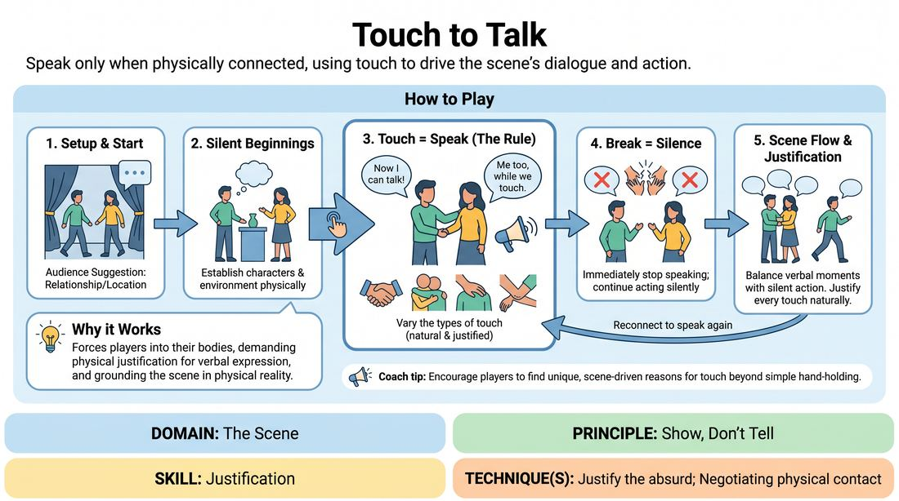

# Touch to Speak

{ .game-hero }

> Speak only when physically connected, using touch to drive the scene's dialogue and action.

## Overview
Two players perform a scene under a strict physical constraint: they can only speak when they are in physical contact with one another. The moment contact is broken, they must fall silent, relying on physical expression, movement, and space work to tell the story. This creates a dynamic tension between physical proximity and verbal communication.

## What It Trains
- **Domain:** D3 — The Scene
- **Principle(s):** Commit 100%; Make Your Partner a Genius; Show, Don't Tell
- **Skill(s):** Physicality & Space Work; Single-Partner Empathy & Mirroring; Boundary Navigation; Justification
- **Technique(s):** Negotiating physical contact; Justify the absurd
- **Focus:** mixed

**Objective:** To develop physical justification, non-verbal storytelling, and deep partner awareness by linking the ability to speak directly to physical contact.

## Setup
A clear performance space with room for two players to move freely. Before beginning, the facilitator establishes clear physical boundaries and consent guidelines for the group.

## How to Play
1. Two players step into the performance space and receive a simple relationship or location suggestion from the audience.
2. The players begin the scene, establishing their characters and environment through physical action.
3. A strict rule is enforced: a player may only speak, make sounds, or vocalize while they are in physical contact with the other player.
4. The moment physical contact is broken, both players must immediately stop speaking, though they must continue acting and reacting silently.
5. Players must justify the physical contact within the context of the scene, making the touch feel natural to the characters and setting.
6. Players are encouraged to vary the types of touch used, such as a hand on a shoulder, a high-five, a tight embrace, or guiding someone by the elbow, rather than maintaining a static hold.
7. The scene continues for three to five minutes, balancing moments of close physical dialogue with silent, active physical separation.

## Facilitation Notes
- Side-coaching cue: 'Find the silence!' Encourage players to embrace the quiet moments when they separate, using object work and facial expressions to communicate.
- Pitfall: Players holding a static, awkward handshake just to keep talking. Fix: Side-coach them to break contact, move across the stage, and find a new, justified reason to touch again.
- Side-coaching cue: 'Justify the touch!' Remind players to make the physical contact make sense for their characters and the setting, rather than treating it as an arbitrary game rule.
- Pitfall: Rushing the physical contact out of fear of silence. Fix: Remind players that silence is a powerful narrative tool; let the physical distance build tension before closing the gap.

## Variations
- Varying Intensity: The volume or emotional intensity of the speech must match the pressure or surface area of the physical touch.
- One-Way Talk: Only the player initiating the touch is allowed to speak, while the receiver must remain silent until they initiate a touch of their own.
- Emotional Conductors: Each specific type of touch triggers a specific pre-assigned emotion or subtext for the speaker.

## Debrief
- How did the physical constraint change how you listened and responded to your partner?
- What strategies did you use to justify why your characters were touching or why they suddenly stopped talking?
- How did the silent moments affect the pacing and tension of the scene?
- In what ways did this game force you to 'show' your relationship rather than 'tell' it?

## Safety & Inclusion
Establish clear physical boundaries before starting. Players must discuss and agree on their comfort levels with touch (e.g., 'shoulders and arms only' or 'no torso touch'). Anyone can opt out or adjust the touch rules at any time without explanation. Ensure a culture of consent is active before play begins.

## Why It Works
By tying verbal communication directly to physical touch, the game forces players out of their heads and into their bodies. It strips away the ability to rely solely on witty dialogue, demanding that players use physical justification to make the scene believable. This builds a strong foundation for 'Show, Don't Tell' because the physical relationship must be negotiated and justified in real-time.
