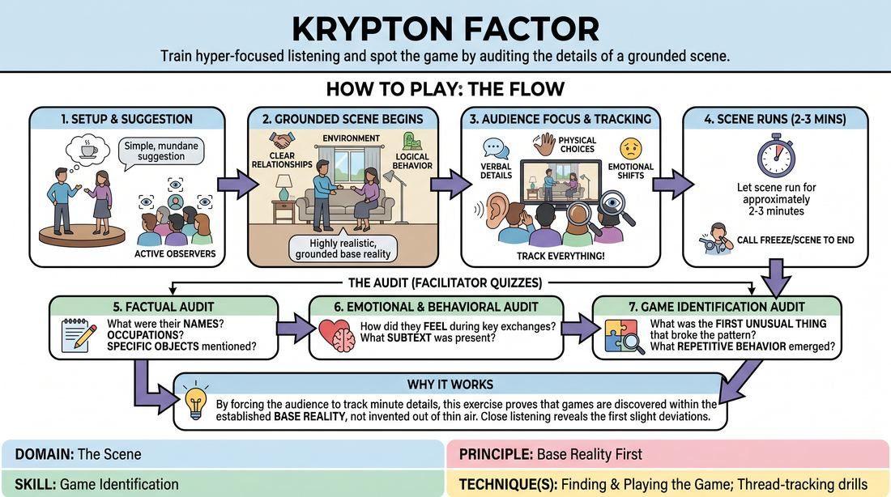

# The Observation Audit

{ .game-hero }

> Train hyper-focused listening and spot the game by auditing the details of a grounded scene.

## Overview
Two players improvise a grounded, realistic scene while the rest of the group acts as active observers. Afterward, the facilitator quizzes the audience on minute details, emotional shifts, and emerging patterns to reveal how a strong base reality naturally generates the game of the scene.

## What It Trains
- **Domain:** D3 — The Scene
- **Principle(s):** Base Reality First; Yes, And
- **Skill(s):** Game Identification; Active Listening; Peripheral Awareness
- **Technique(s):** Finding & Playing the Game; Thread-tracking drills
- **Focus:** skill_drill

**Objective:** To develop deep active listening, peripheral awareness, and the ability to identify the 'first unusual thing' (the game) by establishing and tracking a solid base reality.

## Setup
An active performance space for two players at the front, with the remaining participants seated as an audience. No props or materials are required.

## How to Play
1. Select two players to step into the performance space and obtain a simple, mundane suggestion to start the scene.
2. Instruct the players to begin a scene, focusing on establishing a highly realistic, grounded base reality with clear relationships, environment, and logical behavior, avoiding any immediate attempts to be funny or absurd.
3. Direct the remaining participants to watch and listen with absolute focus, tracking every verbal detail, physical choice, and emotional shift.
4. Let the scene run for approximately two to three minutes, then call freeze or scene to end the performance.
5. Begin the audit by asking the audience literal, factual questions about what transpired, such as character names, occupations, or specific objects mentioned.
6. Transition the questions to emotional and behavioral observations, asking how characters felt during specific exchanges or what subtext was present.
7. Conclude the audit by asking game-identification questions to pinpoint the first unusual thing that broke the normal pattern of the world and what repetitive behavior could become the game.

## Facilitation Notes
- Encourage players to keep the start of the scene incredibly ordinary; if they jump to high-concept absurdity immediately, it becomes harder to track the first unusual thing.
- If the audience struggles to recall details, remind them that active listening in improv is about tracking the history of the stage rather than just waiting for a turn to speak.
- Validate multiple interpretations of the game of the scene, as different audience members will naturally latch onto different patterns.
- Pitfall: Players trying to help the audience by over-emphasizing details. Fix: Coach them to play naturally and let the audience do the work of observing.

## Variations
- The Mid-Scene Pivot: Pause the scene the moment the audience spots the first unusual thing, ask them to define the game, and then have the players unfreeze to play that game to its logical extreme.
- The Hand-Raise Trigger: Instruct audience members to silently raise their hands the exact moment they perceive the first unusual thing or a repeatable pattern emerging.
- The Rapid-Fire Line: Go down the line of the entire audience, requiring every single person to name one distinct pattern or potential game they observed, even if they repeat or build on a previous answer.

## Debrief
- How did focusing on literal, mundane details help you discover the emotional truth or game of the scene?
- Why is a strong, grounded base reality necessary before we can find the first unusual thing?
- How does active listening as an audience member translate to being a better scene partner when you step on stage?

## Safety & Inclusion
Ensure that the questioning process remains supportive and collaborative, not a test of memory that shames participants. If a participant has auditory processing or visual differences, encourage them to focus on whatever sensory details they naturally track best.

## Why It Works
By forcing the audience to track minute details, this exercise proves that games are not invented out of thin air; they are discovered within the established base reality. When players listen closely enough to notice the first slight deviation from normal behavior, the game of the scene reveals itself naturally without the need for forced jokes.
