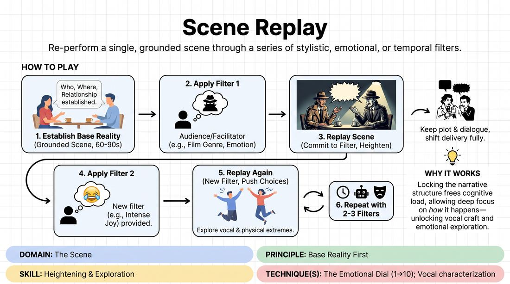

# The Replay Matrix

{ .game-hero }

> Re-perform a single, grounded scene through a series of stylistic, emotional, or temporal filters.

## Overview
Two players perform a brief, realistic scene to establish a solid base reality. Once completed, they replay the exact same narrative arc and relationship under different stylistic, emotional, or structural constraints. This challenges players to maintain core narrative integrity while dynamically shifting their physical and vocal delivery.

## What It Trains
- **Domain:** D3 — The Scene
- **Principle(s):** Base Reality First; Commit 100%; Yes, And; Group Mind
- **Skill(s):** Heightening & Exploration; Emotional Fluidity; Vocal Craft; Active Listening; Pacing & Rhythm
- **Technique(s):** The Emotional Dial (1→10); Vocal characterization; Gibberish; Timing exercises
- **Focus:** mixed

**Objective:** Develops the ability to establish a strong base reality first, using subsequent stylistic filters to heighten and explore the scene's core game without losing the underlying relationship.

## Setup
A clear performance space at the front of the room. The remaining participants act as the active audience and facilitators. No props or special materials are required.

## How to Play
1. Select two players to step into the performance space.
2. Ask the players to perform a short, grounded scene of about 60 to 90 seconds based on a simple, everyday suggestion.
3. Instruct the players to focus heavily on establishing a clear base reality: who they are, where they are, and what their relationship is.
4. Once the initial scene concludes, the facilitator or audience provides a specific 'filter' or constraint, such as a film genre, an intense emotion, or a historical era.
5. The players immediately replay the scene, keeping the same basic plot points, relationship dynamics, and core dialogue, but fully committing to the new filter.
6. Repeat this process with two to three different filters, pushing the players to heighten their physical and vocal choices with each iteration.

## Facilitation Notes
- Side-coaching cue: 'Keep the relationship the same, just change the filter!'
- Side-coaching cue: 'Commit 100% to the new style—don't comment on the absurdity, live in it!'
- Pitfall: Players change the plot or characters entirely during the replay. Fix: Remind them that the humor and skill come from the contrast of the same story told differently. Have them repeat the exact opening line to anchor themselves.
- Pitfall: The initial scene is too wacky or chaotic, making it hard to replay. Fix: Emphasize 'Base Reality First' in the setup. The first scene must be mundane and grounded to give them a solid foundation to build upon.

## Variations
- Temporal Compression: Replay the scene in 60 seconds, then 30 seconds, then 15 seconds, and finally 5 seconds, forcing extreme physical and vocal economy.
- Gibberish Replay: Replay the exact scene using only gibberish, relying entirely on emotional fluidity, vocal tone, and physical expression to convey the original dialogue's meaning.
- Tag-Team Replay: Two new players step in to replay the original players' scene, interpreting their characters and choices through a new genre.

## Debrief
- How did having a strong, grounded base reality in the first run help you navigate the shifts in the replays?
- What happened to your physical and vocal choices when we applied different genres or emotional filters?
- How did you maintain active listening when the pacing or style of your partner changed dramatically?

## Safety & Inclusion
Ensure that emotional filters (such as extreme anger or grief) are played with theatrical commitment but respect personal boundaries. Players should feel free to adjust the intensity of the filter to remain within their comfort zone.

## Why It Works
By locking down the narrative structure in the first run, players are freed from the cognitive load of inventing 'what happens next.' This allows them to focus entirely on 'how it happens,' unlocking deep exploration of vocal craft, emotional fluidity, and physical commitment.
