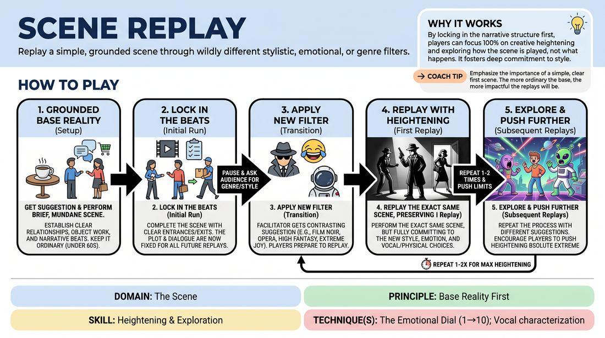

# Genre Rewind

{ .game-hero }

> Replay a simple, grounded scene through wildly different stylistic, emotional, or genre filters.

## Overview
In this game, players establish a simple, mundane base reality in a short scene, then replay the exact same sequence of events under the influence of different audience-suggested genres or emotions. The fun lies in how the core narrative beats are stretched, heightened, and transformed while keeping the original structure intact.

## What It Trains
- **Domain:** D3 — The Scene
- **Principle(s):** Base Reality First; Commit 100%; Yes, And
- **Skill(s):** Heightening & Exploration; Emotional Fluidity; Unfiltered Spontaneity; Active Listening; Thematic Synthesis
- **Technique(s):** The Emotional Dial (1→10); Vocal characterization; Justify the absurd; Callbacks & Mapping
- **Focus:** comedy_game

**Objective:** To develop the ability to establish a clear, simple base reality first, and then use extreme commitment and emotional fluidity to heighten and explore that reality through stylistic filters.

## Setup
An active playing space at the front of the room with the rest of the group acting as the audience. No props or special staging are required, though two chairs can be used if needed.

## How to Play
1. Ask for a suggestion of a mundane, everyday location or activity to set the scene.
2. Two main players step up to begin a short, grounded scene, establishing a clear base reality with simple dialogue and clear object work.
3. During the scene, one or two additional players from the sideline should make brief, purposeful entrances, deliver a line or two, and then exit, leaving the original duo to close the scene.
4. Keep this initial scene brief (under 60 seconds) and intentionally ordinary, focusing on clear narrative beats and a logical sequence of events.
5. Once the scene ends, the facilitator pauses the action and asks the audience for a contrasting genre, film style, or intense emotion.
6. The players immediately replay the exact same scene, preserving the original plot points, character entrances, and basic dialogue beats, but fully committing to the new stylistic filter.
7. Repeat the replay process one or two more times with different suggestions, encouraging the players to push the physical and vocal heightening to its absolute limit.

## Facilitation Notes
- Coaching Tip: Remind players that the first scene must be simple and grounded. If the base reality is already wacky, the replays have nowhere to go.
- Side-coaching Cue: 'Keep the same structure!' If players start inventing entirely new plot lines during the replay, gently remind them to stick to the original sequence of events.
- Pitfall & Fix: Players often struggle to remember the exact dialogue. Fix: Emphasize that they don't need to memorize word-for-word; they just need to hit the same narrative beats and emotional beats in the same order.
- Coaching Tip: Encourage physical transformation. A change in genre should change how characters stand, move, and use space, not just how they speak.

## Variations
- Emotional Rollercoaster: Instead of replaying the whole scene in one genre, the facilitator calls out different emotions mid-scene, forcing players to transition on the fly.
- Gibberish Translation: The first run is in English, and the replay is done entirely in gibberish, relying purely on physical heightening and vocal tone to convey the original story.
- Tempo Shift: Replay the scene at double-speed (fast forward) or half-speed (slow motion), maintaining the exact physical and verbal beats.

## Debrief
- How did having a simple, grounded base reality in the first run make it easier to play the extreme genres later?
- What did you notice about your physical and vocal choices when you committed 100% to a genre?
- How did keeping the same narrative structure free you up to be more spontaneous with your character choices?

## Safety & Inclusion
Ensure that physical choices in high-energy genres (like action films or westerns) remain safe and controlled, respecting physical boundaries and avoiding actual physical contact unless explicitly agreed upon.

## Why It Works
By locking in the narrative structure and dialogue beats in the first run, players are freed from the cognitive load of 'what happens next.' This allows them to channel 100% of their creative energy into 'how it happens,' fostering deep commitment, emotional fluidity, and playful heightening.
