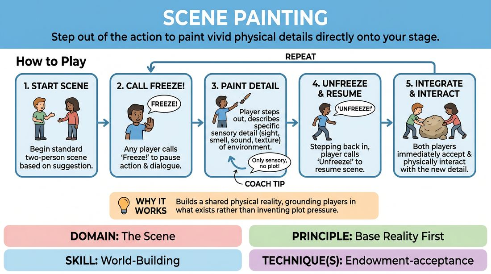

# Scene Painting

{ .game-hero }

> Step out of the action to paint vivid physical details directly onto your stage.

## Overview
A scene-building exercise where players temporarily pause the action to describe specific, sensory details of their physical environment. By stepping out of character to paint the space, players establish a rich, shared base reality that immediately informs their characters' choices and the narrative stakes.

## What It Trains
- **Domain:** D3 — The Scene
- **Principle(s):** Base Reality First; Serve the Story; Yes, And
- **Skill(s):** World-Building; Narrative Architecture; Offer Reception
- **Technique(s):** Endowment-acceptance
- **Focus:** skill_drill

**Objective:** To develop robust world-building skills and establish a strong base reality by consciously adding sensory, environmental details that influence the scene's subtext and physical action.

## Setup
Two active players stand in the performance space. The remaining players observe as an active audience, ready to rotate in. No physical props or set pieces are used; the stage is entirely blank.

## How to Play
1. Begin a standard two-person scene based on a simple relationship or location suggestion.
2. At any point during the scene, either player can call 'Freeze!' to temporarily pause the physical action and dialogue.
3. The player who called the freeze steps slightly out of their character's physical posture, addresses the space, and describes one specific, sensory detail of the environment that wasn't there before.
4. The description must be purely environmental and sensory—focusing on sight, smell, sound, or texture—rather than explaining character thoughts or plot points.
5. Once the detail is painted, the player steps back into their character's physical position and calls 'Unfreeze!' to resume the scene.
6. Both players must immediately accept this new environmental detail, integrating it into their physical work, dialogue, or emotional subtext.
7. Keep the painted details active by physically interacting with them or letting them influence the tension of the scene.

## Facilitation Notes
- Coaching Cue: 'Paint what we can't see, then show us how it feels.' Encourage players to use sensory language (temperature, smell, texture) rather than just listing objects.
- Pitfall: Players using the freeze to explain their character's internal thoughts or to force a plot twist. Fix: Remind them that scene painting is strictly for physical, environmental details. Let the environment drive the psychology, not the other way around.
- Coaching Cue: 'Touch the paint.' Remind players to physically interact with the newly described objects once the scene resumes to solidify the reality.
- Pitfall: Overusing the freeze mechanic, which stalls the natural momentum of the scene. Fix: Limit each player to one or two freezes per scene, encouraging them to weave details organically into dialogue when possible.

## Variations
- Third-Party Painter: An off-stage player or the facilitator calls the freeze and paints a detail into the scene, forcing the two active players to adapt to an unexpected environmental element.
- Sensory Focus: Restrict the scene painting to non-visual senses, such as describing a specific smell, a background hum, or the temperature of the air.
- Emotional Echo: The painted detail must directly reflect or contrast the current emotional state of the characters (e.g., a cold, sterile room during a passionate argument).

## Debrief
- How did having a highly detailed physical environment change your character's physical choices and movement?
- In what ways did the painted details help establish the subtext or stakes of the scene without you having to explain them through dialogue?
- How did it feel to have your partner paint an object that completely changed your understanding of the space?

## Safety & Inclusion
Ensure players are mindful of physical boundaries when describing the environment, avoiding painting details that force unwanted physical contact or touch between characters. Allow players to paint elements that accommodate their own physical comfort and mobility.

## Why It Works
By separating environmental description from active dialogue, players bypass the pressure of inventing plot and instead focus on discovering what is already there. This grounds the scene in a shared physical reality, making subsequent narrative choices feel organic, earned, and deeply rooted in the space.
