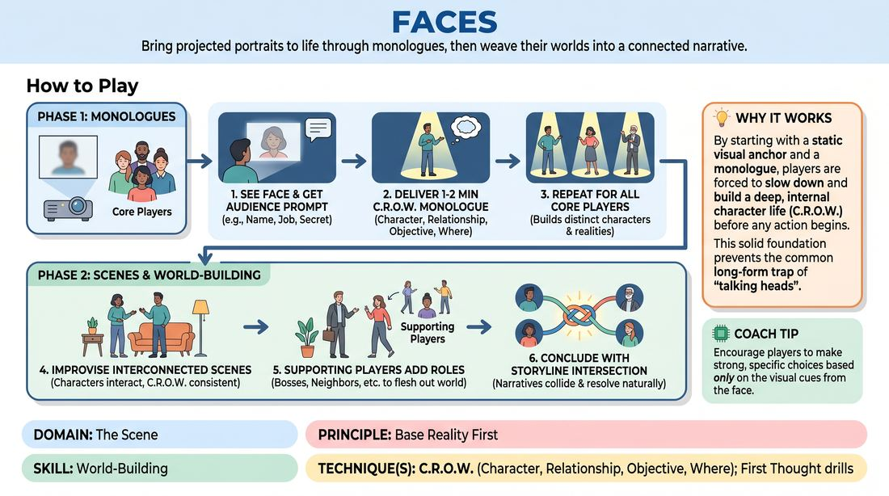

# Portrait Gallery

{ .game-hero }

> Bring projected portraits to life through monologues, then weave their worlds into a connected narrative.

## Overview
In this long-form format, players improvise character monologues inspired by unseen, projected photographs of diverse faces. After establishing these distinct characters and their core realities, the ensemble performs a series of interconnected scenes that explore how their lives and worlds collide.

## What It Trains
- **Domain:** D3 — The Scene
- **Principle(s):** Base Reality First; Serve the Story; The First Thought Is a Gift; Serve the Piece; The Audience Is the Final Scene Partner
- **Skill(s):** World-Building; Unfiltered Spontaneity; Narrative Architecture; Format Literacy; Room Reading
- **Technique(s):** C.R.O.W. (Character, Relationship, Objective, Where); First Thought drills; Longform vs. shortform mechanics; Platform/Tilt
- **Focus:** narrative

**Objective:** To master the C.R.O.W. framework (Character, Relationship, Objective, Where) by establishing a rich, grounded base reality from visual prompts, and to develop narrative architecture skills by weaving disparate characters into a cohesive story.

## Setup
A projector or large display screen visible to both the audience and the stage. A curated slideshow of high-resolution, expressive, and diverse portrait photographs that the players have not seen beforehand. A performance space with a clear stage area and seating for an audience.

## How to Play
1. Divide the ensemble into Core Players (3 to 5 people who will each receive a portrait) and Supporting Players (who will play auxiliary roles).
2. Project the first portrait onto the screen. The assigned Core Player stands next to the projection, seeing the face for the very first time.
3. Ask the audience for a few quick details based on the image, such as a name, an unusual occupation, or a secret longing.
4. The Core Player delivers a 1-to-2-minute monologue in character, establishing their C.R.O.W. (who they are, how they relate to others, what they want, and where they spend their time), inspired by the photo and suggestions.
5. Repeat this process for each Core Player until all 3 to 5 main characters have been introduced with their own distinct monologues.
6. Transition into the scene phase: the ensemble improvises a series of scenes where these established characters interact, keeping their C.R.O.W. profiles consistent.
7. Supporting Players edit scenes and enter as minor characters (e.g., bosses, neighbors, strangers) to flesh out the world and drive the narrative forward.
8. Conclude the piece when the storylines of the main characters reach a natural, satisfying intersection or resolution.

## Facilitation Notes
- Coaching cue: 'Look at the details of the face—the eyes, the posture, the clothing. Let the physical reality of the photo dictate your character's voice and physical life.'
- Pitfall: Players ignoring the photo or audience suggestions after the first few seconds. Fix: Remind players to constantly anchor back to the visual details of the portrait throughout their monologue.
- Coaching cue: 'Establish C.R.O.W. early. We need to know what you want (Objective) and where you are (Where) to build a stable base reality.'
- Pitfall: The subsequent scenes becoming chaotic or losing the established character depth. Fix: Instruct players to prioritize 'Base Reality First' in the scenes; don't rush into high-stakes drama before establishing the everyday relationship between the characters.

## Variations
- The Object Connection: Instead of portraits of faces, use photos of highly specific personal objects (e.g., a dusty violin, a key ring with ten keys, a worn-out diary) to inspire the characters.
- The Split-Screen: Have two portraits projected simultaneously, and have two players deliver a joint monologue or a split-focus scene establishing their pre-existing relationship.
- Virtual Adaptation: In a digital space, the host shares their screen with the portrait, and the spotlighted player performs the monologue directly to the camera.

## Debrief
- How did having a concrete visual prompt (the portrait) help you establish a grounded character and base reality?
- How did the C.R.O.W. elements established in the monologues make it easier to initiate and navigate the subsequent scenes?
- What strategies did the supporting players use to weave the different characters' worlds together without crowding the main narratives?

## Safety & Inclusion
Ensure the curated portrait collection represents a wide diversity of ages, ethnicities, genders, and expressions, avoiding caricatures. Instruct players to portray all characters with empathy and respect, avoiding stereotypes or mocking accents based on the visual appearance of the portraits.

## Why It Works
By starting with a static visual anchor and a monologue, players are forced to slow down and build a deep, internal character life (C.R.O.W.) before any action begins. This solid foundation prevents the common long-form trap of 'talking heads' or plot-rushing, as the base reality is already rich, textured, and ready to be explored.
