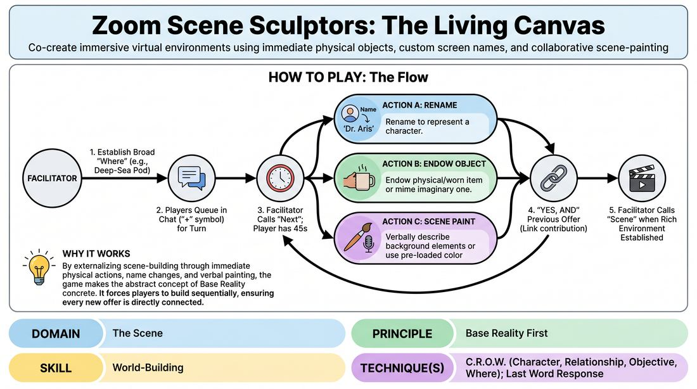

# The Digital Diorama

{ .game-hero }

> Co-create immersive virtual environments using immediate physical objects, custom screen names, and collaborative scene-painting.

## Overview
The Digital Diorama is a collaborative, virtual world-building game where players construct a detailed base reality step-by-step. By combining physical props, display name changes, and verbal scene-painting, participants transform their individual video tiles into a unified, imaginative environment. The game emphasizes rapid offer acceptance and sensory endowment to establish a clear sense of place, character, and relationship.

## What It Trains
- **Domain:** D3 — The Scene
- **Principle(s):** Yes, And; Make Your Partner a Genius; Base Reality First; Group Mind
- **Skill(s):** Active Listening; Offer Reception; Active Gifting; World-Building; Justification; Support Work
- **Technique(s):** Last Word Response; Endowment-acceptance; Endowment-gifting drills; C.R.O.W. (Character, Relationship, Objective, Where); Endowment chains; Justify the absurd; Playing architecture/objects
- **Focus:** mixed

**Objective:** To establish a robust, detailed Base Reality using the C.R.O.W. framework (Character, Relationship, Objective, Where) in a virtual space, training players to instantly accept, justify, and build upon environmental offers.

## Setup
Players join a video call in gallery view. Each player identifies two to three items within immediate arm's reach, or prepares to use wearable items like glasses or clothing. Participants ensure they know how to quickly rename themselves on the platform. The facilitator acts as the host and queue manager.

## How to Play
1. The facilitator initiates the round by establishing a broad, evocative 'Where' such as a high-security vault or a deep-sea research pod.
2. Players who want to contribute type a simple symbol like a plus sign in the chat to enter a running queue, ensuring a smooth, lag-free order of play.
3. The facilitator calls on the first player in the queue, who has up to 45 seconds to make a single, clear 'Yes, And' contribution that builds the environment.
4. To prevent technical delays, the active player chooses one of three rapid actions: rename themselves to represent a character, endow a physical object within arm's reach as a scene prop, or verbally paint a visual detail of the background.
5. If choosing a background change, players must use pre-loaded platform colors or simply describe the background aloud to avoid searching for files mid-turn.
6. If physical mobility is limited, players may endow an item they are already wearing like a watch or glasses, or mime an imaginary object with detailed physical justification.
7. The active player's contribution must explicitly reference and validate the previous player's addition, weaving C.R.O.W. elements together.
8. The facilitator maintains a brisk pace, calling 'Next' to transition smoothly to the next player in the queue.
9. Once a rich, multi-layered scene with clear characters, relationships, and environment is established, the facilitator calls 'Scene' to reset.

## Facilitation Notes
- Pacing is key: If a player experiences technical difficulties renaming themselves, have them state their character name verbally and keep moving.
- Encourage early players to focus heavily on the 'Where' and 'Relationship' before introducing complex plot points or physical props.
- Remind players to endow physical or mimed objects with sensory details like weight, temperature, and texture to make them feel tangible on screen.
- If a player introduces a disconnected element, gently side-coach by asking how that object connects to the previous player's character to maintain the Base Reality.

## Variations
- C.R.O.W. Rotation: Each position in the queue is assigned a specific element where Player 1 establishes the Where, Player 2 the Character, Player 3 the Relationship, and Player 4 the Objective.
- The Invisible Prop: Players are forbidden from using physical items and must entirely mime and verbally describe their objects, focusing on physical precision and partner reaction.

## Debrief
- How did grounding the physical environment first make it easier to discover our characters and relationships?
- What techniques did you use to keep the pacing fast and avoid technical lag during your turn?
- How did you adapt your offers when physical props weren't available, and how did your partners support that?

## Safety & Inclusion
Ensure all players feel comfortable with their physical spaces being visible. For players with limited mobility, emphasize that miming, verbal description, or endowing wearable items like a shirt collar or glasses are fully equal alternatives to grabbing physical props. Avoid any pressure to move quickly or reach for distant objects.

## Why It Works
By externalizing scene-building through immediate physical actions, name changes, and verbal painting, the game makes the abstract concept of Base Reality concrete. It forces players to build sequentially, ensuring that every new offer is directly rooted in what came before, which prevents the common virtual-scene pitfall of talking heads in a void.
