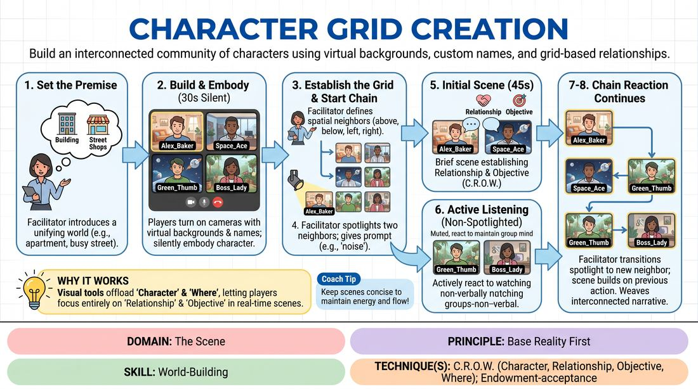

# The Digital Neighborhood

{ .game-hero }

> Build an interconnected community of characters using virtual backgrounds, custom names, and grid-based relationships.

## Overview
The Digital Neighborhood is a virtual-native improv game where players transform their video frames into distinct physical locations using virtual backgrounds and custom screen names. Operating within a shared master grid, players engage in rapid, interconnected scenes with their spatial neighbors as designated by the facilitator. The result is a dynamic, living tapestry of characters and relationships that highlights how digital constraints can fuel rich, collaborative world-building.

## What It Trains
- **Domain:** D3 — The Scene
- **Principle(s):** Yes, And; Make Your Partner a Genius; Base Reality First; Serve the Story; Group Mind
- **Skill(s):** Active Listening; Offer Reception; Active Gifting; World-Building; Peripheral Awareness
- **Technique(s):** Endowment-acceptance; Endowment-gifting drills; C.R.O.W. (Character, Relationship, Objective, Where); Thread-tracking drills
- **Focus:** mixed

**Objective:** To rapidly establish a solid Base Reality using the C.R.O.W. framework (Character, Relationship, Objective, Where) by leveraging visual cues, active listening, and spatial constraints in a virtual environment.

## Setup
Players join a virtual meeting platform in Gallery View. Each player must have access to virtual backgrounds and the ability to rename themselves. The facilitator acts as the Grid Master, using their screen's layout as the definitive Master Grid to determine spatial adjacency. Before starting, players are given 2 minutes to select a virtual background representing a specific location (e.g., a messy kitchen, a serene forest, a high-tech lab) and rename themselves to include a character name and role (e.g., 'Dr. Aris - Lead Botanist').

## How to Play
1. The facilitator introduces a broad, unifying premise for the entire grid, such as an apartment building with paper-thin walls or a series of shops on a busy street corner.
2. Players turn on their cameras, displaying their chosen virtual backgrounds and renamed character tags, and spend 30 seconds silently embodying their character's physical presence in their frame.
3. The facilitator, viewing the group in Gallery View, establishes the spatial layout by announcing who is adjacent to whom (above, below, left, or right) based on the facilitator's master screen.
4. The facilitator initiates the first scene by spotlighting two adjacent players and giving them a prompt based on their visual environments, such as noise leaking from one frame to another.
5. The spotlighted players play a brief, 45-second scene, immediately establishing their Relationship and Objectives (the R and O of C.R.O.W.) to complement their pre-established Character and Where (C and W).
6. Non-active players keep their cameras on but remain muted, actively listening and reacting non-verbally to the ongoing scene to maintain a shared group mind.
7. The facilitator transitions the action by un-spotlighting one player and spotlighting a new neighbor adjacent to the remaining player, prompting them to react to what they just overheard or witnessed.
8. This chain reaction continues across the grid, weaving a continuous, interconnected narrative where every new pairing builds directly upon the established base reality of the previous scenes.

## Facilitation Notes
- The Sync Fix: Because video grids display differently on every participant's device, the facilitator must explicitly announce spatial relationships (e.g., 'In my master view, Sarah is directly above Marcus') to avoid confusion.
- Side-Coaching C.R.O.W.: If a scene stalls, call out prompts like: 'What does your character want from them right now?' (Objective) or 'How long have you two known each other?' (Relationship).
- Keep it Snappy: Keep scenes to under a minute. The magic of this game lies in the rapid, cinematic cuts and the momentum of passing the narrative baton.
- Pitfall - Talking Heads: Players may forget to interact with their virtual environment. Remind them to use physical object work that interacts with their background, such as reaching for a book that matches a library background.

## Variations
- The Shared Crisis: Introduce a sudden global event halfway through (e.g., 'The power goes out across the entire grid!') to force all characters to adapt their objectives simultaneously.
- Cross-Grid Whispers: Allow characters who are not adjacent but share a visual element (e.g., both have plants in their backgrounds) to have a 'secret alliance' scene via private chat or a sudden double-spotlight.
- Silent Observers: Non-spotlighted players must physically react to the active scene as if they can hear it through the 'walls' of their video frames, creating a rich visual background tapestry.

## Debrief
- How did having your 'Where' (virtual background) and 'Character' (rename tag) pre-established change how quickly you could find your Relationship and Objective?
- How did you adapt your physical acting to make your virtual background feel like a real, three-dimensional space?
- What strategies did you use to seamlessly connect your scene to the one that happened right before it?

## Safety & Inclusion
Ensure all players are comfortable using virtual backgrounds; if technical limitations prevent someone from using a background, they can describe their 'Where' in their renamed tag (e.g., '[In a Dark Cave] Leo') or use a physical prop in their real room. Encourage players to set boundaries regarding virtual 'intrusions' into their personal space.

## Why It Works
By pre-loading the 'Character' and 'Where' through visual tools, the game offloads cognitive weight, allowing players to focus entirely on discovering 'Relationship' and 'Objective' in real-time. The strict spatial constraints of the grid force players to practice deep peripheral awareness and active listening, ensuring that every new scene honors and expands the established base reality rather than starting from scratch.
