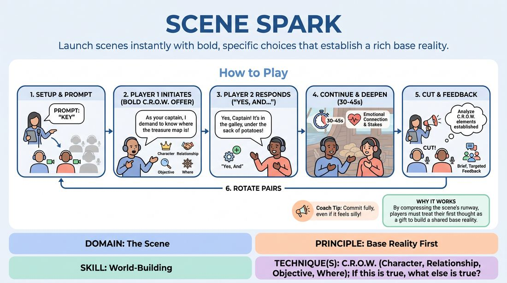

# C.R.O.W. Ignition

{ .game-hero }

> Launch scenes instantly with bold, specific choices that establish a rich base reality.

## Overview
C.R.O.W. Ignition is a rapid-fire virtual training drill designed to eliminate tentative, slow-burn scene starts. Players receive a single prompt word and must immediately launch into a high-stakes scenario, establishing their character, relationship, objective, and location within the first two lines. The exercise emphasizes immediate commitment, active listening, and rapid world-building in a low-physicality, high-focus online environment.

## What It Trains
- **Domain:** D3 — The Scene
- **Principle(s):** Base Reality First; Start in the Middle; Yes, And; Make Your Partner a Genius; The First Thought Is a Gift
- **Skill(s):** World-Building; Justification; Active Listening; Offer Reception; Unfiltered Spontaneity
- **Technique(s):** C.R.O.W. (Character, Relationship, Objective, Where); If this is true, what else is true?; Endowment-acceptance; First Thought drills
- **Focus:** skill_drill

**Objective:** To develop the ability to establish a robust Base Reality First (C.R.O.W.) instantly, training players to make bold, specific, and unfiltered initiations while their partner immediately justifies and elevates those choices.

## Setup
Conducted in a virtual meeting space. All players keep their cameras off except for the two active players. No props or physical materials are required. The facilitator prepares a list of single-word prompts.

## How to Play
1. The facilitator calls two players to turn on their cameras and microphones, while all other participants turn theirs off to focus attention.
2. The facilitator provides a single-word prompt to the active pair.
3. Player 1 immediately initiates the scene with a bold, specific statement or action that establishes at least two elements of C.R.O.W. (Character, Relationship, Objective, Where), avoiding vague setups.
4. Player 2 instantly responds by accepting the initiation as absolute truth, using the 'Yes, And' principle to justify the premise and add further specific details to complete the C.R.O.W. framework.
5. The players continue the scene for only 30 to 45 seconds, focusing on deepening their emotional connection and exploring the immediate stakes of their established reality.
6. The facilitator calls 'Cut!' to stop the scene before it wanders into a narrative plot, keeping the focus entirely on the foundation.
7. The facilitator leads a brief, targeted feedback session with the active players and the observing gallery, analyzing exactly how the C.R.O.W. elements were established.
8. The active players turn off their cameras, and the facilitator calls up the next pair to repeat the process with a new prompt.

## Facilitation Notes
- Coaching Cue: If Player 1 hesitates, side-coach with: 'Trust your first thought! Speak immediately!' to encourage unfiltered spontaneity.
- Pitfall: Players often default to transactional or expository dialogue. Fix: Coach them to show the relationship through emotional attitude and specific actions rather than literal labels.
- Coaching Cue: Remind Player 2 to use 'If this is true, what else is true?' to expand the world rather than introducing a completely new, unrelated conflict.
- Pitfall: Virtual lag or talking over each other. Fix: Instruct players to leave a micro-pause for audio transmission but maintain high emotional readiness.
- Coaching Cue: If the initiation is weak or vague, call 'Reset!' immediately and have Player 1 try again with a bolder choice.

## Variations
- Silent Ignition: Player 1 must initiate using only physical object work and facial expressions on camera, and Player 2 must speak first to label and justify what they see.
- Blind C.R.O.W.: The facilitator privately messages Player 1 a specific location and Player 2 a specific relationship; they must merge these hidden prompts into their immediate initiation.

## Debrief
- How did having a highly specific initiation make it easier or harder for the second player to respond?
- What clues did we use to identify the relationship and location before they were explicitly named?
- How does establishing a strong base reality in the first ten seconds prevent a scene from stalling later on?

## Safety & Inclusion
Since this game requires rapid, unfiltered responses, remind players that they have full agency over their boundaries. If an initiation touches on a sensitive topic, players can instantly redirect, or the facilitator can call 'Reset' with no explanation needed. Ensure the virtual chat is monitored for accessibility needs.

## Why It Works
By compressing the scene's runway to under a minute, players cannot rely on slow exposition. It forces them to treat their first thought as a gift and immediately build a shared base reality. Player 1's bold offer provides the raw material, while Player 2's instant justification solidifies the world, demonstrating that a scene's foundation is strongest when built collaboratively and immediately.
