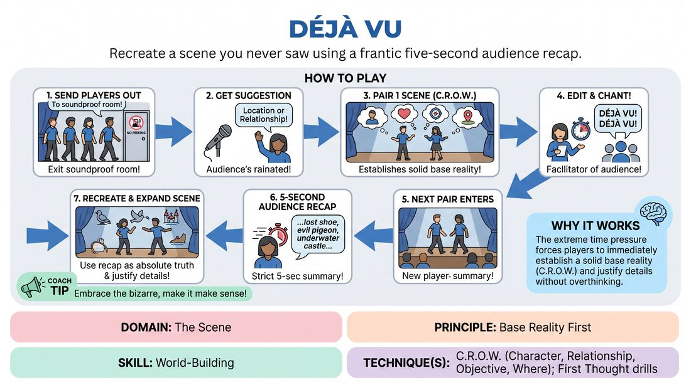

# Déjà Vu

{ .game-hero }

> Recreate a scene you never saw using a frantic five-second audience recap.

## Overview
A high-energy performance game where pairs of players attempt to recreate a scene they did not witness, guided solely by a rapid-fire, five-second audience summary. As details morph and degrade through successive rounds, players must instantly establish a firm base reality and justify the bizarre fragments they are handed.

## What It Trains
- **Domain:** D3 — The Scene
- **Principle(s):** Commit 100%; Yes, And; Base Reality First; The Audience Is the Final Scene Partner
- **Skill(s):** Unfiltered Spontaneity; Offer Reception; World-Building; Justification; Room Reading
- **Technique(s):** First Thought drills; Endowment-acceptance; C.R.O.W. (Character, Relationship, Objective, Where); Justify the absurd
- **Focus:** comedy_game

**Objective:** To master rapid world-building (C.R.O.W.) and base reality establishment under extreme information constraints, while practicing deep justification of absurd or incomplete offers.

## Setup
An in-person playing space with a clear stage area and an audience. Six players are selected: two remain on stage, while the other four are sent completely out of sight and earshot of the performance space.

## How to Play
1. Send four players out of the room to a location where they cannot hear or see the stage.
2. Get a suggestion (such as a specific location or relationship) from the audience for the remaining two players.
3. The first pair performs a standard, high-energy scene, focusing on establishing a clear C.R.O.W. (Character, Relationship, Objective, Where) with distinct physical actions and clear stakes.
4. The facilitator edits the scene after 90 seconds. Immediately, the audience chants 'Déjà vu! Déjà vu! Déjà vu! Déjà vu!' to signal the next pair.
5. Two players from outside are called back into the room. As they step onto the stage, the facilitator selects an audience member to give a strict five-second summary of the scene that just occurred.
6. The incoming pair must immediately perform their version of the scene based solely on that five-second recap, treating the description as absolute truth and fully committing to the established base reality.
7. The second pair should not just repeat the summary, but actively expand the world, justifying the details and continuing the narrative trajectory.
8. Repeat the edit, the audience chant, and the five-second recap for the final pair of players, who must recreate the second scene based on the new audience summary.

## Facilitation Notes
- Keep the five-second recap strictly timed. Use a physical countdown or a buzzer sound to cut off the audience member, forcing them to be concise and chaotic.
- Side-coach the first pair to include clear physical object work and distinct relationships; this gives the audience concrete details to describe.
- Encourage the incoming players to treat the audience's brief description as a sacred text. If the audience member says 'They were astronauts fighting over a sandwich,' the players must immediately embody those characters and that conflict without hesitation.
- Pitfall: Incoming players spend too much time talking about what they are doing instead of doing it. Fix: Side-coach them to 'Show us the environment immediately through physical action!'

## Variations
- The Telephone Chain: Instead of an audience member describing the scene, one player from the previous scene has 10 seconds to whisper the summary to the incoming players.
- Genre Shift: Each subsequent pair must perform the recreated scene in a completely different theatrical genre (e.g., Shakespearean, Sci-Fi, Film Noir) while keeping the core plot points.
- Silent Replay: The audience member must act out the summary using only gibberish or pantomime for 10 seconds, and the incoming players must interpret and play the scene.

## Debrief
- How did the base reality (C.R.O.W.) shift from the first iteration to the last, and what caused those shifts?
- What strategies did you use to instantly commit to a scene description that made no logical sense?
- How does having limited information force you to make bolder, more immediate physical and character choices?

## Safety & Inclusion
Ensure the pathway for players running back into the room is clear of obstacles. Since players are entering high-energy and blind to the stage setup, establish a rule that physical contact must be initiated with clear, consensual eye contact or pre-established boundaries.

## Why It Works
This game works because it strips away the paralysis of choice. By receiving a highly compressed, chaotic prompt, players cannot overthink; they must immediately establish a base reality (C.R.O.W.) to make the scene functional. The pressure of the 'déjà vu' structure forces instant justification, turning Chinese-whisper style errors into brilliant comedic choices.
