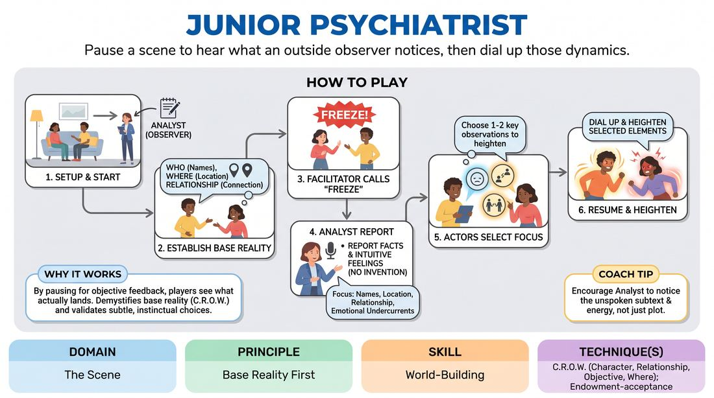

# The Scene Analyst

{ .game-hero }

> Pause a scene to hear what an outside observer notices, then dial up those dynamics.

## Overview
Two players begin a scene to establish a clear base reality, while a third player acts as an analytical observer. Mid-scene, the action freezes, and the observer shares the factual details, relationships, and emotional undercurrents they detected. The actors then resume, consciously heightening the specific elements identified by the observer.

## What It Trains
- **Domain:** D3 — The Scene
- **Principle(s):** Yes, And; Make Your Partner a Genius; Base Reality First
- **Skill(s):** Active Listening; Offer Reception; Heightening & Exploration; World-Building
- **Technique(s):** Endowment-acceptance; Exploring the 'why'; C.R.O.W. (Character, Relationship, Objective, Where)
- **Focus:** skill_drill

**Objective:** To strengthen C.R.O.W. (Character, Relationship, Objective, Where) and base reality by training players to recognize and amplify the implicit offers they make in the opening moments of a scene.

## Setup
Three players take the stage: two as active scene partners and one as the Analyst standing to the side. No props or special staging are required.

## How to Play
1. Assign two players to start a scene and one player to act as the Analyst, standing downstage or to the side to observe.
2. Instruct the two active players to begin a scene, focusing on establishing a clear base reality (who they are, where they are, and their relationship) through dialogue and physical action.
3. After approximately 45 to 60 seconds, once a basic platform is established, the facilitator calls 'Freeze' to pause the action.
4. Ask the Analyst to report their observations, focusing strictly on what has been established: the characters' names, their physical location, their relationship, and any underlying emotional tension or subtext.
5. Emphasize to the Analyst that their role is to report actual observations and intuitive feelings, not to invent new plot points or make up external details.
6. Ask the two active players to select one or two of the Analyst's observations—especially any subtle emotional dynamics or subtext—to focus on.
7. Unfreeze the scene, instructing the actors to continue the scene while deliberately dialing up and heightening those specific observed elements.

## Facilitation Notes
- Coaching cue: Remind the Analyst to focus on 'what is' rather than 'what could be.' They are a mirror, not a writer.
- Pitfall: Actors sometimes feel judged by the Analyst. Fix: Frame the Analyst's feedback as a gift of clarity, showing the actors what they are already successfully communicating.
- Coaching cue: Encourage the actors to lean heavily into the subtext identified. If the Analyst felt 'unspoken resentment,' make that resentment active and visible in the next lines.
- If the Analyst struggles to find details, ask targeted questions: 'Where do you think they are?' or 'Who holds the higher status here?'

## Variations
- The Silent Analyst: The Analyst writes down three observations on a notepad during the freeze and hands them to the actors without speaking, keeping the audience in the dark about what was adjusted.
- The Multi-Analyst Panel: For larger groups, have a panel of three observers, each assigned to watch for a specific element: one for physical environment, one for relationship/status, and one for emotional subtext.

## Debrief
- How did hearing an outside perspective change your awareness of the offers you were making unconsciously?
- Was it easier to heighten the scene once your implicit relationship dynamics were named out loud?
- For the Analyst, what subtle physical or vocal cues gave away the relationship before the characters explicitly stated it?

## Safety & Inclusion
Ensure the Analyst's feedback remains focused on the characters and scene dynamics, never on the actors' personal performance or skill level. Keep the tone collaborative and analytical.

## Why It Works
By pausing the scene, players get immediate, objective feedback on what is actually landing with the audience. This demystifies the process of establishing a base reality (C.R.O.W.) and teaches players that their subtle, instinctual choices are highly readable and worth heightening.
