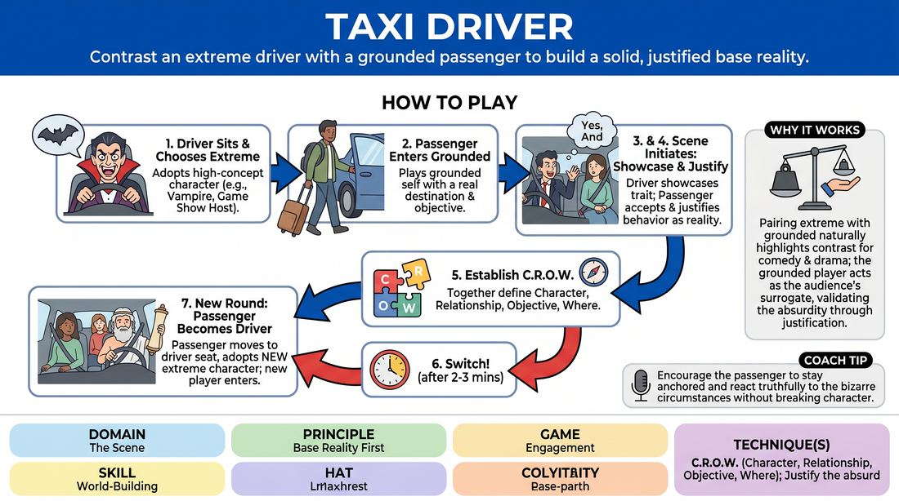

# The Cab Ride

{ .game-hero }

> Contrast an extreme driver with a grounded passenger to build a solid, justified base reality.

## Overview
In this scene-building exercise, two players share a confined vehicle space: one plays an exaggerated, high-concept driver, while the other plays a grounded passenger close to their real-life persona. The passenger must accept and justify the driver's bizarre behavior while maintaining a realistic, stable environment, establishing a clear C.R.O.W. dynamic.

## What It Trains
- **Domain:** D3 — The Scene
- **Principle(s):** Base Reality First; Make Your Partner a Genius; Yes, And
- **Skill(s):** World-Building; Justification; Active Listening; Offer Reception
- **Technique(s):** C.R.O.W. (Character, Relationship, Objective, Where); Justify the absurd; Endowment-acceptance
- **Focus:** skill_drill

**Objective:** To develop the ability to establish a strong Base Reality (C.R.O.W.) by contrasting an extreme character choice with a grounded, realistic partner who validates and justifies the unusual behavior.

## Setup
Place two chairs side-by-side facing the audience to represent the front seats of a taxi cab. The rest of the group sits as active observers.

## How to Play
1. Player A sits in the driver's seat, adopting an extreme, high-concept character choice such as a vampire, an over-enthusiastic game show host, or an ancient philosopher.
2. Player B enters as the passenger, playing a grounded version of themselves, bringing a realistic destination and a simple, everyday objective.
3. The driver initiates the scene, immediately showcasing their unusual character trait through dialogue and physical object work like steering and adjusting mirrors.
4. The passenger must accept the driver's bizarre behavior as absolute reality, using 'Yes, And' to justify why they are staying in the cab instead of fleeing.
5. Both players work together to establish the C.R.O.W. elements: who they are to each other, where they are going, and how the driver's nature affects the journey.
6. After two to three minutes of play, the facilitator calls 'Switch!' to end the beat.
7. The passenger (Player B) now moves into the driver's seat, adopting a brand-new extreme character, while a new player from the group enters as the grounded passenger.

## Facilitation Notes
- Encourage the passenger to play 'straight'—the scene's comedy and stability come from the contrast, not from two wacky characters competing for attention.
- Side-coach the passenger to find a logical reason to stay in the car (e.g., 'I'm already late for my wedding' or 'It's pouring rain outside') to practice justification.
- Remind the driver to keep driving; physical object work helps anchor the 'Where' of the scene.
- Pitfall: The passenger becomes as crazy as the driver. Fix: Remind the passenger that their job is to be the anchor of reality, making the driver's choices look even more brilliant.

## Variations
- Shared Affliction: The driver's extreme emotion or physical quirk slowly infects the passenger over the course of the ride.
- The Detour: The driver takes a sudden, unexpected route, forcing the passenger to negotiate their objective while maintaining their grounded persona.
- Carpool Lane: Add a third chair in the back. A second grounded passenger enters, and the two passengers must whisper and react to the driver together.

## Debrief
- How did having one highly grounded character help make the driver's extreme choice feel more believable and funny?
- What strategies did the passengers use to justify staying in the vehicle with an unusual driver?
- How did the physical environment of the car help you establish the 'Where' and 'Relationship' quickly?

## Safety & Inclusion
Since the players are in a simulated confined space, remind participants to respect physical boundaries. Players should avoid unwanted physical contact and can verbally establish boundaries if the driver's character choice feels too intense or invasive.

## Why It Works
By pairing an extreme character with a grounded one, the exercise naturally highlights the contrast needed for comedy and drama. The grounded player acts as the audience's surrogate, validating the unusual behavior through justification, which solidifies the scene's base reality and prevents it from collapsing into chaos.
