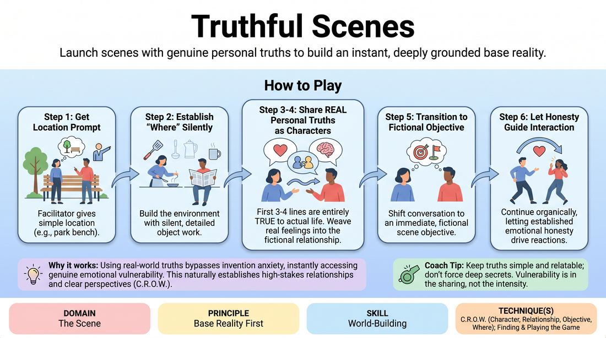

# Truthful Beginnings

{ .game-hero }

> Launch scenes with genuine personal truths to build an instant, deeply grounded base reality.

## Overview
Two players initiate a scene by sharing authentic personal memories, opinions, or feelings in their first few lines of dialogue, while simultaneously establishing a physical environment. This blend of real-world vulnerability and fictional space creates a rich, believable foundation. As the scene progresses, players transition from these genuine truths into an organic, playful exploration of their characters' relationship.

## What It Trains
- **Domain:** D3 — The Scene
- **Principle(s):** Base Reality First; Vulnerability; Make Your Partner a Genius
- **Skill(s):** World-Building; Game Identification; Unfiltered Spontaneity; Active Listening
- **Technique(s):** C.R.O.W. (Character, Relationship, Objective, Where); Finding & Playing the Game; First Thought drills
- **Focus:** mixed

**Objective:** To master the C.R.O.W. technique (Character, Relationship, Objective, Where) by anchoring the scene's initial reality in genuine personal truth, making the base reality instantly believable and compelling.

## Setup
An open performance space. Two players stand in the playing area, while the rest of the group sits as active observers. No props or special staging are required.

## How to Play
1. Ask two players to step forward and prompt them with a simple, everyday physical location (e.g., a kitchen, a garage, a park bench).
2. Instruct the players to begin the scene by engaging in silent, detailed physical object work to establish the physical environment ('Where').
3. When players begin speaking, their first three to four lines of dialogue must be entirely true to their actual lives, expressing real personal memories, genuine opinions, or current feelings.
4. While sharing these real-life truths, players must treat each other as their scene characters, instantly weaving their real feelings into the fictional relationship ('Relationship' and 'Character').
5. Once the initial truthful exchange is established, players naturally transition the conversation to focus on an immediate, fictional objective within the scene ('Objective').
6. Allow the scene to continue organically, letting the established emotional honesty guide how the characters interact and react to one another.

## Facilitation Notes
- Side-coaching cue: 'Keep the physical action going. Don't let the truth-telling freeze your body.'
- Side-coaching cue: 'Listen to the emotional subtext of their truth. How does your character feel about that real opinion?'
- Pitfall: Players sharing 'improv truths' (e.g., 'We are in an improv class'). Fix: Remind them that the dialogue must be personal truth (memories, tastes, beliefs) spoken through the filter of their characters in the designated setting.
- Pitfall: Rushing into wacky comedy too quickly. Fix: Encourage players to sit in the quiet, grounded reality of their shared truths for at least a minute before looking for comedic beats.

## Variations
- Game Spotting: Have the observing players raise their hands the moment they hear or see an unusual behavior, pattern, or emotional spike. The active players must then lean into that specific element as the 'game' of the scene.
- Monologue Source: One player delivers a brief, 30-second true monologue to the audience, and then two other players use the emotional core and details of that monologue to start their scene's base reality.

## Debrief
- How did starting with actual personal truths affect the speed and depth of your character connection?
- What did you notice about the physical environment when you were focused on speaking honestly?
- How does a highly grounded base reality make it easier to discover and play a comedic game later in the scene?

## Safety & Inclusion
Remind players that while they are sharing real truths, they are in complete control of their boundaries. They should only share memories or opinions they feel comfortable disclosing publicly, and should never feel pressured to share deeply private or traumatic experiences.

## Why It Works
By using real-world truths, players bypass the anxiety of inventing plot and instantly access genuine emotional vulnerability. This vulnerability naturally establishes a high-stakes relationship and a clear character perspective (C.R.O.W.), providing a rock-solid base reality. When the foundation is this strong, any subsequent comedic game feels earned, organic, and highly impactful.
