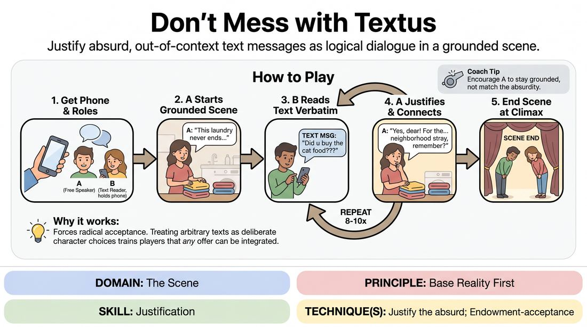

# Text Message Roulette

{ .game-hero }

> Justify absurd, out-of-context text messages as logical dialogue in a grounded scene.

## Overview
Two players perform a scene where one speaks freely while the other must read their lines verbatim from a real text message thread on an audience member's phone. The challenge is to justify these random, out-of-context texts to build a coherent, hilarious base reality.

## What It Trains
- **Domain:** D3 — The Scene
- **Principle(s):** Base Reality First; Make Your Partner a Genius; The Audience Is the Final Scene Partner
- **Skill(s):** Justification; Active Listening; Offer Reception; Room Reading
- **Technique(s):** Justify the absurd; Endowment-acceptance
- **Focus:** comedy_game

**Objective:** Develops the skill of justifying the absurd, active listening, and establishing a strong base reality under highly unpredictable constraints.

## Setup
Two players stand on stage. The facilitator borrows a volunteer's mobile phone with a text message conversation open. One player holds this phone.

## How to Play
1. Ask an audience volunteer to lend their unlocked phone, opened to a casual, non-sensitive text message thread.
2. Designate Player A as the 'free speaker' and Player B as the 'text reader' who holds the phone.
3. Instruct Player B to scroll to a random point in the text thread and prepare to read the messages sequentially.
4. Player A initiates a grounded, realistic scene with a clear physical activity and relationship, establishing the base reality.
5. Player B must deliver their lines by reading the next consecutive text message from the phone, word-for-word, without altering the phrasing.
6. Player A must actively listen to Player B's text line, accept it as absolute truth, and immediately justify why Player B said it within the context of their scene.
7. Player B continues down the text thread line-by-line for each of their turns, while Player A works to keep the scene logical and emotionally connected.
8. End the scene once a satisfying comedic climax or narrative resolution is reached, typically after 8 to 10 exchanges.

## Facilitation Notes
- Coaching cue: 'Don't ignore the weirdness—explain it!' Encourage Player A to treat every bizarre text as a deliberate, meaningful choice by Player B.
- Pitfall: Player B tries to skip 'boring' texts like 'OK' or 'On my way.' Fix: Remind them that mundane texts often ground the scene and provide excellent comedic pacing.
- Coaching cue: 'Let the text change your emotional state.' Player A should let the random texts deeply affect their character's feelings.
- Pitfall: Player A steamrolls the scene with pre-planned plot. Fix: Side-coach Player A to slow down and let the text message dictate the direction of the scene.

## Variations
- Double Text: Both players use different audience phones and can only speak using their respective text threads.
- Genre Justification: Play the scene in a specific high-stakes genre, such as a Shakespearean tragedy or a gritty detective noir, forcing modern texts to fit the style.
- The Translator: A third player stands behind the text reader and physically acts out the subtext or 'real meaning' behind the random text messages.

## Debrief
- How did having to justify completely random lines help you discover the relationship between the characters?
- What strategies did the free-speaking player use to make the absurd texts feel logical?
- How does your active listening change when you have absolutely no idea what your partner is going to say next?

## Safety & Inclusion
Ensure the phone donor is fully comfortable with their texts being read aloud. Instruct the reading player to instantly skip any highly sensitive personal information, full names, or private data if they appear in the thread.

## Why It Works
This game forces the free-speaking player to abandon control and practice radical acceptance. By treating arbitrary text messages as profound, deliberate character choices, players learn that any offer—no matter how absurd—can be integrated into a stable base reality through strong justification.
